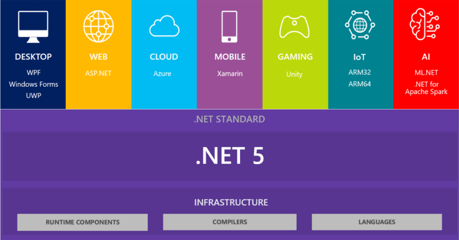
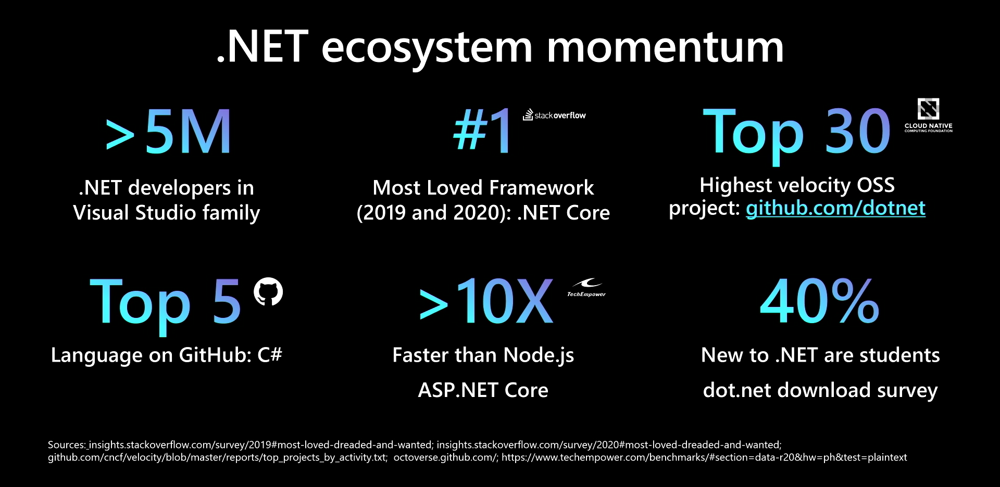
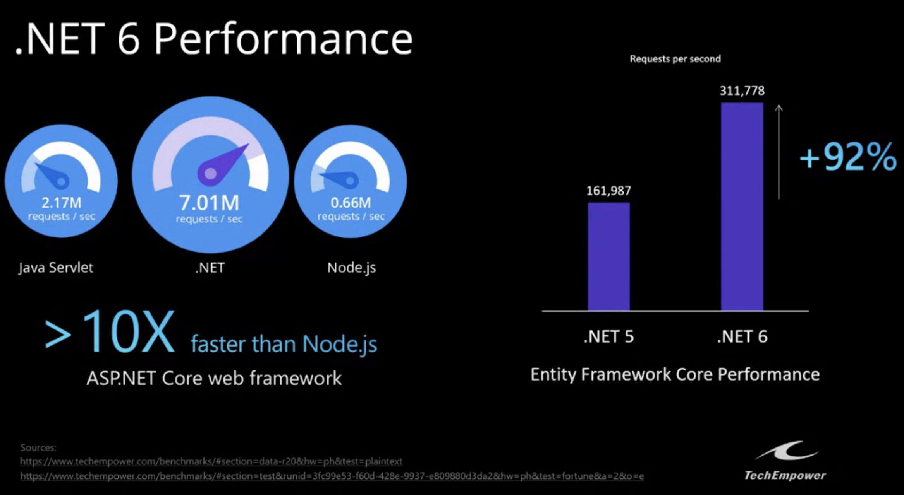
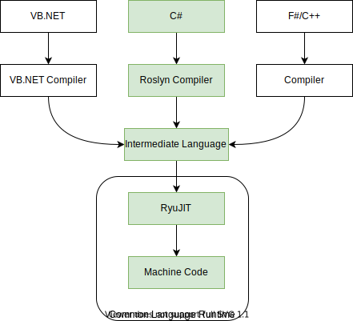
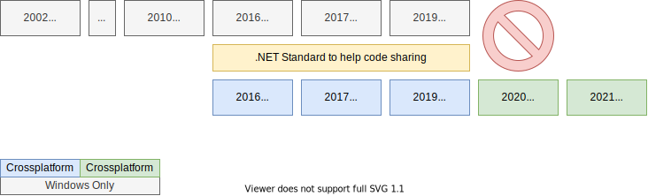

class: dark middle

# Enterprise Web Development C&#35;
> 1. Introducting the .NET ecosystem

---
### Introducting the .NET ecosystem
# Table of contents

- [.NET Explained](#net-explained)
- [> Hello World!](#hello-world)
- [Tutorials](#tutorials)
- [Class Libraries](#class-libraries)
- [GIT](#git)
- [Summary](#summary)

---
name:net-explained
class: dark middle
# Introducting the .NET ecosystem
> .NET Explained


---
### .NET Explained
# What is .NET?
<br/>


---
### .NET Explained
# Why.NET?
<br/>


---
### .NET Explained
# Why.NET?
<br/>


---
### .NET Explained
# .NET The Ecosystem
- Languages
 - C&#35;
 - F&#35;
 - VB
- Libraries
 - **B**ase **C**lass **L**ibrary
 - 3rd party
 - Provided by the **NuGet** package manager
- Compilers
 - Roslyn | RyuJIT
- Runtimes
 - **C**ommon **L**anguage **R**untime 
     - Like Java's JVM


> <a href="https://www.youtube.com/watch?v=bEfBfBQq7EE" target="_blank">Listen to Scott Hanselman himself</a>


---
### .NET Explained
# The ❤️ of .NET
**B**ase **C**lass **L**ibrary
- Contains most common functionalities
- A set of reusable:
  - Interfaces
  - Classes
  - Value Types
  - Functions
  - ...
- Provided by the NuGet Package Manager

---
### .NET Explained
# The ❤️ of .NET
**C**ommon **L**anguage **R**untime
- An Application **V**irtual **M**achine
- Manages memory
- Code access security
- Code safety
- Makes the developer's life easier
- Compiles the **I**ntermediate **L**anguage Code **J**ust **I**n **T**ime to Machine Code

---
### .NET Explained
# Tools
**V**isual **S**tudio
- **I**ntegrated **D**evelopment **E**nvironment
- Use it to write code.
- **S**oftware **D**evelopment **K**it
   - Analysers
   - Compilers
   - Runtime
   - BCL
   - CLI

dotnet **C**ommand **L**ine **I**nterface
- dotnet new&nbsp;&nbsp;&nbsp;&nbsp;&nbsp;&nbsp;&nbsp;| project templates
- dotnet watch | dev time compile, watch for changes and run
- dotnet publish&nbsp;&nbsp;&nbsp;| ready for deployment

---
### .NET Explained
# Development Flow
What happens to my C&#35; code?



---
### .NET Explained
# Development Flow
What happens to my C&#35; code?

1. Create a new project using Visual Studio or the dotnet CLI
2. You write C&#35; code with the help of:
 - **B**ase **C**lass **L**ibrary
 - External packages downloaded from NuGet
 - Analysers provided by the Roslyn compiler
3. You build/compile the project into **D**ynamic **L**ink **L**ibraries using Roslyn
4. Run the application using the **C**ommon **L**anguage **R**untime
5. The CLR compiles code **J**ust **I**n **T**ime to machine code.

---
name:history
### .NET Explained
# History
3 Flavours of .NET:
- .NET Framework
- .NET Core
- .NET Standard



---
### .NET Explained
# The market right now
- **.NET Framework**
  - Original
  - Windows Only
  - Runtime
  - Closed Source
- **.NET Core**
  - vNext of .NET Framework
  - Cross-platform
  - Runtime
  - Open Source
- **.NET Standard**
  - Created for compatibility between .NET Framework and .NET Core
  - Library
  - Open Source

---
### .NET Explained
# Problems with .NET Standard
.NET Standard has made it much easier to create libraries that work on all .NET platforms. But there are still three problems with .NET Standard:
- **Versions slowly**
 - which means you can’t easily use the latest features.
- Needs a <a href="https://dotnet.microsoft.com/platform/dotnet-standard#versions" target="_blank">decoder table</a>
 - Which API's are available in which implementation?
- Exposes **platform-specific features**
 - They didn't want to break the entire ecosystem so there are Windows specific API's. Which don't make sense on Apple devices. e.g. FileSystem

> More information about .NET Standard can be found <a href="https://devblogs.microsoft.com/dotnet/the-future-of-net-standard/" target="_blank">here</a>.

---
### .NET Explained
# Problems with .NET Standard


---
### .NET Explained
# What you should target
Do you have **legacy** code written in .NET Framework?
- .NET Standard

Shipping a **NuGet package** and want compatibility with .NET Framework?
- .NET Standard

All other stuff:
- .NET6
> **You are here**

---
### .NET Explained
# Versioning

.NET uses semantic versioning, example for .net5:
- .NET 5.1.3
  - Major Version: 5
  - Minor Version: 1
  - Fix Version: 3
- Major release every year in november
  - Which is annoying for a curriculum but hey...
- **L**ong **T**erm **S**upport release a few months after major release.
  - Major release: 5.0
  - LTS release: 5.1
  - So they have time to fix bugs etc.

---
class: dark middle
name:hello-world
# Enterprise Web Development C&#35;
>  `> Hello World!`

---
### `> Hello World!`
# Your first application

Using the CLI you can create projects using the starter templates.
1. Open the command prompt or terminal
2. Check that your SDK is installed
```
dotnet --info
```
3. Get a list of all possible starter templates
```
dotnet new list
```
4. Create a new console application.
```
dotnet new console -o App -f net6.0 --use-program-main
```
5. Checkout what these arguments mean
```
dotnet new console -h
```

> Continued on next slide...

---
### `> Hello World!`
# Your first application

Open the folder with VS Code and look at the contents
```
cd app
code .
```
> For macOS checkout [this youtube video](https://www.youtube.com/watch?v=CYU07mlXZ5Y) for the `code` command

In the folder you'll find the following files/folders:
- `App.csproj`
    - Remember, .NET is **project based**. 
    - Configuration of the project e.g.
        - Which `LangVersion`
        - Which `TargetFramework`
- `Program.cs`
    - Entry point `static void Main(string[] args)`
- `obj`
    - Some temporarily artifact files

---
### `> Hello World!`
# Your first application

Let's build the application
```
dotnet build
```

You'll see a new folder called `bin`(aries), which contains:
- **D**ynamic **L**ink **L**ibraries
- Executable
- Project configuration files

Let's run the application
```
dotnet run
```
> When running this command `dotnet build` is implicitly implied.

---
### `> Hello World!`
# Getting rid of the boilerplate
**program.cs**
```
using System; // Using the BCL

namespace App; // Namespace of the module (file scoped)
class Program 
{
    static void Main(string[] args) // Entry Point
    {
        Console.WriteLine("Hello World!") // Print statement
    }
}
```
> **You right now**: *"Bweik... all that boilerplate for a simple print and I never understood the `Main()` method in Java anyway..."*

Let's do something about that...

---
### `> Hello World!`
# Getting rid of the boilerplate
Due to [top-level-statements](https://docs.microsoft.com/en-us/dotnet/csharp/fundamentals/program-structure/top-level-statements) introduced in C&#35;9 we can create a one-liner.
> Note that we use C&#35;10 which is the default for .NET6.0 apps.

1. Delete all code in `Program.cs` and replace it with the following one-liner:
```
System.Console.WriteLine("Hello World!");
```

2. Run
```
dotnet run
```

> **You right now**: *"Nais..."*

---
class: dark middle
name:tutorials
# Enterprise Web Development C&#35;
>  Tutorials

---
### Tutorial
# Microsoft Learn
Complete the following interactive tutorials provided by Microsoft Learn:
1. <a target="_blank" href="https://docs.microsoft.com/en-us/dotnet/csharp/tour-of-csharp/tutorials/hello-world">Hello World</a><small>(30 Mins.) </small>
2. <a target="_blank" href="https://docs.microsoft.com/en-us/dotnet/csharp/tour-of-csharp/tutorials/numbers-in-csharp">Numbers in C#</a><small>(30 Mins.) </small>
3. <a target="_blank" href="https://docs.microsoft.com/en-us/dotnet/csharp/tour-of-csharp/tutorials/branches-and-loops">Branches and Loops</a><small>(45 Mins.) </small>
4. <a target="_blank" href="https://docs.microsoft.com/en-us/dotnet/csharp/tour-of-csharp/tutorials/list-collection">List Collections</a><small>(30 Mins.) </small>

> Even if you're familiar with C&#35;, **follow them** and do **not** copy-paste the code, write it yourself. 

---
class: dark middle
name:class-Libraries
# Enterprise Web Development C&#35;
>  Class Libraries

---
### Class Libraries
# Problem Domain
Real projects resolve around a **problem domain** or multiple domains.
Classes of the problem domain might be:
- Customer
- Product
- ProductType (could be an `enum`)
- Order
- OrderLine
- Invoice
- ...

These classes should always reside in a separate **Class Library** so they're shareable between multiple applications and **can** be distributed via NuGet.

> Class Libraries cannot run by themselves they need to be referenced by a runnable project (e.g. Console App). 
---
### Class Libraries
# Class Example
JAVA
```
class Bicycle {
  private int gear = 5;
  public void brake() {
    System.out.println("I'm braking!");
  }
}
```
C#
```
class Bicycle {
  private int gear = 5;
  public void Brake() { // Notice the PascalCase instead of camelCase
    Console.WriteLine("I'm braking!")
  }
}
```

> More about classes in Chapter 2, but in essence they're the same as JAVA classes. 

---
### Class Libraries
# Creating a Class Library
1. Create a new folder `hello-class-libraries` with a `src` folder inside.
```console 
mkdir hello-class-libraries
cd hello-class-libraries
mkdir src
cd src
```
2. Create a new Console Application
```console
dotnet new console -o App
```
> **-o** is used to specify the name.
3. Create a Class Library
```console
dotnet new classlib -o Domain
```

---
### Class Libraries
# Linking a Class Library
We want to use `Class`es from the `Domain` project in the `App` project so:
1. Execute the following command in the `src` folder to link the Domain Class Library to the Application.
```console
dotnet add App/App.csproj reference Domain/Domain.csproj
```

2. Open the `App.csproj` file and see what's added by the command.
```
<ItemGroup>
      <ProjectReference Include="..\Domain\Domain.csproj"/>
</ItemGroup>
```

> **Without a explicit reference you cannot use any classes defined in the Domain.csproj class library from the Console Application.**

---
### Class Libraries
# Referencing a Class Library
1. Open the root folder `hello-class-libraries` in vs code
2. Rename `Class1.cs` to `Bicycle.cs` and implement it:
```cs
namespace Domain;
public class Bicycle // Public is mandatory, (see later)
{ 
      private int gear = 5; // Field
      public void Brake() // Function
      { 
          System.Console.WriteLine("I'm braking in gear:" + gear);
      }
}
```
3. Use it in the `Program.cs` from the App package.
```
using Domain; // Importing the namespace
var bike = new Bicycle(); // Instantiating a new Bicycle Object
bike.Brake(); // Using the method
```
4. Open a terminal and run the App. (**GIF on next slide**)

---
### Referencing a Class Library
<video controls width="100%">
  <source src="images/class-library-bicycle.mp4" type="video/mp4">
Your browser does not support the video tag.
</video>
> Same as the slide before, without file-scoped namespace. Notice that you might have less indents.
---
class: dark middle
name:git
# Enterprise Web Development C&#35;
>  GIT

---
### GIT
# Repository Structure
Although .NET is project based, the folder structure is important for GIT.

Standard folder structure:
- ProjectName (repository)
- .gitignore (notice it's in the root folder)
- readme.md (information about the repository)
  - src
        - project1
            - Files for project1
        - classlibrary1
            - Files for classlibrary1
        - ...
  - tests
        - Same as src but for tests

---
### GIT
# Source Control
1. Open the root folder `hello-class-libraries` in vs code
2. Open a terminal and initialize a git repository
```
git init
```
3. We don't want build artefacts being tracked by GIT, so add a .net specific `.gitignore` in the **root folder**:
```
dotnet new gitignore
```

Build artefacts are generated files by certain dotnet commands for example `dotnet build` or `dotnet run`. **Never track obj and bin folders, since they're binary files**!

> GIF provided in the next slide. 


---
### GIT
# Source Control for .NET
<video controls width="100%">
  <source src="images/git-ignore.mp4" type="video/mp4">
Your browser does not support the video tag.
</video>

---
### Visual Studio Community 2019 Solution Setup
<br/>
<video controls width="100%">
  <source src="images/create-solution-structure-vs.mp4" type="video/mp4">
Your browser does not support the video tag.
</video>
> Altough it's 2019 it should look very similar to 2022, notice that file scoped namespaces and top-level statements are not used. Which can occur more in the course. 
---
class: dark middle
# Introducting the .NET ecosystem
>  Exercises

---
name:exercises
### Introducting the .NET ecosystem
# Exercises
Complete the following exercises:
1. <a href="https://github.com/HOGENT-Web/csharp-ch-1-exercise-1" target="_blank">You</a>
2. <a href="https://www.w3resource.com/csharp-exercises/basic/index.php" target="_blank">92 Drill exercises if you're feeling keen!</a>


---
name:solutions
### Introducting the .NET ecosystem
# Solutions
On the following links you can find the solutions for the exercises.
1. <a href="https://github.com/HOGENT-Web/csharp-ch-1-exercise-1/tree/solution#solution" target="_blank">You</a>
2. <a href="https://github.com/HOGENT-Web/csharp-ch-1-exercise-2/tree/solution#solution" target="_blank">Fibonacci</a>
3. <a href="https://www.w3resource.com/csharp-exercises/basic/index.php" target="_blank">92 Drill exercises if you're feeling keen!</a>
 - Each exercise has it's own solution

---
class: dark middle
name:summary
# Introducting the .NET ecosystem
>  Summary

---
### Introducting the .NET ecosystem
# Summary
In this chapter you learned:
- The ins- and outs of the .NET Ecosystem.
- Basic C# syntax
- dotnet **C**ommnad **L**ine **I**nterface
- Creating a simple console application
- The problem domain goes into it's own class library
- Linking a class library to a console application
- The standard GIT folder structure for .NET projects
