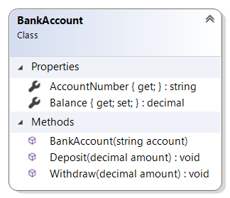
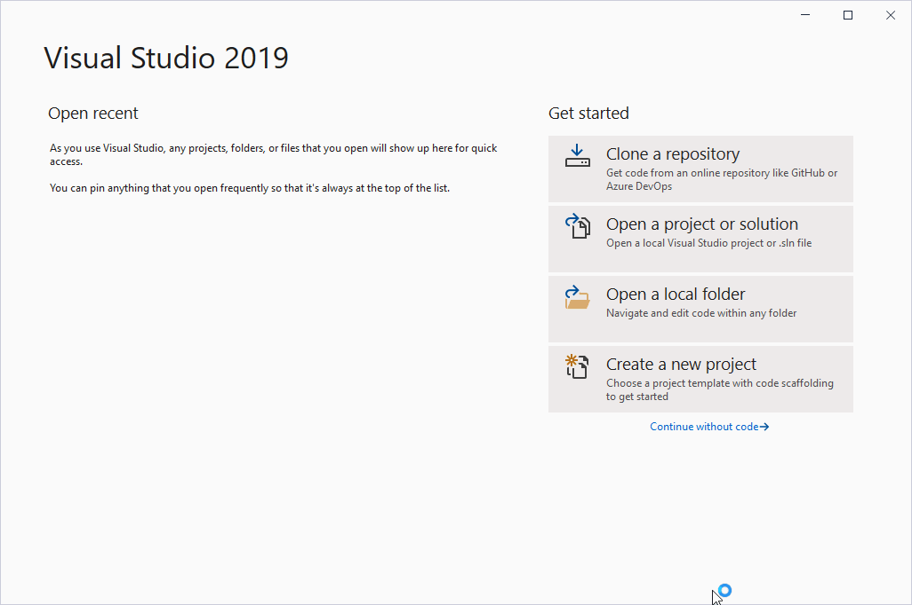
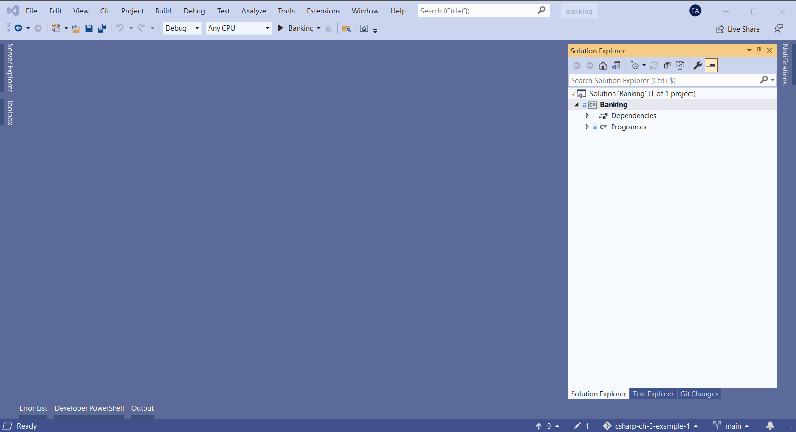
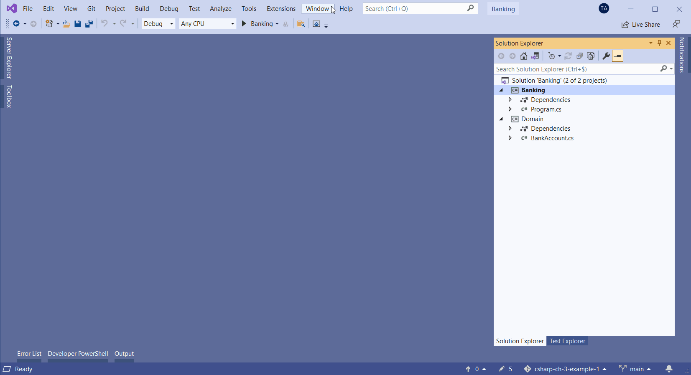

class: dark middle

# Enterprise Web Development C&#35;
> Chapter 3 - Model &amp; Unit Testing

---
### Chapter 3 - Model &amp; Unit Testing
# Table of contents

TODO: shouldn't collections be the last thing?

- [The Visual Studio Solution](#vs-solution)
- [The sample application](#sample-application)
- [Classes](#classes)
- [Associations &amp; collections](#associations)
- [Inheritance](#inheritance)
- [Polymorphism](#polymorphism)
- [Abstract class](#abstract-class)
- [Interface](#interface)
- [Static members](#static-members)
- [Delegates &amp; Events](#events)
- [Unit Testing](#unit-testing)

---
name: vs-solution
class: dark middle

# Model &amp; Unit Testing
> The Visual Studio Solution

TODO: add some info about a Visual Studio Solution and the projects

---
name: sample-application
class: dark middle
# Model &amp; Unit Testing
> The sample application

TODO: add UML diagram for Banking app (draw.io)

---
name: classes
class: dark middle

# Model &amp; Unit Testing
> Classes

---
### Classes
# Members of a class

- [Fields (= attributes)](#fields)
- [Methods](#methods)
- [Constructor](#constructor) - [destructor](#destructor)
- [Properties](#properties)
- Events (later)

---
### Classes
# Access modifiers for members

- `public`
  - accessible from everywhere, no limits
- `private`
  - only accessible from within the class
  - *this is the default*
- `internal`
  - only accessible within the same assembly
  - an assembly = one unit of deployment, version control...
- `protected`
  - only accessible within the class and all classes who inherit from this class
  - in Java: also accessible in same package, not in C#!
- `protected internal`
  - combination of `protected` and `internal`

---
### Classes

# Access modifiers for classes

Classes, structs or records directly declared in a namespace can be `public` or `internal` (default).

> Directly declared in a namespace = not nested within another class or struct

Nested classes or structs _in structs_ can be declared `public`, `internal` or `private`.

Nested classes or structs _in classes_ can be declared all of the previous ones (`public`, `private`, `protected`, `internal` or `protected internal`).

The default for nested classes or structs is `private`.

> Derived classes and records can't have greater accessibility than their base types (see later).

---
name: fields
### Classes
# Fields

> **[modifier]** *datatype variableName*

* Encapsulation of data
* Can be **variables** or **constants**
* Always **`private`**
* Can be **`static`**
  * linked to the class and not to an instance
  * static members only exist once per class
* Naming convention: **_camelCase**

```{cs}
public class BankAccount
{
  private string _accountNumber;
  private decimal _balance;
}
```

---

### Classes
# Constants

* Use the keyword **`const`**
* Must be **initialized** when declared
* Value can **never change**
* Implicit **`static`**, doesn't have the keyword
* Name convention: **PascalCase**

```{cs}
public class BankAccount
{
  public const decimal WithdrawCost = 0.25M;
}
```

**Accessed through the class name:**

```{cs}
Console.WriteLine(BankAccount.WithdrawCost);
```

---

### Classes
# readonly

* Use the keyword **`readonly`**
* Can only be **assigned a value once**
  * at **declaration** OR
  * in the **constructor**
  * not required at declaration <> `const`

```{cs}
public class BankAccount
{
  private readonly string _accountNumber;
  private decimal _balance;
}
```

---
name: methods
### Classes
# Methods

> **[modifier]** return_type MethodName([parameters]) { ... }

* **Operations** the object can execute
* May or may not (`void`) return a value
* Can be `static`
* Name convention: **PascalCase**

```{cs}
public class BankAccount
{
  private readonly string _accountNumber;
  private decimal _balance;

  public void Deposit(decimal amount)
  {
    throw new NotImplementedException();
  }
}
```

---
### Methods
# Parameter list

* **separated by a comma**
* have a **type** and **name** (camelCase)
* if no parameters, use ()
* can be **optional**
  * can have a default value
  * no value is required when calling the method
  * last in the list

```{cs}
public void ExampleMethod(int required, int optionalInt = 10)
{
  throw new NotImplementedException();
}

// Calling this method
ExampleMethod(5); // optionalInt will be 10
ExampleMethod(5, 8); // optionalInt will be 8
```

---
### Methods
# Named arguments

- not every optional parameter may have a value
- what if you only want to give a value for the last int?

```{cs}
public void ExampleMethod(int required,
  string optionalStr = "default value", int optionalInt = 10)
{
  throw new NotImplementedException();
}
```

- use **named arguments**

```{cs}
ExampleMethod(5, `optionalInt`: 8);
```

---
### Methods
# Passing parameters (1)

Parameters can be passed in 3 ways:
* **value** parameters
  * input parameters

```
public void Test1(int x)
{
  x += 1;
}

int i = 0;
Test1(i); // i is still 0
```

---
### Methods
# Passing parameters (2)

Parameters can be passed in 3 ways:

* **ref** parameters
  * must write **`ref`** when declaring and passing value
  * passed variable must be initialized
  * **every change** to the variable's value will be **reflected** to the ref parameter

```
public void Test2(ref int x)
{
  x += 1;
}

int i = 0;
Test2(ref i); // i has now value 1
```

---
### Methods
# Passing parameters (3)

Parameters can be passed in 3 ways:

* **out** parameters
  * must write **`out`** when declaring and passing value
  * passed variable must not be initialized
  * the **method must assign a value** to the out parameter

```
public void Test3(out int x)
{
  x = 10;
}

int i = 0;
Test3(out i); // i has now value 10
```

---
### Methods
# Passing parameters (4)

> **Passing objects as value parameters, copies the references**

* You can change properties and fields of the object
* But not the actual variable's value
  * only possible with `ref` keyword

```{cs}
public void Demonstrate1(BankAccount bankAccount)
{
  bankAccount = null;
}

public void Demonstrate2(ref BankAccount bankAccount)
{
  bankAccount = null;
}

BankAccount myAccount = new BankAccount();
Demonstrate1(myAccount); // myAccount won't be null
Demonstrate2(ref myAccount); // myAccount is null now
```

---
### Methods
# Return types

Methods can also have a return type

```{cs}
public decimal GetBalance()
{
  return _balance;
}
```

**return** statement
* can be **anywhere** in the method's code
* can occur **multiple times**
* returns the **value of the method**
* **method's execution is immediately stopped**
  * maybe some `finally` code needs to be executed
  * or resources need to be cleaned up (with `using`)

---
name: constructor
### Classes
# Constructor

> **[modifier]** ClassName([parameters]) { ... }

* Name is equal to the **class name**
* Has a **no return type**
* Not required, you get a default constructor or free
  * if one constructor is defined, you won't get it :(
* A class can have more than one constructor
  * differ in number and/or type of parameters
* **Re-use constructors** with `: this(...)` after the parameter list

```{cs}
public BankAccount(string accountNumber) { /* ... */ }

public BankAccount(string accountNumber,
  decimal balance): this(accountNumber)
{
  throw new NotImplementedException();
}
```

---
### Classes
# Constructor

A constructor also supports **optional parameters**

```{cs}
public BankAccount(string accountNumber, decimal balance = 0M)
{
  throw new NotImplementedException();
}
```

> This way **no overloading is needed** and two constructors have been reduced to one.

> Visual Studio snippet: **ctor + tab**

---
### Classes
# Constructor

Declaration and instantiation can be seperate

```{cs}
BankAccount myAccount;
myAccount = new BankAccount("123-123123-12");
```

Or in one statement

```{cs}
BankAccount myAccount = new BankAccount("123-123123-12");
```

---
### Classes
# Constructor

If the setter for `Balance` was public, but there is no constructor to set it right away, there is a solution: **object initializers**.


```{cs}
BankAccount account = new BankAccount("123-123123-12");
myAccount.Balance = 200M;

// Is equal to
BankAccount account = new BankAccount("123-123123-12") { Balance = 200M };
```

---
name: destructor
### Classes
# Destructor

* **Cleans** objects
* Automagically executed when garbage collector releases an object
* Name is equal to the **class name** with a tilde (~) as prefix
* Has **no access modifier, no parameters**
* Rarely used, better to inherit from `IDisposable`

```{cs}
public class BankAccount
{
  ~BankAccount()
  {
    // Yes, I do the cleaning
  }
}
```

---
name: properties
### Classes
# Properties

* Combination of fields and methods, **used as if it's a field**
* Consists of 1 or 2 pieces of code: **getter and/or setter**
  * getter: executed when property is being read
  * setter: executed when property is assigned a value
* Name convention: **PascalCase**

```{cs}
public class BankAccount
{
  private string _accountNumber;

  public string AccountNumber
  {
    get { return _accountNumber; }
    set { _accountNumber = `value`; }
  }
}

string accountNumber = myAccount.AccountNumber;
myAccount.AccountNumber = "12-456376-25";
```

???

* This property is called `AccountNumber` and has type `string`.
* `get` is the getter and is more convenient and less boiler plate than Java
  * is executed when the property is read
* `set` is the setter
  * is executed when the property is assigned a value
  * `value` is a keyword in C# which contains the value that is being assigned (and obviously has the same type as the property)

---
### Classes
# Properties

* don't always need getter and setter
  * **read-only property**: only `get`
  * **write-only property**: only `set`
* get/set **inherit access level from the property**, but can be changed

```{cs}
public class BankAccount
{
  private decimal _balance;

  public decimal Balance
  {
    get { return _balance; }
    `private` set { _balance = value; }
  }
}
```

---
### Classes
# Properties: Automatic properties

> You don't always need a field, there is a **shortcut**

> Visual Studio snippet: **prop + tab**

```{cs}
public class BankAccount
{
  public decimal Balance { get; set; }
}
```

The compiler will still use a field behind the scenes, but this is much more convenient for simple properties.


---
### Classes
# Properties: Automatic properties

You can also change the access level

```{cs}
public class BankAccount
{
  public decimal Balance { get; `private` set; }
}
```

Initializing a property when declaring is easy peasy

```{cs}
public class BankAccount
{
  public decimal Balance { get; private set; } `= 0M;`
}
```
**Read-only** properties only have a `get` and can be initialized as above or in the constructor.

---
### Classes
# Regions

* Used to **group pieces of code**
  * can be collapsed and opened
* Best practice: at least **4 regions: Fields, Constructors, Methods, Properties**


```{cs}
public class BankAccount
{
  #region Properties
  public string AccountNumber { get; };
  public decimal Balance { get; private set; } = 0M;
  #endregion
}
```

> In Visual Studio: select code > right click > Snippet > Surround with > #region

---
### Classes
# Example

Let's implement the `BankAccount` class!



---
### Create a new project in Visual Studio 2019



---
### Create an empty `BankAccount` class



> The class diagram is a bit laggy in the beginning, ignore this

---
### Pushing your changes to GitHub



> Or use GitKraken or the git CLI, whatever you like

---
name: associations
class: dark middle

# Model &amp; Unit Testing
> Associations &amp; collections

---
name: inheritance
class: dark middle

# Model &amp; Unit Testing
> Inheritance

---
name: polymorphism
class: dark middle

# Model &amp; Unit Testing
> Polymorphism

---
name: abstract-class
class: dark middle

# Model &amp; Unit Testing
> Abstract class

---
name: interface
class: dark middle

# Model &amp; Unit Testing
> Interface

---
name: static-members
class: dark middle

# Model &amp; Unit Testing
> Static members

---
name: events
class: dark middle

# Model &amp; Unit Testing
> Delegates &amp; Events

---
name: unit-testing
class: dark middle

# Model &amp; Unit Testing
> Unit Testing

