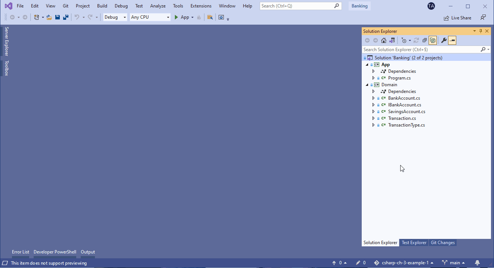
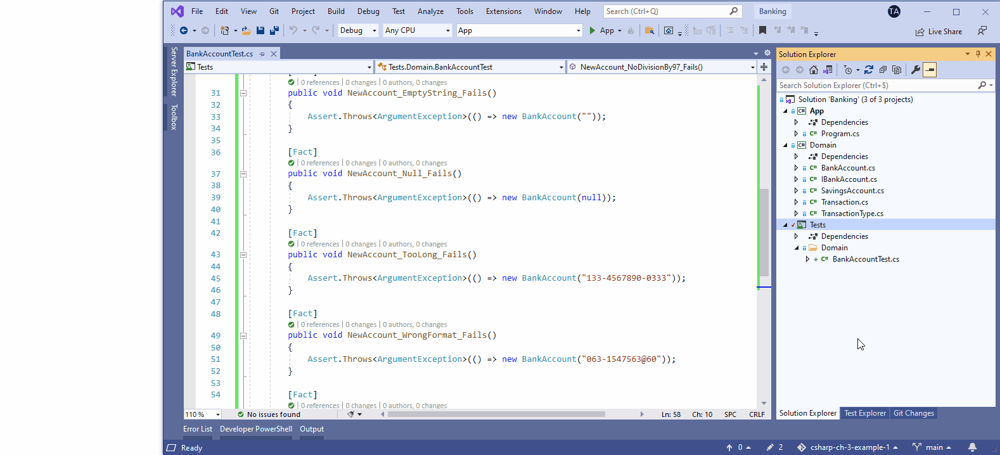

class: dark middle

# Enterprise Web Development C&#35;
> Chapter 3 - Solving The Problem Domain

---
### Chapter 3 - Solving The Problem Domain
# Table of contents

- [The Visual Studio Solution](#vs-solution)
- [The sample application](#sample-application)
- [Classes](#classes)
- [Associations &amp; collections](#associations)
- [Inheritance](#inheritance)
- [Polymorphism](#polymorphism)
- [Abstract class](#abstract-class)
- [Interface](#interface)
- [Static members](#static-members)
- [Delegates &amp; Events](#events)
- [Unit Testing](#unit-testing)

---
name: vs-solution
class: dark middle

# Solving The Problem Domain
> The Visual Studio Solution

---
### The Visual Studio Solution
# Projects

* **Every idea starts with a project** (app, website...)
* Contains all files for **one executable, library or website**
* Can contain source code, images, data files...
* Contains compiler settings and other configuration

---
### The Visual Studio Solution
# Project file

* Visual Studio builds with **MSBuild**
* **Every project has a project file** (C# extension `.csproj`)
* **XML** document with all information and instructions
  * content
  * platform requirements
  * versioning information
  * web/database server settings
  * tasks to perform


---
### The Visual Studio Solution
# Solution

* **Container for one or more projects**
* Also contains build information, VS window settings...
* Extension `.sln`

<br />


---
name: sample-application
class: dark middle
# Solving The Problem Domain
> The sample application

---
### The sample application
# Domain Class Diagram


---
name: classes
class: dark middle

# Solving The Problem Domain
> Classes

---
### Classes
# Members of a class

- [Fields (= attributes)](#fields)
- [Methods](#methods)
- [Constructor](#constructor) - [destructor](#destructor)
- [Properties](#properties)
- Events (later)

---
### Classes
# Access modifiers for members

- `public`
  - accessible from everywhere, no limits
- `private`
  - only accessible from within the class
  - *this is the default*
- `internal`
  - only accessible within the same assembly
  - an assembly = one unit of deployment, version control...
- `protected`
  - only accessible within the class and all classes who inherit from this class
  - in Java: also accessible in same package, not in C#!
- `protected internal`
  - combination of `protected` and `internal`

---
### Classes

# Access modifiers for classes

Classes, structs or records directly declared in a namespace can be `public` or `internal` (default).

> Directly declared in a namespace = not nested within another class or struct

Nested classes or structs _in structs_ can be declared `public`, `internal` or `private`.

Nested classes or structs _in classes_ can be declared all of the previous ones (`public`, `private`, `protected`, `internal` or `protected internal`).

The default for nested classes or structs is `private`.

> Derived classes and records can't have greater accessibility than their base types (see later).

---
name: fields
### Classes
# Fields

> **[modifier]** *datatype variableName*

* Encapsulation of data
* Can be **variables** or **constants**
* Always **`private`**
* Can be **`static`**
  * linked to the class and not to an instance
  * static members only exist once per class
* Naming convention: **_camelCase**

```{cs}
public class BankAccount
{
  private string _accountNumber;
  private decimal _balance;
}
```

---

### Classes
# Constants

* Use the keyword **`const`**
* Must be **initialized** when declared
* Value can **never change**
* Implicit **`static`**, doesn't have the keyword
* Name convention: **PascalCase**

```{cs}
public class BankAccount
{
  public const decimal WithdrawCost = 0.25M;
}
```

**Accessed through the class name:**

```{cs}
Console.WriteLine(BankAccount.WithdrawCost);
```

---

### Classes
# readonly

* Use the keyword **`readonly`**
* Can only be **assigned a value once**
  * at **declaration** OR
  * in the **constructor**
  * not required at declaration <> `const`

```{cs}
public class BankAccount
{
  private readonly string _accountNumber;
  private decimal _balance;
}
```

---
name: methods
### Classes
# Methods

> **[modifier]** return_type MethodName([parameters]) { ... }

* **Operations** the object can execute
* May or may not (`void`) return a value
* Can be `static`
* Name convention: **PascalCase**

```{cs}
public class BankAccount
{
  private readonly string _accountNumber;
  private decimal _balance;

  public void Deposit(decimal amount)
  {
    throw new NotImplementedException();
  }
}
```

---
### Methods
# Parameter list

* **separated by a comma**
* have a **type** and **name** (camelCase)
* if no parameters, use ()
* can be **optional**
  * can have a default value
  * no value is required when calling the method
  * last in the list

```{cs}
public void ExampleMethod(int required, int optionalInt = 10)
{
  throw new NotImplementedException();
}

// Calling this method
ExampleMethod(5); // optionalInt will be 10
ExampleMethod(5, 8); // optionalInt will be 8
```

---
### Methods
# Named arguments

- not every optional parameter may have a value
- what if you only want to give a value for the last int?

```{cs}
public void ExampleMethod(int required,
  string optionalStr = "default value", int optionalInt = 10)
{
  throw new NotImplementedException();
}
```

- use **named arguments**

```{cs}
ExampleMethod(5, `optionalInt`: 8);
```

---
### Methods
# Passing parameters (1)

Parameters can be passed in 3 ways:
* **value** parameters
  * input parameters

```
public void Test1(int x)
{
  x += 1;
}

int i = 0;
Test1(i); // i is still 0
```

---
### Methods
# Passing parameters (2)

Parameters can be passed in 3 ways:

* **ref** parameters
  * must write **`ref`** when declaring and passing value
  * passed variable must be initialized
  * **every change** to the variable's value will be **reflected** to the ref parameter

```
public void Test2(ref int x)
{
  x += 1;
}

int i = 0;
Test2(ref i); // i has now value 1
```

---
### Methods
# Passing parameters (3)

Parameters can be passed in 3 ways:

* **out** parameters
  * must write **`out`** when declaring and passing value
  * passed variable must not be initialized
  * the **method must assign a value** to the out parameter

```
public void Test3(out int x)
{
  x = 10;
}

int i = 0;
Test3(out i); // i has now value 10
```

---
### Methods
# Passing parameters (4)

> **Passing objects as value parameters, copies the references**

* You can change properties and fields of the object
* But not the actual variable's value
  * only possible with `ref` keyword

```{cs}
public void Demonstrate1(BankAccount bankAccount)
{
  bankAccount = null;
}

public void Demonstrate2(ref BankAccount bankAccount)
{
  bankAccount = null;
}

BankAccount myAccount = new BankAccount();
Demonstrate1(myAccount); // myAccount won't be null
Demonstrate2(ref myAccount); // myAccount is null now
```

---
### Methods
# Return types

Methods can also have a return type

```{cs}
public decimal GetBalance()
{
  return _balance;
}
```

**return** statement
* can be **anywhere** in the method's code
* can occur **multiple times**
* returns the **value of the method**
* **method's execution is immediately stopped**
  * maybe some `finally` code needs to be executed
  * or resources need to be cleaned up (with `using`)

---
name: constructor
### Classes
# Constructor

> **[modifier]** ClassName([parameters]) { ... }

* Name is equal to the **class name**
* Has a **no return type**
* Not required, you get a default constructor or free
  * if one constructor is defined, you won't get it :(
* A class can have more than one constructor
  * differ in number and/or type of parameters
* **Re-use constructors** with `: this(...)` after the parameter list

```{cs}
public BankAccount(string accountNumber) { /* ... */ }

public BankAccount(string accountNumber,
  decimal balance): this(accountNumber)
{
  throw new NotImplementedException();
}
```

---
### Classes
# Constructor

A constructor also supports **optional parameters**

```{cs}
public BankAccount(string accountNumber, decimal balance = 0M)
{
  throw new NotImplementedException();
}
```

> This way **no overloading is needed** and two constructors have been reduced to one.

> Visual Studio snippet: **ctor + tab**

---
### Classes
# Constructor

Declaration and instantiation can be seperate

```{cs}
BankAccount myAccount;
myAccount = new BankAccount("123-123123-12");
```

Or in one statement

```{cs}
BankAccount myAccount = new BankAccount("123-123123-12");
```

---
### Classes
# Constructor

If the setter for `Balance` was public, but there is no constructor to set it right away, there is a solution: **object initializers**.


```{cs}
BankAccount account = new BankAccount("123-123123-12");
myAccount.Balance = 200M;

// Is equal to
BankAccount account = new BankAccount("123-123123-12") { Balance = 200M };
```

---
name: destructor
### Classes
# Destructor

* **Cleans** objects
* Automagically executed when garbage collector releases an object
* Name is equal to the **class name** with a tilde (~) as prefix
* Has **no access modifier, no parameters**
* Rarely used, better to inherit from `IDisposable`

```{cs}
public class BankAccount
{
  ~BankAccount()
  {
    // Yes, I do the cleaning
  }
}
```

---
name: properties
### Classes
# Properties

* Combination of fields and methods, **used as if it's a field**
* Consists of 1 or 2 pieces of code: **getter and/or setter**
  * getter: executed when property is being read
  * setter: executed when property is assigned a value
* Name convention: **PascalCase**

```{cs}
public class BankAccount
{
  private string _accountNumber;

  public string AccountNumber
  {
    get { return _accountNumber; }
    set { _accountNumber = `value`; }
  }
}

string accountNumber = myAccount.AccountNumber;
myAccount.AccountNumber = "12-456376-25";
```

???

* This property is called `AccountNumber` and has type `string`.
* `get` is the getter and is more convenient and less boiler plate than Java
  * is executed when the property is read
* `set` is the setter
  * is executed when the property is assigned a value
  * `value` is a keyword in C# which contains the value that is being assigned (and obviously has the same type as the property)

---
### Classes
# Properties

* don't always need getter and setter
  * **read-only property**: only `get`
  * **write-only property**: only `set`
* get/set **inherit access level from the property**, but can be changed

```{cs}
public class BankAccount
{
  private decimal _balance;

  public decimal Balance
  {
    get { return _balance; }
    `private` set { _balance = value; }
  }
}
```

---
### Classes
# Properties: Automatic properties

> You don't always need a field, there is a **shortcut**

> Visual Studio snippet: **prop + tab**

```{cs}
public class BankAccount
{
  public decimal Balance { get; set; }
}
```

The compiler will still use a field behind the scenes, but this is much more convenient for simple properties.


---
### Classes
# Properties: Automatic properties

You can also change the access level

```{cs}
public class BankAccount
{
  public decimal Balance { get; `private` set; }
}
```

Initializing a property when declaring is easy peasy

```{cs}
public class BankAccount
{
  public decimal Balance { get; private set; } `= 0M;`
}
```
**Read-only** properties only have a `get` and can be initialized as above or in the constructor.

---
### Classes
# Regions

* Used to **group pieces of code**
  * can be collapsed and opened
* Best practice: at least **4 regions: Fields, Constructors, Methods, Properties**


```{cs}
public class BankAccount
{
  #region Properties
  public string AccountNumber { get; };
  public decimal Balance { get; private set; } = 0M;
  #endregion
}
```

> In Visual Studio: select code > right click > Snippet > Surround with > #region

---
### Classes
# Example

Let's implement the `BankAccount` class!


---
### Create a new project in Visual Studio 2019


---
### Create an empty `BankAccount` class


---
### Pushing your changes to GitHub


> Or use GitKraken or the git CLI, whatever you like

---
name: associations
class: dark middle

# Solving The Problem Domain
> Associations &amp; collections

---
### Associations &amp; collections
# Associations

Associations are relations between classes:
* one to one
* one to many
* many to one
* many to many

> It's just a member of a class with a (list of a) class as type.

---
### Associations &amp; collections
# Example


Two associations in `Transaction` class:
* `TransactionType`: one to one
* `_transactions`: one to many - use a Collection

> Note: `Transaction` is **immutable** (no setters)

---
### Associations &amp; collections
# Collections

* Collections are **generic types**
* Can only contain items of that type
* Namespace: `System.Collections.Generic`
* Always **use collection interfaces**
  * better testable code
  * loosely coupled

---
### Associations &amp; collections
# Collection interfaces


<br />


---
### Collections
# IEnumerable&lt;T&gt;

* Most important interface
* You can **iterate over its items**
* Offers an **enumerator** to iterate through the collection
* `T` is the **generic** type parameter (can be any class, struct or record)

<br />


```{cs}
// Short way to create a list
IEnumerable<string> list = new List<string>
{
  "Monday", "Tuesday", "Wednesday", "Thursday", "Friday",
  "Saturday", "Sunday"
}
```

---
### Collections
# ICollection&lt;T&gt;

* Implements `IEnumerable<T>`
* Knows the **number of items**
* Knows if its items can be **manipulated**


```{cs}
ICollection<string> list = new List<string>
{
  "Monday", "Tuesday", "Wednesday", "Thursday", "Friday",
  "Saturday", "Sunday"
}
```

---
### Collections
# IList&lt;T&gt;

* Implements `ICollection<T>`
* Can manipulate its items
* Index-based access to the items
  * first index is 0
  * use square brackets: `[index]`
* Some useful methods:
  * `Add(T item): int`
  * `Clear(): void`
  * `Insert(int index, T item): void`
  * `Remove(T item): void`
  * `RemoveAt(int index): void`

---
### Associations &amp; collections
# Implementations

C# has different types of collections, all serving its unique purpose:
* **List**: just a simple list of items
* **ArrayList**: a simple list to store `object`s, no type is given
* **Stack**: LIFO structure
* **Queue**: FIFO structure
* **Dictionary**: list of key-value pairs in unordered way
* **Hashtable**: list of key-value pairs stored by a hash of the key

Learn about collection with this [tutorials](https://www.tutorialsteacher.com/csharp/csharp-collection).

---
### Associations &amp; collections
# Example


Let's implement the `Transaction` class! Update the `BankAccount` class with its association with `Transaction`. Don't forget to update its two methods.


> You might need computed properties for `IsDeposit` or `IsWithdraw`, see [Properties with backing fields](https://docs.microsoft.com/en-us/dotnet/csharp/programming-guide/classes-and-structs/properties#properties-with-backing-fields) or even [Expression body definitions](https://docs.microsoft.com/en-us/dotnet/csharp/programming-guide/classes-and-structs/properties#expression-body-definitions)

---
name: inheritance
class: dark middle

# Solving The Problem Domain
> Inheritance

---
### Solving The Problem Domain
# Inheritance

* Mechanism to **reuse code**
* **Superclass** contains shared properties and methods
* **Subclass inherits all** `public` and `protected` members
  * `private` members are not accessible/inherited
* **Subclass extends or specialises** the superclass' behavior
* **"Is a"** relation between sub- and superclass

---
### Inheritance
# Superclass definition

Nothing special is needed in the superclass

```{cs}
public class BankAccount { /* ... */ }
```

If no class can inherit from a given class, it must be **sealed**

```{cs}
public `sealed` class BankAccount { /* ... */ }
```

---
### Inheritance
# Subclass definition

A subclass defines its superclass after the classname, followed by a colon

```{cs}
public class SavingsAccount `: BankAccount` { /* ... */ }
```

A class can **only inherit from one class**, no multiple inhertance allowed.


---
### Inheritance
# Constructors

* Constructors are **not inherited**
* If no constructors are written, you get a default constructor for free
  * It'll call the superclass' constructor
  * Will give an error if the superclass has no default constructor


* **Keyword `base`**: call method/constructor of superclass
* Keyword `this`: references the current instance

---
### Inheritance
# Constructors

```{cs}
public class SavingsAccount: BankAccount
{
  public decimal IntrestRate { get; set; };

  public SavingsAccount(string accountNumber, decimal intrestRate)
    : `base(accountNumber)` // call constructor of BankAccount
  {
    IntrestRate = intrestRate;
  }

  public SavingsAccount(string accountNumber, decimal intrestRate,
    bool goldMember) : `this(accountNumber, intrestRate)`
  // call the other constructor of SavingsAccount
  {
    // ...
  }
}
```

---
### Inheritance
# Methods

* By default methods cannot be overriden in the subclass
* **Keyword `virtual`** is needed in the superclass

```{cs}
public `virtual` void Withdraw(decimal amount)
{
  _transactions.Add(new Transaction(amount, TransactionType.Withdraw));
  Balance -= amount;
}
```

* **Keyword `override`** is needed in the subclass

```{cs}
public `override` void Withdraw(decimal amount)
{
  base.Withdraw(amount);
  base.Withdraw(WithdrawCost);
}
```

---
### Inheritance
# Methods

The compiler will always choose the right implementation, depending on the runtime type.

```{cs}
BankAccount account1 = new BankAccount("123-123123-12");
BankAccount account2 = new SavingsAccount("123-123123-13", 0.1M);

account1.Withdraw(100M); // method from BankAccount
account2.Withdraw(100M); // method from SavingsAccount
```

---
### Inheritance
# Object class

* **Every object** in C# implicitly **inherits from `System.Object`**
  * No need to write this
* You get these methods for free with this behaviour
  * `ToString()`: returns the class name
  * `Equals(Object)`: returns true
      * if two reference variables reference the same object or
      * if two value variables have the same value
  * `GetHashCode()`: used in hash-based collections (e.g. `Dictionary`)
* In most cases, one wants to override these methods

---
### Inheritance
# Example

Now implement the `SavingsAccount` class! Also add a `ToString`, `Equals` and `GetHashCode` to the class `BankAccount`.


---
name: polymorphism
class: dark middle

# Solving The Problem Domain
> Polymorphism

---
### Solving The Problem Domain
# Polymorphism

* Can happen when classes inherit from each other
* Makes easy to save instances of a subclass in a collection of the superclass

```{cs}
IList<BankAccount> accounts = new List<BankAccount>();
accounts.Add(new BankAccount("123-123123-12"));
accounts.Add(new SavingsAccount("123-123123-13", 0.1M));
accounts.Add(new SavingsAccount("123-123123-13", 0.05M));
```

* Executes the correct method depending on the instance type

```{cs}
IList<BankAccount> accounts = new List<BankAccount>();

foreach (var account in accounts)
{
  account.Withdraw(10M);
}
```

---
### Solving The Problem Domain
# Polymorphism

Checking the type of the instance is possible with the **`is` keyword**

```{cs}
BankAccount s = new SavingsAccount("123-123123-13", 0.1M)
if (s is SavingsAccount)
{
  // Do something useful
}
```

---
name: abstract-class
class: dark middle

# Solving The Problem Domain
> Abstract class

---
### Solving The Problem Domain
# Abstract class

* A class with **one or more abstract methods is an abstract class**
* An abstract class can also have normal members
* **Cannot be instantiated**, a subclass should be used to create an instance
* **Keyword `abstract`**
* A subclass of an abstract class should implement all abstract methods or be an abstract class itself
  * **Implementation** of method should use **keyword `override`**

---
### Abstract class
# Example

The class `BankAccount` is now abstract because of the `Print` method.

```{cs}
public abstract class BankAccount
{
  public virtual void Withdraw(decimal amount) { /* ... */ }
  `public abstract string Print();`
}
```

Now let's implement this in our example.

---
name: interface
class: dark middle

# Solving The Problem Domain
> Interface

---
### Solving The Problem Domain
# Interface

* An interface defines a **contract**
* Any **class or struct** which implements an interface should **implement all members in the contract**
* An interface may define a **default implementation** for members (since C# 8.0)
* Can also define static members (= single implementation for common functionality)
* **Cannot be instantiated**
* Name convention: start with an `I`

---
### Interface
# Example

Let's create an interface for the `BankAccount` class. Remove the abstract method from `BankAccount`.


---
name: static-members
class: dark middle

# Solving The Problem Domain
> Static members

---
### Solving The Problem Domain
# Static members

* Information **linked to the class**, not to an instance
* Are **always accessible**, even without an instance
* **Keyword `static`**
* Accessed through the class name

Declaring a static member

```{cs}
public class SavingsAccount: BankAccount
{
  public `static` int nrOfAccounts = 0;
}
```

And accessing it

```
int total = SavingsAccount.nrOfAccounts;
```

---
### Solving The Problem Domain
# Static class

* A class can also be static
* **Only static members**
* **Cannot be instantiated**
* Are **sealed**, cannot be inherited

The class `Math` is static

```{cs}
double result = Math.Cos(45);
```

---
name: events
class: dark middle

# Solving The Problem Domain
> Delegates &amp; Events

---
### Delegates &amp; Events
# Events

* **Something that happened** during the execution of a program
* **Inform others** about it (i.e. some other piece of code)
* Examples:
  * a new user was created
  * a product was added to a cart
  * some user changed something
  * someone scored a certain amount of points
  * ...

---
### Delegates &amp; Events
# Events

* Based on the **delegate model**
* Follows the [observer design pattern](https://refactoring.guru/design-patterns/observer).
* Type of message sent by an object to signal the occurence of an action
* Typically a member of the event sender
* Event sender doesn't know which object or method will receive (or handle) his events

???
### Observer
With this pattern you enable subscriber to register with and receive notifications from a provider. The event sender (= provider) pushes a notification after an event occured, the event receiver (= subscriber) receives it and does something with it.

---
### Events
# Definition

Simply add the `event` keyword before the declaration of an `EventHandler`.

```{cs}
class Counter {
  `event EventHandler ThresholdReached;`
}
```

The EventHandler can also get a type parameter: `EventHandler<TEventArgs>`.

---
### Events
# Emitting an event

Define a `protected` and `virtual` method following the name convention **On*EventName***. This method always has **one parameter** of type **`EventArgs`** which contain the event data, if present.

```{cs}
class Counter {
  event EventHandler ThresholdReached;

  `protected virtual void OnThresholdReached(EventArgs e) {`
    `ThresholdReached?.Invoke(this, e);`
  `}`
}
```

---
### Events
# Event arguments

* Every event can have arguments (not required!)
* Create a **subclass of `EventArgs`**
  * Has a static property **`Empty`**
  * Used for events without arguments
  * Pass `EventArgs.Empty` to the second parameter of the handler
* Add the arguments as **properties** in this new class

```{cs}
public class ThresholdReachedEventArgs : EventArgs
{
  public int Threshold { get; set; }
  public DateTime TimeReached { get; set; }
}
```

---
### Events
# Event arguments

Example of empty event arguments

```{cs}
public class Counter
{
  private int threshold;
  private int total;
  public event EventHandler ThresholdReached;

  public Counter(int passedThreshold) { /* ... */ }

  public void Add(int x)
  {
    total += x;
    if (total >= threshold)
      `OnThresholdReached(EventArgs.Empty);`
  }

  protected virtual void OnThresholdReached(EventArgs e) { /* ... */ }
}
```

---
### Events
# Event arguments

Example of custom event arguments

```{cs}
public class Counter
{
  private int threshold;
  private int total;
  public event EventHandler ThresholdReached;

  public Counter(int passedThreshold) { /* ... */ }

  public void Add(int x)
  {
    total += x;
    if (total >= threshold)
      `OnThresholdReached(new ThresholdReachedEventArgs() {`
        `Threshold = threshold, TimeReached = DateTime.Now });`
  }

  protected virtual void OnThresholdReached(EventArgs e) { /* ... */ }
}
```

---
### Delegates &amp; Events
# Delegates

* Reference type
* Holds a **reference to a method**
* **Declares signature** of the method: return type and parameters
  * Can only hold references to methods with an exact match
  * Type-safe function pointer (as in C++ for example) or a callback (JavaScript)
* **Intermediary** between event source and code that handles it
* **Multicast**: can hold more than one reference
* `EventHandler` itself is a delegate: look at the [documentation](https://docs.microsoft.com/en-us/dotnet/api/system.eventhandler?view=net-5.0).
* Can also be **used to emit events**, it's easier to define the arguments.
  * No inheritance of `EventArgs` needed

---
### Delegates
# Definition

Define a `public` `void` method using the **keyword `delegate`** and declaring the parameters.

```{cs}
public `delegate` void ThresholdReachedEventHandler(object sender,
  ThresholdReachedEventArgs e);
```

Or even with custom arguments

```{cs}
public delegate void OnThresholdReached(`int threshold`);
```

---
### Delegates &amp; Events
# Example

Add an event to a BankAccount which emits a transaction when one is added.

> Why do we need a setter for `TransactionAdded`?


---
name: unit-testing
class: dark middle

# Solving The Problem Domain
> Unit Testing

---
### Solving The Problem Domain
# Unit Testing 

Always write tests, use a **Test Driven Development (TDD)** approach


---
### Unit Testing
# Test Driven Development

The idea of TDD:
* write a **test**
* let it **fail**
* make it **pass**
* **improve** your code (= refactor)

> **Refactoring** <br />
> &nbsp;&nbsp;= restructuring existing code in order to make it better/cleaner <br />
> &nbsp;&nbsp;!= changing its external behavior


---
### Test Driven Development
# Step by step

1. Create the class you want to test
  * Every method throws a `NotImplementedException`
2. Create a test class
3. Write all tests you need (e.g. for one method)
4. Implement all tests
5. Run the tests -> they fail
6. Adapt the class' code to make the tests pass
7. Run the tests -> they pass
8. Refactor the code
7. Run the tests -> they should still pass
9. Repeat steps 3-9 untill the entire class is implemented

---
### Unit Testing
# When to write tests?

* No silver bullet
* Don't exaggerate
  * don't test boiler plate getters and setters
  * don't test obvious constructors
  * ...
* **Test business logic**
* **Use mocks only when needed**
  * prefer integration testing over unit testing for everything other than business logic
  * testing nothing when everything is mocked
* Make tests **independent of implementation**
  * mocks are implementation aware

---
### Unit Testing
# How to write good unit tests?

Use the **3A pattern**:
* **A**rrange
  * initialization:
      * create an object of the class being tested
      * initialize variables
      * ...
* **A**ct
  * call the method being tested
* **A**ssert
  * check if the result is as expected
  * **only test one thing**
  * use the **Assert** class and its methods

---
### Unit Testing
# Assert

Some useful methods of **Assert**
* **`(Not)Null`**: check if the parameter is (not) null
* **`Empty`**: check if the given collection is empty
* **`Contains`**: check if the given collection contains an element
* **`Is(Not)Type`**: check if the parameter is (not) of a certain type
* **`(Not)Equal`**: check if both parameters are equal
* **`True`**/**`False`**: check if the given parameter is `true`/`false`
* **`Throws`**: check if the given lambda throws an exception

---
### Unit Testing
# What should be tested?

* Be **creative**
* Get inspiration from use cases (if you have any)
* **Test every possible outcome**
  * one normal case
  * every possible error
  * edge case(s)
* Name convention:
  * test class: **`ClassNameTest`**
  * method: **`MethodName_TestCase_Outcome`**
  * constructor: **`NewClassName_TestCase_Outcome`**

---
### Unit Testing
# Show me the code

* **One test class per class**
* Every test is a **`public void` method** with one of these annotations
  * **`[Fact]`**: test with same data (one case)
  * **`[Theory]`**: data driven test (multiple cases at once)
      * use **`[InlineData(/* ... */)]`** or
      * **`[MemberData(nameof(/* field */))]`**
* **Set up** code goes in the constructor
* **Tear down** code goes in the `Dispose` method
  * Inherit from `IDisposable`

---
### Show me the code
# Fact

```{cs}
public class BankAccountTest
{
  `[Fact]`
  `public void NewAccount_BalanceZero`()
  {
    // Arrange
    string accountNumber = "123-4567890-02";
    // Act
    BankAccount account = new BankAccount(accountNumber);
    // Assert
    `Assert.Equal(0, account.Balance);`
  }
}
```

---
### Show me the code
# Theory

```{cs}
public class BankAccountTest
{
  `[Theory]`
  `[InlineData("123-4567890-0333")]` // too long
  [InlineData("063-1547563@60")] // wrong format
  [InlineData("133-4567890-03")] // not divisable by 97
  public void NewAccount_WrongAccountNumber_Fails(`string accountNumber`)
  {
    // Assert
    `Assert.Throws<ArgumentException>(`
      `() => new BankAccount(accountNumber))`
    `);`
  }
}
```

---
### Show me the code
# Theory

```{cs}
public class BankAccountTest
{
  public static IEnumerable<object[]> TestData
  {
      get
      {
          DateTime yesterday = DateTime.Today.AddDays(-1);
          DateTime tomorrow = DateTime.Today.AddDays(1);

          yield return new object[] { null, null, 2 };
          yield return new object[] { yesterday, tomorrow, 2 };
          yield return new object[] { yesterday, yesterday, 0 };
      }
  }

  [Theory]
  `[MemberData(nameof(TestData))]`
  public void GetTransactions_ReturnsTransactions(`DateTime? from,`
    `DateTime? till, int expected`) { /* ... */ }
}
```

---
### Unit Testing
# Example

* Create a new **xUnit Test Project** called `Tests`
* Add a **reference to** the **Domain** project
* Remove the class `UnitTest1.cs`
* Create a new class named `BankAccountTest` in a folder named `Domain`

---
### Create a new test project



> Or use the CLI

---
### Unit Testing
# Example (1)

Create the following tests for **`BankAccount`** (use `"123-4567890-02"` as account number)

| Test name                    | Outcome                             |
| ---------------------------- | ----------------------------------- |
| NewAccount_BalanceZero       | Balance is `0.00`                   |
| NewAccount_SetsAccountNumber | AccountNumber is `"123-4567890-02"` |

> **Hint:** create regions for each method you test

---
### Run the tests



---
### Unit Testing
# Example (2)

Create the following tests for **`BankAccount`**

| Test name                       | AccountNumber      | Outcome                 |
| ------------------------------- | ------------------ | ----------------------- |
| NewAccount_EmptyString_Fails    | `string.Empty`     | `ArgumentException`     |
| NewAccount_Null_Fails           | `null`             | `ArgumentNullException` |
| NewAccount_TooLong_Fails        | `133-4567890-0333` | `ArgumentException`     |
| NewAccount_WrongFormat_Fails    | `063-1547563@60`   | `ArgumentException`     |
| NewAccount_NoDivisionBy97_Fails | `133-4567890-03`   | `ArgumentException`     |

> You might need a [Regex](https://docs.microsoft.com/en-us/dotnet/api/system.text.regularexpressions.regex?view=net-5.0) here<br />
> Checksum account number `"123-4567890-02"`:<br/>&nbsp;&nbsp;(123 + 4567890) % 97 == 2

---
### Unit Testing
# Example (3)

Create the following tests for **`BankAccount`** (use `"123-4567890-02"` or `"123-4567891-03"` as account number)

| Test name                                    | Outcome                       |
| -------------------------------------------- | ----------------------------- |
| Deposit_AmountBiggerThanZero_ChangesBalance  | Balance is changed            |
| Withdraw_AmountBiggerThanZero_ChangesBalance | Balance is changed            |
| Withdraw_NegativeOrZeroAmount_Fails          | `ArgumentOutOfRangeException` |
| Deposit_NegativeOrZeroAmount_Fails           | `ArgumentOutOfRangeException` |
| Equals_SameAccountNumber_ReturnsTrue         | `true`                        |
| Equals_DifferentAccountNumber_ReturnsFalse   | `false`                       |

> Use a `Theory` for the first four tests

---
### Unit Testing
# Example (4)

Now create a test class for **`SavingsAccount`** and **`Transaction`** and think of some test cases yourself.


---
### Unit Testing
# Example (5)

Finally extend the tests for **`BankAccount`** for all transactions stuff.


---
class: dark middle
# Solving The Problem Domain
> Exercise

---
name: exercise
### Excercise
# <a href="https://github.com/HOGENT-Web/csharp-ch-3-exercise" target="_blank">BlackJack</a>

Read the exercise on the <a href="https://github.com/HOGENT-Web/csharp-ch-3-exercise" target="_blank">GitHub repository</a>.


---
class: dark middle
# Solving The Problem Domain
> Solution

---
name: solution
### Solution
# <a href="https://github.com/HOGENT-Web/csharp-ch-3-exercise/tree/solution" target="_blank">BlackJack</a>

<a href="https://github.com/HOGENT-Web/csharp-ch-3-exercise/tree/solution" target="_blank">Here</a> is a solution.


