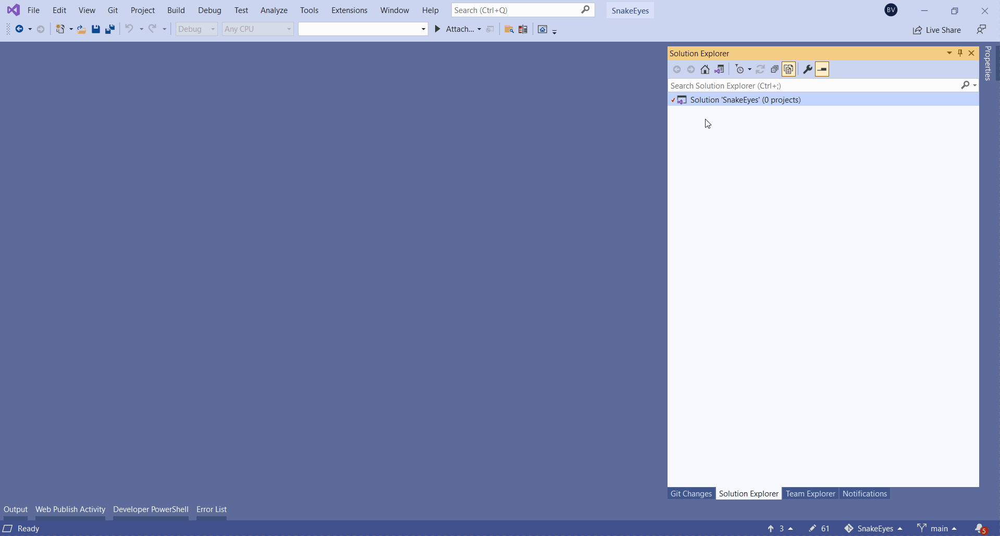

class: dark middle

# Enterprise Web Development C&#35;
> Suit up, wear a Blazor

---
### Suit up, wear a Blazor
# Table of contents

- [Hosting Models](#hosting-models)
- [Blazor Workshop](#introduction)
- [Snake Eyes](#snake-eyes)
- [Unboxing Blazor](#unboxing-blazor)

---
name:introduction
### Suit up, wear a Blazor
# Introduction
- [Single Page Application Framework](https://en.wikipedia.org/wiki/Single-page_application)
- Combination of the words Browser and Razor (.NET HTML View Engine)
- Capable of rendering views on the client.
- Utilises [WebAssembly (WASM)](https://blazor-university.com/overview/what-is-webassembly/)
 - Intermediate Binary like the Common Intermediate Language(CIL)
 - C# is thus compiled to WASM
 - Does not need plugins
 - Can run in all [modern browsers](https://caniuse.com/?search=wasm)
- [Open Source on GitHub](https://github.com/dotnet/aspnetcore/tree/main/src/Components)

---
name:hosting-models
### Suit up, wear a Blazor
# Hosting Models
- Server side
- Client side (WASM)

---
### Hosting Models
# Client Side (WASM)
- Pro's
    - Runs on the client, inside the browser, so it can be deployed as **static files**.
    - Blazor Wasm **can work off-line**.
    - Can easily run as a [Progressive Web App](https://web.dev/progressive-web-apps/).
    - Server load is reduced, since it runs on the Client's machine.
- Con's
    - Is slower since .NET DLL assemblies have to be downloaded (the first time)
    - The Mono Framework interprets .NET Intermediate Language so is slower than running server-side Blazor.
    - Only works on modern browsers
    - Single threaded
    - **Not SEO friendly** by default (server-side pre-rendering)

---
### Hosting Models
# Server Side (WASM)
- Pro's
- Con's


---
name:snake-eyes
### Suit up, wear a Blazor
# SnakeEyes
- We'll develop a SnakeEyes game to learn basic concepts of Blazor
- Concepts of the Game:
    - 2 dices are rolled on the click of a button.
    - If the dices both show `1`, you lose.
    - If the dices are not both equal to 1 you sum up the amount
    - Play as long as you don't get Snake Eyes 🎲-🎲.

> GIF on next slide

---
### SnakeEyes

---
### SnakeEyes
# Creating the Solution
Create a new folder called `SnakeEyes`

```
mkdir SnakeEyes
cd SnakeEyes
```

Initialize the GIT Repository with a `.gitignore`

```
git init
dotnet new gitignore
```

Create a Visual Studio Solution (`.sln`)
```
dotnet new sln
```

---
### SnakeEyes
# Creating the Projects
Create a `src` folder which will contain our projects.
```
mkdir src
cd src
```

Create a Blazor Web Assembly Project called `Client`
```
dotnet new blazorwasm -o Client
```

Create a Class Library called `Domain`
```
dotnet new classlib -o Domain
```

Reference the Domain Class Library in the Client
```
dotnet add Client/Client.csproj reference Domain/Domain.csproj
```

---
### Linking the Solution
Open the Solution in Visual Studio and follow along



> <a href="images/snake-eyes-project-setup.gif" target="_blank">Fullscreen</a>

---
class: dark middle

# Suit up, wear a Blazor
> 📝 Commit: Add Project Files

---
### SnakeEyes
# Why a domain project?
Imagine, you want to re-use this super kewl game in a 
- MVC Application
- Razor Application
- Console Application
- ...

Then we can re-use the `Domain.csproj` with all it's fluffy goodness and just implement the presentation layer.

> TBH: You would probably never do this for this small app, but for bigger apps it might be a good idea.

---
### SnakeEyes
# Domain
Let's implement the following Domain


> For now all the methods can `throw new ImplementedException()`

---
### SnakeEyes - Domain
# Dice
Implement the following:
- `Constructor`
    - Set's the default value of `Dots` which is `6`.
- `Roll()`
    - Uses the `_randomizer` to set the `Dots` to a value between `1` and `6`
    > Google is your friend for this one...
- `Eye1 | Eye2`
    - Return the `Dots` (which should be private) of `_dice1` and `_dice2`.

---
### SnakeEyes - Domain
# Game
Implement the following:
- `Constructor`
    - Uses the `Initialize()` method
- `Restart()`
    - Uses the `Initialize()` method
- `Initialize()`
    - Initializes the 2 `Dice`s
- `Play()`
    - Rolls the 2 `dice`s
    - Checks if the game is finished (HasSnakeEyes)
    - If so :Adds the `Total` to the `_highscores` and resets the `Total`.
    - If not: Adds the sum of the 2 Eyes / Dices to the `Total`.


---
class: dark middle

# Suit up, wear a Blazor
> 📝 Commit: Implement Domain

---
name:unboxing-blazor
### SnakeEyes - Client
# Unboxing the Client
```
Dependencies
Properties
|- launchSettings.json 
wwwroot
|- css
|- sample-data
   |- weather.json
|- favicon.ico
|- index.html
Pages
|- Counter.razor
|- FetchData.razor
|- Index.razor
Shared
|- MainLayout.razor
|- NavMenu.razor
|- SurveyPrompt.razor
_Imports.razor
App.razor
Program.cs
```
> Read more about the structure <a target="_blank" href="https://docs.microsoft.com/en-us/aspnet/core/blazor/project-structure?view=aspnetcore-5.0#blazor-webassembly-1">here</a>

---
### Unboxing the Client
# launchSettings.json


- Is only used on the local development machine.
- Contains profile settings.

> Read more about profils <a target="_blank" href="https://docs.microsoft.com/en-us/aspnet/core/fundamentals/environments?view=aspnetcore-5.0#development-and-launchsettingsjson-1">here</a>

---
### Unboxing the Client
# wwwroot
- **Static assets** which are available on the Web Server.
- Can be downloaded by the client.
```
css
|- bootstrap
       |- bootstrap.min.css  // Default template is bootstrap.
|- open-iconic           // Some Fonts to use in App.css
       |- font
|- app.css               // Main CSS file 
sample-data              
|- weather.json          // Mock JSON data for the FetchData.razor page
favicon.ico              // Icon in the browser tab
index.html               // Entry point of the client.
```

---
### Unboxing the Client
# index.html
```html
<!DOCTYPE html>
<html>
<head>
    <title>Client</title>
    <base href="/" />
    <link href="css/bootstrap/bootstrap.min.css" rel="stylesheet" />
    <link href="css/app.css" rel="stylesheet" /> // Main CSS File
    <link href="Client.styles.css" rel="stylesheet" /> 
    <!-- Compiled Scoped CSS File -->
</head>
<body>
    <!-- Looks for the <App/> component and loads it here. -->
    <div id="app">Loading...</div> 
    <div id="blazor-error-ui">
        An unhandled error has occurred.
        <a href="" class="reload">Reload</a>
        <a class="dismiss">🗙</a>
    </div>
    <!-- Starts | Bootstraps the Blazor Application -->
    <script src="_framework/blazor.webassembly.js"></script> 
</body>
</html>
```

---
### Unboxing the Client
# Index.razor
```
*@page "/"

<h1>Hello, world!</h1>

Welcome to your new app.

*<SurveyPrompt Title="How is Blazor working for you?" />
```
- Is a page, specified by the `@page` directive
- Navigate to **`/`** and you'll see this page.
- Uses HTML + C# (Razor)
- Renders a component called `SurveyPrompt`

---
### Unboxing the Client
# SurveyPrompt.razor
```
<div class="alert alert-secondary mt-4" role="alert">
    <span class="oi oi-pencil mr-2" aria-hidden="true"></span>
    <strong>`@Title`</strong>
    <span class="text-nowrap">
        Please take our
        <a target="_blank" class="font-weight-bold" href="google.com">
            brief survey
        </a>
    </span>
    and tell us what you think.
</div>

*@code {
*    [Parameter] public string Title { get; set; }
*}
```
- Is not a page but a component, since there is no `@page` directive
- Has a `[Parameter]` called `Title` that can be passed by the `Parent`

> Read more about components <a target="_blank" href="https://docs.microsoft.com/en-us/aspnet/core/blazor/components/?view=aspnetcore-5.0"> here</a>

---
### Unboxing the Client
# Counter.razor
```
@page "/counter" 

<h1>Counter</h1>
<p>Current count: `@currentCount`</p>
<button class="btn btn-primary" `@onclick="IncrementCount"`>Click</button>
@code {
*   private int currentCount = 0;

*   private void IncrementCount()
*   {
*       currentCount++;
*   }
}
```
- The `code` block can use all the C# goodness you're used to.
- The event handler `@onclick` takes in a delegate.
    - Called the same as HTML ones but don't forget `@`

> Read more about event handling <a target="_blank" href="https://docs.microsoft.com/en-us/aspnet/core/blazor/components/event-handling?view=aspnetcore-5.0"> here</a>

---
### Unboxing the Client
# Counter.razor.cs
```
@page "/counter"  // Counter.razor
<h1>Counter</h1>
<p>Current count: `@currentCount`</p>
<button class="btn btn-primary" `@onclick="IncrementCount"`>Click</button>
```

```
*namespace Client.Pages // Counter.razor.cs
{
    public `partial` class Counter
    {
        private int currentCount = 0;
        void IncrementCount()
        {
            currentCount++;
        }
    }
}
```
- Code behind can be separated into it's own file (recommended)

> Read more about code-behind and partial class support <a target="_blank" href="https://docs.microsoft.com/en-us/aspnet/core/blazor/components/?view=aspnetcore-5.0#partial-class-support-1"> here</a>


---
### Unboxing the Client
# MainLayout.razor
```
*@inherits LayoutComponentBase
<div class="page">
    <div class="sidebar">
        `<NavMenu />`
    </div>
    <div class="main">
        <div class="top-row px-4">
            <a href="/" target="_blank" class="ml-md-auto">About</a>
        </div>
        <div class="content px-4">
            `@Body`
        </div>
    </div>
</div>
```
- MainLayout page for the Application, but can be changed / nested.
- `NavMenu` is a component with navigation links (left side)
- Renders pages inside the `@Body` 

> Read more about layouts <a target="_blank" href="https://docs.microsoft.com/en-us/aspnet/core/blazor/components/layouts?view=aspnetcore-5.0"> here</a>

---
### Unboxing the Client
# NavMenu.razor
```
<ul class="nav flex-column">
    <li class="nav-item px-3">
*     <NavLink class="nav-link" href="" Match="NavLinkMatch.All">
*         <span class="oi oi-home" aria-hidden="true"></span> Home
*     </NavLink>
    </li>
    <li class="nav-item px-3">
      <NavLink class="nav-link" href="counter">
          <span class="oi oi-plus" aria-hidden="true"></span> Counter
      </NavLink>
    </li>
    <li class="nav-item px-3">
      <NavLink class="nav-link" href="fetchdata">
          <span class="oi oi-list-rich" aria-hidden="true"></span> Fetch
      </NavLink>
    </li>
</ul>
```
- Take a look at the source code for <a target="_blank" href="https://github.com/dotnet/aspnetcore/blob/8b30d862de6c9146f466061d51aa3f1414ee2337/src/Components/Web/src/Routing/NavLink.cs">NavLink</a>

> Read more <a target="_blank" href="https://docs.microsoft.com/en-us/aspnet/core/blazor/fundamentals/routing?view=aspnetcore-5.0#navlink-and-navmenu-components-1"> here</a>

---
### Unboxing the Client
# NavMenu.razor.css
```css
h1 { 
    color: brown;
    font-family: Tahoma, Geneva, Verdana, sans-serif;
}
```
- CSS Isolation is used to not leak styles to other components.
- Any `h1` CSS declarations defined elsewhere in the app don't conflict with the `NavMenu` component's styles.
- Convention in file naming: 
  - Component.**razor**
  - Component.**razor.css**
- Used in `index.html`
  - `<link href="Client.styles.css" rel="stylesheet" />`
- Shared CSS can be put inside `wwwroot/css/app.css`


> Read more about CSS Isolation <a target="_blank" href="https://docs.microsoft.com/en-us/aspnet/core/blazor/components/css-isolation?view=aspnetcore-5.0"> here</a>

---
### Unboxing the Client
# App.razor
```html
<Router AppAssembly="@typeof(Program).Assembly" 
        PreferExactMatches="@true">
    <Found Context="routeData">
        <RouteView RouteData="@routeData" 
                   DefaultLayout="@typeof(MainLayout)" />
    </Found>
    <NotFound>
        <LayoutView Layout="@typeof(MainLayout)">
            <p>Sorry, there is nothing at this address.</p>
        </LayoutView>
    </NotFound>
</Router>
```
- Loaded in the index.**html**, bootstraps the App
- Layouts are defined
- 404 page is available, due to the `<Router>` component

> Read more about routing <a target="_blank" href="https://docs.microsoft.com/en-us/aspnet/core/blazor/fundamentals/routing?view=aspnetcore-5.0"> here</a>

---
### Unboxing the Client
# Program.cs
```
namespace Client
{
    public class Program
    {
        public static async Task Main(string[] args)
        {
            var builder = WebAssemblyHostBuilder.CreateDefault(args);
            //Link to index.html and App.razor
            builder.RootComponents.Add<App>("#app"); 
            // Possibility to add Dependency Injection
            // HttpClient in this case, refers to it's own wwwroot folder
            builder.Services.AddScoped(sp => new HttpClient 
            { 
               BaseAddress = new Uri(builder.HostEnvironment.BaseAddress) 
            });

            await builder.Build().RunAsync();
        }
    }
}
```
> Read more about Dependency Injection <a target="_blank" href="https://docs.microsoft.com/en-us/aspnet/core/blazor/fundamentals/dependency-injection?view=aspnetcore-5.0&pivots=webassembly"> here</a>

---
### Unboxing the Client
# FetchData.razor (1)
```
@code {
    private WeatherForecast[] forecasts;
*   protected override async Task OnInitializedAsync()
    {
*       forecasts = await Http.GetFromJsonAsync<WeatherForecast[]>
*       (
*           "sample-data/weather.json" // JSON file in wwwroot
*                                      // Can also be any (JSON) Web API
*       );
    }
    public class WeatherForecast // Data Transfer Object (DTO) Class.
    {
        public DateTime Date { get; set; }
        public int TemperatureC { get; set; }
        public string Summary { get; set; }
        public int TemperatureF => 32 + (int)(TemperatureC / 0.5556);
    }
}
```

> Read more about `OnInitializedAsync` and component lifecycles <a target="_blank" href="https://docs.microsoft.com/en-us/aspnet/core/blazor/fundamentals/dependency-injection?view=aspnetcore-5.0&pivots=webassembly"> here</a>

---
### FetchData.razor (2)
```razor
*@if (forecasts == null) { <p><em>Loading...</em></p> }
else
{
    <table class="table">
        <thead><tr>
            <th>Date</th>
            <th>Temp. (C)</th>
            <th>Temp. (F)</th>
        </tr></thead>
        <tbody>
*           @foreach (var forecast in forecasts)
            `{`
                <tr>
                    <td>`@forecast.Date.ToShortDateString()`</td>
                    <td>`@forecast.TemperatureC`</td>
                    <td>`@forecast.TemperatureF`</td>
                </tr>
            `}`
        </tbody>
    </table>
}
```
> Rendering Razor which is a combination of C# and HTML.

---
### Unboxing the Client
# _Imports.razor
```
@code {
@using System.Net.Http
@using System.Net.Http.Json
@using Microsoft.AspNetCore.Components.Forms
@using Microsoft.AspNetCore.Components.Routing
@using Microsoft.AspNetCore.Components.Web
@using Microsoft.AspNetCore.Components.Web.Virtualization
@using Microsoft.AspNetCore.Components.WebAssembly.Http
@using Microsoft.JSInterop
@using Client
@using Client.Shared
```
Every folder of an app can optionally contain a template file named `_Imports.razor`. The compiler includes the directives specified in the imports file in all of the Razor templates in the same folder and recursively in all of its subfolders.

> Read more about `_Imports.razor` <a target="_blank" href="https://docs.microsoft.com/en-us/aspnet/core/blazor/components/layouts?view=aspnetcore-5.0#apply-a-layout-to-a-folder-of-components-1"> here</a>

---
name:sportstore
### Suit up, wear a Blazor
# SportStore
What we're building:
- A Storestore where customers can buy items
- A Customer can filter items.
- A Customer can add items to his shoppingcart. 
- Administrators can use CRUD operations.
- The client will call a Web API which returns data.
    - > The Web API will be developt in the next chapter.

---
name:sportstore
### Suit up, wear a Blazor
# Second Blazor App
How we're building it:
- Using a blazorwasm template.
- [BULMA](https://bulma.io) will be used as a CSS library
    - Does not contain any JavaScript.
- Put all contracts in a separate classlib


---
name:blazor-workshop
### Suit up, wear a Blazor
# Blazor Workshop

Follow the following tutorial:
- <a href="https://github.com/dotnet-presentations/blazor-workshop" target="_blank">Blazor Workshop</a>
---
