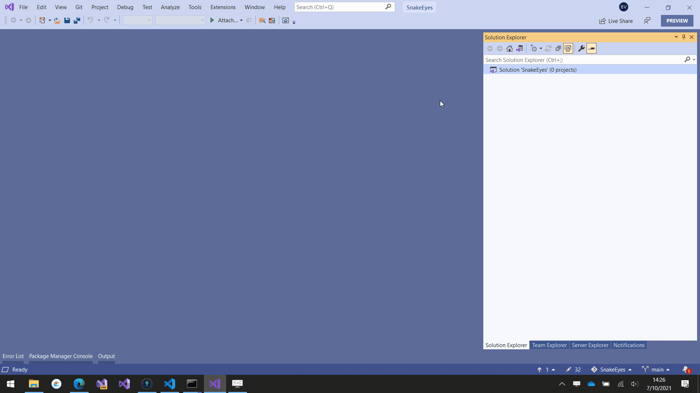
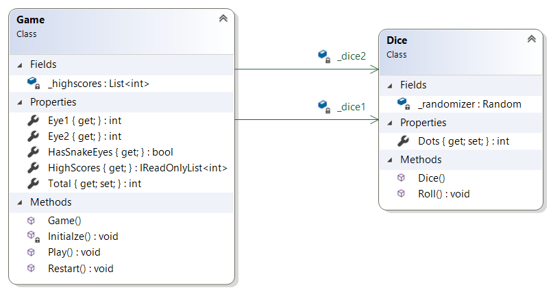

class: dark middle

# Enterprise Web Development C&#35;
> Suit up, wear a Blazor

---
### Suit up, wear a Blazor
# Table of contents

- [Blazor Workshop](#introduction)

---
name:introduction
### Suit up, wear a Blazor
# Introduction
- [Single Page Application Framework](https://en.wikipedia.org/wiki/Single-page_application)
- Combination of the words Browser and Razor (.NET HTML View Engine)
- Capable of rendering views on the client.
- Utilises [WebAssembly (WASM)](https://blazor-university.com/overview/what-is-webassembly/)
 - Intermediate Binary like the Common Intermediate Language(CIL)
 - C# is thus compiled to WASM
 - Does not need plugins
 - Can run in all [modern browsers](https://caniuse.com/?search=wasm)
- [Open Source on GitHub](https://github.com/dotnet/aspnetcore/tree/main/src/Components)

---
name:hosting-models
### Suit up, wear a Blazor
# Hosting Models
- Server side
- Client side (WASM)

---
### Hosting Models
# Client Side (WASM)
- Pro's
    - Runs on the client, inside the browser, so it can be deployed as **static files**.
    - Blazor Wasm **can work off-line**.
    - Can easily run as a [Progressive Web App](https://web.dev/progressive-web-apps/).
    - Server load is reduced, since it runs on the Client's machine.
- Con's
    - Is slower since .NET DLL assemblies have to be downloaded (the first time)
    - The Mono Framework interprets .NET Intermediate Language so is slower than running server-side Blazor.
    - Only works on modern browsers
    - Single threaded
    - **Not SEO friendly** by default (server-side pre-rendering)

---
### Hosting Models
# Server Side (WASM)
- Pro's
- Con's


---
name:snake-eyes
### Suit up, wear a Blazor
# SnakeEyes
- We'll develop a SnakeEyes game to learn basic concepts of Blazor
- Concepts of the Game:
    - 2 dices are rolled on the click of a button.
    - If the dices both show `1`, you lose.
    - If the dices are not both equal to 1 you sum up the amount
    - Play as long as you don't get Snake Eyes 🎲-🎲.

(TODO: Gif here)

---
### SnakeEyes
# Creating the Solution
Create a new folder called `SnakeEyes`

```
mkdir SnakeEyes
cd SnakeEyes
```

Initialize the GIT Repository with a `.gitignore`

```
git init
dotnet new gitignore
```

Create a Visual Studio Solution (`.sln`)
```
dotnet new sln
```

---
### SnakeEyes
# Creating the Projects
Create a `src` folder which will contain our projects.
```
mkdir src
cd src
```

Create a Blazor Web Assembly Project called `App`
```
dotnet new blazorwasm -o App
```

Create a Class Library called `Domain`
```
dotnet new classlib -o Domain
```

Reference the Domain Class Library in the Client
```
dotnet add App/App.csproj reference Domain/Domain.csproj
```

---
### Linking the Solution
Open the Solution in Visual Studio and follow along



> <a href="images/snake-eyes-1.gif" target="_blank">Fullscreen</a>

---
class: dark middle

# Suit up, wear a Blazor
> 📝 Commit: Add Project Files

---
### SnakeEyes
# Why a domain project?
Imagine, you want to re-use this super kewl game in a 
- MVC Application
- Razor Application
- Console Application
- ...

Then we can re-use the Domain.csproj with all it's goodness inside and just implement the presentation layer.

> TBH: You would probably never do this for this small app, but for bigger apps it might be a good idea.

---
### SnakeEyes
# Domain
Let's implement the following Domain


> For now all the methods can `throw new ImplementedException()`

---
### SnakeEyes
# Game
- `Constructor`
    - Uses the `Initialize()` method
- `Initialize()`
    - Initializes the 2 `Dice`s

---
class: dark middle

# Suit up, wear a Blazor
> 📝 Commit: Implement Domain


---
name:sportstore
### Suit up, wear a Blazor
# SportStore
What we're building:
- A Storestore where customers can buy items
- A Customer can filter items.
- A Customer can add items to his shoppingcart. 
- Administrators can use CRUD operations.
- The client will call a Web API which returns data.
    - > The Web API will be developt in the next chapter.

---
name:sportstore
### Suit up, wear a Blazor
# Second Blazor App
How we're building it:
- Using a blazorwasm template.
- [BULMA](https://bulma.io) will be used as a CSS library
    - Does not contain any JavaScript.
- Put all contracts in a separate classlib


---
name:blazor-workshop
### Suit up, wear a Blazor
# Blazor Workshop

Follow the following tutorial:
- <a href="https://github.com/dotnet-presentations/blazor-workshop" target="_blank">Blazor Workshop</a>
---
