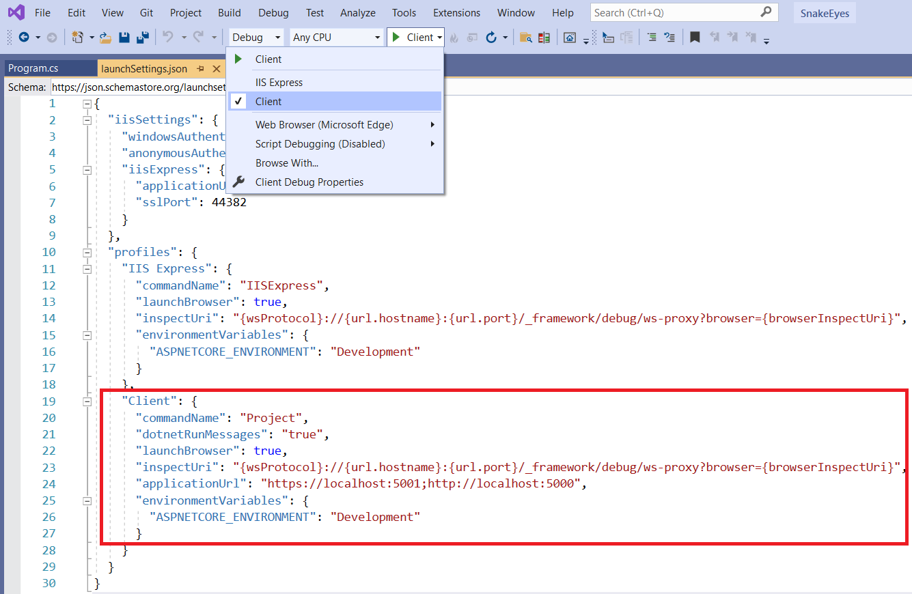
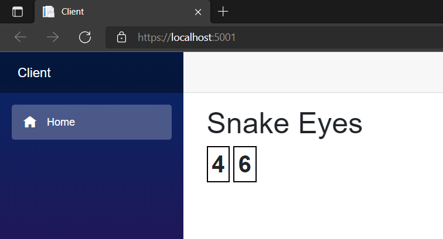
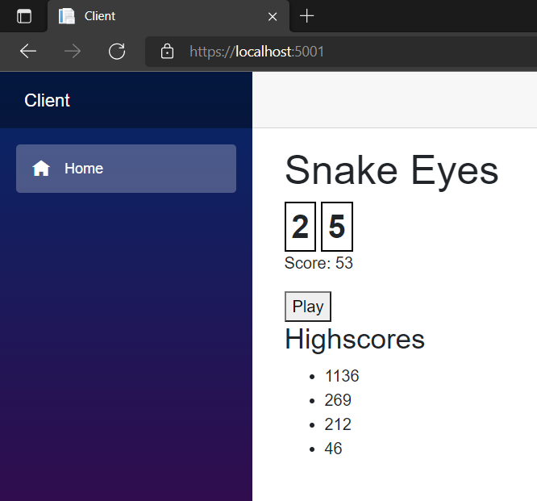
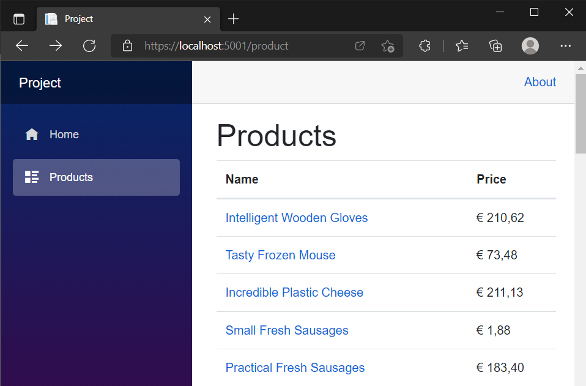
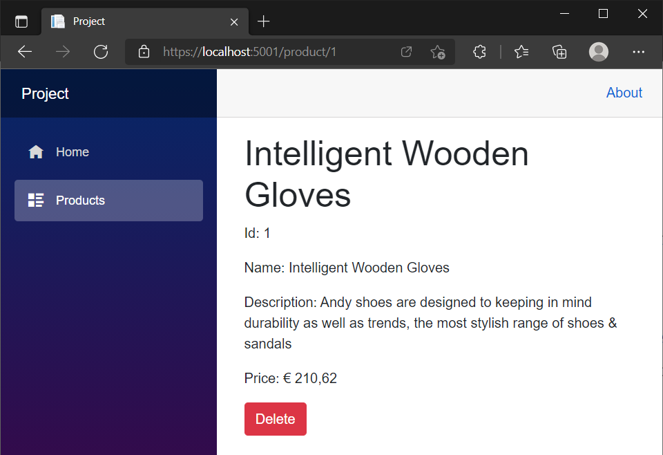

class: dark middle

# Enterprise Web Development C&#35;
> Suit up, wear a Blazor

---
### Suit up, wear a Blazor
# Table of contents

- [Hosting Models](#hosting-models)
- [Snake Eyes](#snake-eyes)
- [Unboxing Blazor](#unboxing-blazor)
- [Deployment](#deployment)
- [Blazor WASM Hosted](#blazor-wasm-hosted)
- [Fake it till you make it](#faking)
- [Workshop](#workshop)


---
### Suit up, wear a Blazor
# Caution

There are a lot of external links to Microsoft's official documentation in this slide deck. The links are part of the educational material and **should** be read by you.

---
name:introduction
### Suit up, wear a Blazor
# Introduction
Blazor:
- [Single Page Application Framework](https://en.wikipedia.org/wiki/Single-page_application)
- Combination of the words Browser and Razor (.NET HTML View Engine)
- Capable of rendering views on the server and client.
- Utilises [WebAssembly (WASM)](https://blazor-university.com/overview/what-is-webassembly/) for client side rendering
 - Intermediate Binary like the Common Intermediate Language(CIL)
 - C# is compiled to WASM
 - Does not need plugins
 - Can run in all [modern browsers](https://caniuse.com/?search=wasm)
- [Open Source on GitHub](https://github.com/dotnet/aspnetcore/tree/main/src/Components)

---
name:hosting-models
### Suit up, wear a Blazor
# Hosting Models
Blazor is a web framework designed to run server-side in ASP.NET (Blazor Server) or client-side in the browser on a WebAssembly-based .NET runtime (Blazor WebAssembly). Regardless of the hosting model, **the app and component models are the same**.
- Server side
- Client side (WASM)

> In this course we'll use Web Assembly (WASM).

> Read more about hosting models <a target="_blank" href="https://docs.microsoft.com/en-us/aspnet/core/blazor/hosting-models?view=aspnetcore-5.0">here</a>.

---
### Hosting Models
# Client Side (WASM)
- Pro's
    - Runs on the client, inside the browser, so it can be deployed as **static files**.
    - Blazor Wasm **can work off-line**.
    - Can easily run as a [Progressive Web App(PWA)](https://web.dev/progressive-web-apps/).
    - Server load is reduced, since it runs on the client's machine.
- Con's
    - Is slower since .NET DLL assemblies have to be downloaded (the first time), cached the second time.
    - The Mono Framework interprets .NET Intermediate Language so is slower than running server-side Blazor.
    - Only works on modern browsers
    - Single threaded
    - **Not SEO friendly** by default (server-side pre-rendering)

---
### Hosting Models
# Server Side
- Pro's
    - Pre-renders HTML content before it is sent to the browser
        - **SEO friendly** by default (server-side pre-rendering)
        - Faster start-up time
    - No requirement for Web Assembly
        - Works on **older browsers** (IE 11) 
        - .NET code can be debugged in Visual Studio (code)
- Con's
    - Server sets up a in-memory session for **every client**
        - Memory and CPU are consumed by the server and not the client
        - Cannot work **without** a internet connection ([SignalR](https://docs.microsoft.com/en-us/aspnet/core/signalr/introduction?view=aspnetcore-5.0))
    - **Latency** can be an issue with events that fire frequently

> Read more about hosting models <a target="_blank" href="https://blazor-university.com/overview/blazor-hosting-models">here</a>.

---
name:snake-eyes
### Suit up, wear a Blazor
# SnakeEyes
- We'll develop a game to learn basic concepts of Blazor WASM
- Concepts of the Game:
    - 2 dices are rolled on the click of a button.
    - If the dices both show `1`, you lose.
    - If the dices are not both equal to 1 you sum up the amount
    - Play as long as you don't get Snake Eyes 🎲-🎲.

> A live version can be found <a href="https://hogent-web.github.io/csharp-ch-6-example-1/" target="_blank">here</a>

---
### SnakeEyes
# Creating the Solution
Create a new folder called `SnakeEyes`

```
mkdir SnakeEyes
cd SnakeEyes
```

Initialize the GIT Repository with a `.gitignore`

```
git init
dotnet new gitignore
```

Create a Visual Studio Solution (`.sln`)
```
dotnet new sln
```

---
### SnakeEyes
# Creating the Projects
Create a `src` folder which will contain our projects.
```
mkdir src
cd src
```

Create a Blazor Web Assembly Project called `Client`
```
dotnet new blazorwasm -o Client
```

Create a Class Library called `Domain`
```
dotnet new classlib -o Domain
```

Reference the Domain Class Library in the Client
```
dotnet add Client/Client.csproj reference Domain/Domain.csproj
```

---
### SnakeEyes
# Linking the .csproj and .sln
Go to the folder where the file `SnakeEyes.sln` is located.
```
cd ..
```

Add the `Client.csproj` to the solution in the `src` folder
```
dotnet sln add src/Client/Client.csproj --solution-folder src 
```

Add the `Domain.csproj` to the solution in the `src` folder
```
dotnet sln add src/Domain/Domain.csproj --solution-folder src 
```

---
### Linking the Solution
If you don't like the CLI, use Visual Studio

<video controls width="100%" class="center">
  <source src="images/snake-eyes-project-setup.mp4" type="video/mp4">
Your browser does not support the video tag.
</video>

---
class: dark middle

# Suit up, wear a Blazor
> 📝 Commit: Add Project Files

---
### SnakeEyes
# Run the app
You should see the following:

<video controls width="100%" class="center">
  <source src="images/run-wasm.mp4" type="video/mp4">
Your browser does not support the video tag.
</video>

---
### SnakeEyes
# Why a domain project?
Imagine, you want to re-use this super kewl game in a 
- MVC Application
- Razor Application
- Console Application
- ...

Then we can re-use the `Domain.csproj` with all it's fluffy goodness and just implement the presentation layer.

> Note: Sharing the `Domain` should **not be done** once we implement the Web API in a later chapter `Ain't no REST for the wicked`.
---
### SnakeEyes
# Domain
Let's implement the following Domain


> For now all the methods can `throw NotImplementedException()`

---
### SnakeEyes - Domain
# Dice
Implement the following:
- `Constructor`
    - Set's the default value of `Dots` which is `6`.
- `Roll()`
    - Uses the `_randomizer` to set the `Dots` to a value between `1` and `6` find out how to [here](https://letmegooglethat.com/?q=C%23+Randomize+value+between+1+and+6).

---
### SnakeEyes - Domain
# Game
Implement the following:
- `Eye1 | Eye2`
    - Return the `Dots` (which should be private but could not be modelled in the class Diagram) of `_dice1` and `_dice2`.
- `Constructor` and `Restart()`
    - Use the `Initialize()` method
- `Initialize()`
    - Initializes the 2 `Dice`s
- `Play()`
    - Rolls the 2 `dice`s
    - Checks if the game is finished (HasSnakeEyes)
    - If so :Adds the `Total` to the `_highscores` and resets the `Total`.
    - If not: Adds the sum of the 2 Eyes / Dices to the `Total`.

---
class: dark middle

# Suit up, wear a Blazor
> 📝 Commit: Implement Domain

---
name:unboxing-blazor
### SnakeEyes - Client
# Unboxing the Client
```
Dependencies
Properties
|- launchSettings.json 
wwwroot
|- css
|- sample-data
   |- weather.json
|- favicon.ico
|- index.html
Pages
|- Counter.razor
|- FetchData.razor
|- Index.razor
Shared
|- MainLayout.razor
|- NavMenu.razor
|- SurveyPrompt.razor
_Imports.razor
App.razor
Program.cs
```
> Read more about the structure <a target="_blank" href="https://docs.microsoft.com/en-us/aspnet/core/blazor/project-structure?view=aspnetcore-5.0#blazor-webassembly-1">here</a>

---
### Unboxing the Client
# launchSettings.json


- Is only used on the local development machine.
- Contains profile settings.

> Read more about profiles <a target="_blank" href="https://docs.microsoft.com/en-us/aspnet/core/fundamentals/environments?view=aspnetcore-5.0#development-and-launchsettingsjson-1">here</a>

---
### Unboxing the Client
# wwwroot
- **Static assets** which are available on the Web Server.
- Can be downloaded by the client.
```
css
|- bootstrap
       |- bootstrap.min.css  // Default template is bootstrap.
|- open-iconic           // Some Fonts to use in App.css
       |- font
|- app.css               // Main CSS file 
sample-data              
|- weather.json          // Mock JSON data for the FetchData.razor page
favicon.ico              // Icon in the browser tab
index.html               // Entry point of the client.
```

---
### Unboxing the Client
# index.html
```html
<!DOCTYPE html>
<html>
<head>
    <title>Client</title>
    <base href="/" />
    <link href="css/bootstrap/bootstrap.min.css" rel="stylesheet" />
    <link href="css/app.css" rel="stylesheet" /> // Main CSS File
    <link href="Client.styles.css" rel="stylesheet" /> 
    <!-- Compiled Scoped CSS File -->
</head>
<body>
    <!-- Looks for the <App/> component and loads it here. -->
    <div id="app">Loading...</div> 
    <div id="blazor-error-ui">
        An unhandled error has occurred.
        <a href="" class="reload">Reload</a>
        <a class="dismiss">🗙</a>
    </div>
    <!-- Starts | Bootstraps the Blazor Application -->
    <script src="_framework/blazor.webassembly.js"></script> 
</body>
</html>
```

---
### Unboxing the Client
# Index.razor
```
*@page "/"
*<PageTitle>Index</PageTitle>

<h1>Hello, world!</h1>

Welcome to your new app.

*<SurveyPrompt Title="How is Blazor working for you?" />
```
- Is a page, specified by the `@page` directive
- Navigate to **`/`** and you'll see this page.
- Uses HTML + C# (Razor)
- Renders a component called `SurveyPrompt`
- The name of the Page is called `Title` which is taken care of by the `PageTitle` component. This can be seen in the browser tab, since it manipules the `<head>` content of the `<html>`.

> Read more about controlling `<head>` content <a target="_blank" href="https://learn.microsoft.com/en-us/aspnet/core/blazor/components/control-head-content?view=aspnetcore-6.0">here</a>.


---
### Unboxing the Client
# SurveyPrompt.razor
```
<div class="alert alert-secondary mt-4" role="alert">
    <span class="oi oi-pencil mr-2" aria-hidden="true"></span>
    <strong>`@Title`</strong>
    <span class="text-nowrap">
        Please take our
        <a target="_blank" class="font-weight-bold" href="google.com">
            brief survey
        </a>
    </span>
    and tell us what you think.
</div>

@code {
    // Demonstrates how a parent component can supply parameters
    [Parameter] public string? Title { get; set; }
}
```

- Is not a page but a component, since there is no `@page` directive.
- A component's name must start with an uppercase character.
- Has a `[Parameter]` called `Title` that can be passed by the `Parent`

> Read more about components <a target="_blank" href="https://docs.microsoft.com/en-us/aspnet/core/blazor/components/?view=aspnetcore-6.0"> here</a>

---
### Unboxing the Client
# Counter.razor
```
@page "/counter" 
<PageTitle>Counter</PageTitle>
<h1>Counter</h1>
<p>Current count: `@currentCount`</p>
<button class="btn btn-primary" `@onclick="IncrementCount"`>Click</button>
@code {
*   private int currentCount = 0;

*   private void IncrementCount()
*   {
*       currentCount++;
*   }
}
```
- The `code` block can use all the C# goodness you're used to.
- The event handler `@onclick` takes in a delegate.
    - Called the same as HTML ones but don't forget `@`

> Read more about event handling <a target="_blank" href="https://docs.microsoft.com/en-us/aspnet/core/blazor/components/event-handling?view=aspnetcore-6.0"> here</a>

---
### Unboxing the Client
# Counter.razor.cs
```
@page "/counter"  // Counter.razor
<h1>Counter</h1>
<p>Current count: `@currentCount`</p>
<button class="btn btn-primary" `@onclick="IncrementCount"`>Click</button>
```

```
*namespace Client.Pages // Counter.razor.cs
{
    public `partial` class Counter
    {
        private int currentCount = 0;
        void IncrementCount()
        {
            currentCount++;
        }
    }
}
```
- Code behind can be separated into it's own file (recommended)

> Read more about code-behind and partial class support <a target="_blank" href="https://docs.microsoft.com/en-us/aspnet/core/blazor/components/?view=aspnetcore-6.0#partial-class-support-1"> here</a>

---
### Unboxing the Client
# MainLayout.razor
```
*@inherits LayoutComponentBase
<div class="page">
    <div class="sidebar">
        `<NavMenu />`
    </div>
    <main>
        <div class="top-row px-4">
            <a href="/" target="_blank" class="ml-md-auto">About</a>
        </div>

        <article class="content px-4">
            `@Body`
        </article>
    </main>
</div>
```
- MainLayout page for the Application, but can be changed / nested.
- `NavMenu` is a component with navigation links (left side)
- Renders pages inside the `@Body` 

> Read more about layouts <a target="_blank" href="https://docs.microsoft.com/en-us/aspnet/core/blazor/components/layouts?view=aspnetcore-6.0"> here</a>

---
### Unboxing the Client
# NavMenu.razor
```
<nav class="flex-column">
    <div class="nav-item px-3">
*           <NavLink class="nav-link" href="" Match="NavLinkMatch.All">
*               <span class="oi oi-home" aria-hidden="true"></span> Home
*           </NavLink>
    </div>
    <div class="nav-item px-3">
        <NavLink class="nav-link" href="counter">
            <span class="oi oi-plus" aria-hidden="true"></span> Counter
        </NavLink>
    </div>
    <div class="nav-item px-3">
        <NavLink class="nav-link" href="fetchdata">
            <span class="oi oi-list-rich" aria-hidden="true"></span> Fetch data
        </NavLink>
    </div>
</nav>
```
- Take a look at the source code for <a target="_blank" href="https://github.com/dotnet/aspnetcore/blob/8b30d862de6c9146f466061d51aa3f1414ee2337/src/Components/Web/src/Routing/NavLink.cs">NavLink</a>

> Read more <a target="_blank" href="https://docs.microsoft.com/en-us/aspnet/core/blazor/fundamentals/routing?view=aspnetcore-5.0#navlink-and-navmenu-components-1"> here</a>

---
### Unboxing the Client
# NavMenu.razor.css
```css
h1 { 
    color: brown;
    font-family: Tahoma, Geneva, Verdana, sans-serif;
}
```
- CSS Isolation is used to not leak styles to other components.
- Any `h1` CSS declarations defined elsewhere in the app don't conflict with the `NavMenu` component's styles.
- Convention in file naming: 
  - Component.**razor**
  - Component.**razor.css**
- Used in `index.html`
  - `<link href="Client.styles.css" rel="stylesheet" />`
- Shared CSS can be put inside `wwwroot/css/app.css`


> Read more about CSS Isolation <a target="_blank" href="https://docs.microsoft.com/en-us/aspnet/core/blazor/components/css-isolation?view=aspnetcore-5.0"> here</a>

---
### Unboxing the Client
# App.razor
```html
<Router AppAssembly="@typeof(App).Assembly">
    <Found Context="routeData">
        <RouteView RouteData="@routeData" 
                   DefaultLayout="@typeof(MainLayout)" />
        <FocusOnNavigate RouteData="@routeData" Selector="h1" />
    </Found>
    <NotFound>
        <PageTitle>Not found</PageTitle>
        <LayoutView Layout="@typeof(MainLayout)">
            <p>Sorry, there's nothing at this address.</p>
        </LayoutView>
    </NotFound>
</Router>

```
- Loaded in the index.**html**, bootstraps the App
- Layouts are defined
- 404 page is available, due to the `<Router>` component
- `FocusOnNavigate` focusses the first `h1` element (can be changed) in the `@Body` after a navigation event.

> Read more about routing <a target="_blank" href="https://docs.microsoft.com/en-us/aspnet/core/blazor/fundamentals/routing?view=aspnetcore-5.0"> here</a>

---
### Unboxing the Client
# Program.cs
```cs
using Microsoft.AspNetCore.Components.Web;
using Microsoft.AspNetCore.Components.WebAssembly.Hosting;
using Client;

var builder = WebAssemblyHostBuilder.CreateDefault(args);
//Link to index.html and App.razor
builder.RootComponents.Add<App>("#app");
builder.RootComponents.Add<HeadOutlet>("head::after");
// Possibility to add Dependency Injection
// HttpClient in this case, refers to it's own wwwroot folder
builder.Services.AddScoped(sp => new HttpClient 
{
    BaseAddress = new Uri(builder.HostEnvironment.BaseAddress) 
});

await builder.Build().RunAsync();
```
> Read more about Dependency Injection <a target="_blank" href="https://docs.microsoft.com/en-us/aspnet/core/blazor/fundamentals/dependency-injection?view=aspnetcore-6.0&pivots=webassembly"> here</a>

---
### Unboxing the Client
# FetchData.razor (1)
```
@code {
    private WeatherForecast[]? forecasts;
*   protected override async Task OnInitializedAsync()
    {
*       forecasts = await Http.GetFromJsonAsync<WeatherForecast[]>
*       (
*           "sample-data/weather.json" // JSON file in wwwroot
*                                      // Can also be any (JSON) Web API
*       );
    }
    public class WeatherForecast // Data Transfer Object (DTO) Class.
    {
        public DateTime Date { get; set; }
        public int TemperatureC { get; set; }
        public string Summary { get; set; }
        public int TemperatureF => 32 + (int)(TemperatureC / 0.5556);
    }
}
```

> Read more about `OnInitializedAsync` and component lifecycles <a target="_blank" href="https://docs.microsoft.com/en-us/aspnet/core/blazor/fundamentals/dependency-injection?view=aspnetcore-6.0&pivots=webassembly"> here</a>

---
### FetchData.razor (2)
```razor
*@if (forecasts == null) { <p><em>Loading...</em></p> }
else
{
    <table class="table">
        <thead><tr>
            <th>Date</th>
            <th>Temp. (C)</th>
            <th>Temp. (F)</th>
        </tr></thead>
        <tbody>
*           @foreach (var forecast in forecasts)
            `{`
                <tr>
                    <td>`@forecast.Date.ToShortDateString()`</td>
                    <td>`@forecast.TemperatureC`</td>
                    <td>`@forecast.TemperatureF`</td>
                </tr>
            `}`
        </tbody>
    </table>
}
```
> Rendering Razor which is a combination of C# and HTML.

> TIP: Check <a target="_blank" href="https://aspnet.github.io/quickgridsamples/sample">QuickGrid</a> for a more sophisticated standard implementation.

---
### Unboxing the Client
# _Imports.razor
```
@using System.Net.Http
@using System.Net.Http.Json
@using Microsoft.AspNetCore.Components.Forms
@using Microsoft.AspNetCore.Components.Routing
@using Microsoft.AspNetCore.Components.Web
@using Microsoft.AspNetCore.Components.Web.Virtualization
@using Microsoft.AspNetCore.Components.WebAssembly.Http
@using Microsoft.JSInterop
@using Client
@using Client.Shared
```
Every folder of an app can optionally contain a template file named `_Imports.razor`. The compiler includes the directives specified in the imports file in all of the Razor templates in the same folder and recursively in all of its subfolders.

> Read more about `_Imports.razor` <a target="_blank" href="https://docs.microsoft.com/en-us/aspnet/core/blazor/components/layouts?view=aspnetcore-6.0#apply-a-layout-to-a-folder-of-components-1"> here</a>

---
### SnakeEyes - Client
# Clean-up - Unused files
Let's remove everything we don't need, remove the following files:

```
wwwroot
|- sample-data (entire folder)
   |- weather.json

Pages
|- Counter.razor
|- FetchData.razor

Shared
|- SurveyPrompt.razor
```

---
### SnakeEyes - Client
# Clean-up - Index**.razor**
Replace the contents of the `Index.razor` with following:

```
@page "/"
<PageTitle>Snake Eyes</PageTitle>

<h1>Snake Eyes</h1>
```

---
### SnakeEyes - Client
# Clean-up - NavMenu.razor
Remove the unused `NavLink` elements and their parent `<div>` elements, keep the rest of the file.

Remove the following:
```
<div class="nav-item px-3">
    <NavLink class="nav-link" href="counter">
        <span class="oi oi-plus" aria-hidden="true"></span> Counter
    </NavLink>
</div>
<div class="nav-item px-3">
    <NavLink class="nav-link" href="fetchdata">
        <span class="oi oi-list-rich" aria-hidden="true"></span> Fetch data
    </NavLink>
</div>
```

---
class: dark middle

# Suit up, wear a Blazor
> 📝 Commit: Clean-up boilerplate

---
### SnakeEyes - Client
# Components
<video controls width="70%" class="center">
  <source src="images/snake-eyes-game.mp4" type="video/mp4">
Your browser does not support the video tag.
</video>

We'd like to show:
- 2 `Dice`s 🎲
- A button to play, when possible else it's disabled
- A label that shows the current score or 0 by default
- A list of highscores ordered by descending
- An `Alert` when you lose the game.
- A restart button only visible when you lost.

---
### SnakeEyes - Client
# Dice
- Create a new solution folder called `Components` in the `Client` project.
- Add a Razor Component called `Dice`
<video controls width="100%" class="center">
  <source src="images/dice.mp4" type="video/mp4">
Your browser does not support the video tag.
</video>

---
### SnakeEyes - Client
# Dice.razor
A dice is a simple `span` element which renders a `Parameter` of type `int` called `pips`.
Implement the component as follows:
```razor
<span>`@Pips`</span>
@code 
{
    [Parameter] public int Pips { get; set; }
}
```

> Since it's such a basic component, we're not using code-behind.

---
### SnakeEyes - Client
# Dice.razor.css
However we still need to style the component in it's scoped .css file
```css
span{
    border: 2px solid black;
    font-size: 2em;
    font-weight: bold;
    padding: 5px;
}
```
- The css will not be leaked to any other components. Therefore we can simply use the `span` selector.
- On compilation the `<link href="Client.styles.css" rel="stylesheet" />` file will contain the css

> See next slide to add a scoped .css file

---
### SnakeEyes - Client
# Dice.razor.css
- The file should be named `Dice.razor.css` exactly, then we can use file-nesting. Which will show the file in the solution explorer beneath the `Dice.razor` file.

<video controls width="100%" class="center">
  <source src="images/dice-file-nesting.mp4" type="video/mp4">
Your browser does not support the video tag.
</video>


---
### SnakeEyes - Client
# Index.razor
Let's use our `Dice` component in the `Index.razor` file and pass constant values `4` en `6` as `Parameter`.

```
@page "/"
*@using Client.Components // namespace of the Dice component

<PageTitle>Snake Eyes</PageTitle>
<h1>Snake Eyes</h1>
*<div>
*    <Dice Pips="4" />
*    <Dice Pips="6" />
*</div>
```

- The using statement can be removed if you add it to the `_Imports.razor` file.
- Notice that the namespace is based on the folder structure.

---
### SnakeEyes - Client
# _Imports.razor
```
@using System.Net.Http
@using System.Net.Http.Json
@using Microsoft.AspNetCore.Components.Forms
@using Microsoft.AspNetCore.Components.Routing
@using Microsoft.AspNetCore.Components.Web
@using Microsoft.AspNetCore.Components.Web.Virtualization
@using Microsoft.AspNetCore.Components.WebAssembly.Http
@using Microsoft.JSInterop
@using Client
@using Client.Shared
*@using Client.Components
```

---
### SnakeEyes - Client
# Dice
You should see the following when you run the app


---
class: dark middle

# Suit up, wear a Blazor
> 📝 Commit: Implement Dice Component

---
### SnakeEyes - Client
# Index.razor
- Let's introduce the `Game` domain object and initialize it.

```
@page "/"
*@using Domain // can also be added in Imports.razor
<h1>Snake Eyes</h1>
<div>
    <Dice Pips="4" />
    <Dice Pips="6" />
</div>
*@code{
*    private Game _game = new Game();
*}
```
---
### SnakeEyes - Client
# Game
- Show the label with the total score of the current game

```
@page "/"
@using Domain 
<h1>Snake Eyes</h1>
<div>
    <Dice Pips="4" />
    <Dice Pips="6" />
</div>
*<p>Score: @_game.Total</p>
@code{
    private Game _game = new Game();
}
```

---
### SnakeEyes - Client
# Game
- Pass the actual game parameters to the `Dice` components

```
@page "/"
@using Domain 
<h1>Snake Eyes</h1>
<div>
    <Dice Pips="`@_game.Eye1`" />
    <Dice Pips="`@_game.Eye2`" />
</div>
<p>Score: @_game.Total</p>
@code{
    private Game _game = new Game();
}
```

---
### SnakeEyes - Client
# Game
- Add a Playbutton and hook the `@onclick` handler onto it.

```
@page "/"
@using Domain 
<h1>Snake Eyes</h1>
<div>
    <Dice Pips="@_game.Eye1" />
    <Dice Pips="@_game.Eye2" />
</div>
<p>Score: @_game.Total</p>
*<button @onclick="_game.Play">Play</button>

@code{
    private Game _game = new Game();
}
```

> 📝 Commit: Introduce Game

---
### SnakeEyes - Client
# Game - Exercise
- Show the highscores using 
    - 1 `<ul>` element
    - a `foreach`
    - `<li>` element(s)

It should look something like this:


---
### SnakeEyes - Client
# Game - Solution
```
@page "/"
@using Domain 
<h1>Snake Eyes</h1>
<div>
    <Dice Pips="@_game.Eye1" />
    <Dice Pips="@_game.Eye2" />
</div>
<p>Score: @_game.Total</p>
<button @onclick="_game.Play">Play</button>
*<h3>Highscores</h3>
*<ul>
*  @foreach(int score in _game.HighScores.OrderByDescending(x => x))
*  {
*    <li>@score</li>
*  }
*</ul>
@code{
    private Game _game = new Game();
}
```

> 📝 Commit: Show Highscores

---
### SnakeEyes - Client
# Alert - Exercise 
- Show an alert when you lose the game use the following:
    - `_game.HasSnakeEyes`
    - <a target="_blank" href="https://getbootstrap.com/docs/4.0/components/alerts/"> Bootstrap alert</a>
    - an `if` statement
    - a `button` with a click handler to `Restart()` the `Game`

> TIP: Look at the <a target="_blank" href="https://hogent-web.github.io/csharp-ch-6-example-1/">live example</a> for a preview.

---
### SnakeEyes - Client
# Alert - Solution 

```
@if (_game.HasSnakeEyes)
{
    <div class="alert alert-danger">Oeps you did it again!</div>
    <button @onclick="_game.Restart">Restart</button>
}
```

If you like you can create a component for this

```
@if (Game.HasSnakeEyes) // Alert.razor
{
    <div class="alert alert-danger">Oeps you did it again!</div>
    <button @onclick="Game.Restart">Restart</button>
}
@code{
    [Parameter] public Game Game { get; set; }
}
```

> 📝 Commit: Show Alert

---
### SnakeEyes - Client
# Disable Play - Exercise 
- Disable the play button when the game is lost, use
    - `HasSnakeEyes`
    - <a target="_blank" href="https://www.w3schools.com/tags/att_disabled.asp">The disabled attribute</a>

---
### SnakeEyes - Client
# Disable Play - Solution 
```
<button @onclick="_game.Play" `disabled="@_game.HasSnakeEyes"`>Play</button>
```

> 📝 Commit: Disable Play when lost

---
class: dark middle

# Suit up, wear a Blazor
> Deployment

---
name:deployment
### Suit up, wear a Blazor
# Deployment
Deployments can be tricky, there are multiple ways to host your awesome game online. Since Blazor WASM is actually a static website (just like HTML + JavaScript) it can be hosted on multiple platforms.
- <a target="_blank" href="https://docs.microsoft.com/en-us/azure/static-web-apps/deploy-blazor">Azure Static Web App</a> 
- <a target="_blank" href="https://swimburger.net/blog/dotnet/how-to-deploy-blazor-webassembly-to-heroku">Heroku</a> 
- <a target="_blank" href="https://swimburger.net/blog/dotnet/how-to-deploy-blazor-webassembly-to-firebase-hosting">Firebase</a> 
- GitHub Pages

> In this course we'll deploy to GitHub Pages for now.


---
name:github-pages
### Deployment
# GitHub Pages
- Publish your repository to GitHub using any tool you'd like.
- Create a workflow file, copy the contents of <a target="_blank" href="https://raw.githubusercontent.com/HOGENT-Web/csharp-ch-6-example-1/main/.github/workflows/deployment.yml">this file</a>
- Replace "csharp-ch-6-example-1" with your repository name

<video controls width="80%" class="center">
  <source src="images/deployment-1.mp4" type="video/mp4">
Your browser does not support the video tag.
</video>

---
### Deployment
# GitHub Pages
- Set the deployment branch to gh-pages once the action ran successfully
<video controls width="80%" class="center">
  <source src="images/deployment-2.mp4" type="video/mp4">
Your browser does not support the video tag.
</video>

---
<br/>
<br/>
<br/>


---
name:exercises
class: dark middle

# Suit up, wear a Blazor
> Exercises

---
### Suit up, wear a Blazor
# Exercises
Complete the following exercise:
1. <a href="https://github.com/HOGENT-Web/csharp-ch-6-exercise-1" target="_blank">Blackjack</a>

---
name:solutions
### Suit up, wear a Blazor
# Solution
On the following links you can find the solutions for the exercises.
1. <a href="https://github.com/HOGENT-Web/csharp-ch-6-exercise-1/tree/solution/src/Client" target="_blank">Blackjack</a>


---
name:blazor-wasm-hosted
class: dark middle

# Suit up, wear a Blazor
> dotnet new blazorwasm --hosted

---
### > dotnet new blazorwasm --hosted
# Introduction
Until now we've been playing games. Let's introduce a more realistic example. Run the following command:
```
dotnet new blazorwasm --hosted -o Project
```
Which generates 3 projects
- Project.Client which is a Blazor WASM Client
- Project.Server which is a REST API and serves the client in one go.
- Project.Shared DTO's shared by both projects
> Project.Shared is **not** meant for a Domain modelling!

The biggest difference is that now, we use the REST API to serve data to the client. Instead of serving it from a `.json` file in `wwwroot`.

> More about REST API's in Chapter 7 : Ain't no REST for the wicked.

---
### > dotnet new blazorwasm --hosted
# First run (Client)
When you run the client (alone), no data will be accessible, since the server cannot serve data since it's offline.
<video controls width="100%" class="center">
  <source src="images/client-solo-run.mp4" type="video/mp4">
Your browser does not support the video tag.
</video>

---
### > dotnet new blazorwasm --hosted
# First run (Server + Client)
When you run the server, the data is accessible.
<video controls width="100%" class="center">
  <source src="images/server-run.mp4" type="video/mp4">
Your browser does not support the video tag.
</video>

---
### > dotnet new blazorwasm --hosted
# Retrieve data on the Client
How is the JSON data being retrieved on the client?

**Program.cs**
```
builder.Services.AddScoped(sp => new HttpClient {
    BaseAddress = new Uri(builder.HostEnvironment.BaseAddress) 
});
```

**FetchData.razor**
```
@inject HttpClient Http
// ... Other code
protected override async Task OnInitializedAsync()
{
    forecasts = await Http.GetFromJsonAsync<WeatherForecast[]>
    (
        "WeatherForecast"
    );
}
```

---
### A more realistic example
# Send data from the Server
How is the JSON data being sent to the client?
```
[ApiController] 
[Route("[controller]")]
public class WeatherForecastController : ControllerBase {
//... Other code 
    [HttpGet]
    public IEnumerable<WeatherForecast> Get()
    {
        var rng = new Random();
        return Enumerable.Range(1, 5).Select(index => new WeatherForecast
        {
            Date = DateTime.Now.AddDays(index),
            TemperatureC = rng.Next(-20, 55),
            Summary = Summaries[rng.Next(Summaries.Length)]
        }).ToArray();
    }
}
```

---
name:faking
class: dark middle

# Suit up, wear a Blazor
> Fake it till you make it

---
### Fake it till you make it
# The customer
A customer asking for an app/website does (most of the time) not care about:
- Which database you're going to use
- Which protocols you're using
- Which design patterns you (didn't) use
- How you're authenticating your users

What he actually cares about is:
- How it looks and feels
- Does it solve the problem at hand

> Getting feedback on your mock-ups or client is important! The infrastructure layer can easily be faked, which **speeds up development time.**

---
### Fake it till you make it
# Different terms
**Dummy objects** are passed around but never actually used. Usually they are just used to fill parameter lists.

**Fake objects** actually have working implementations, but usually take some shortcut which makes them not suitable for production (an in memory database is a good example). We'll be using these quite frequently.

**Stubs** provide an explicit value to calls made during the test, usually not responding at all to anything outside what's programmed in for the test.

**Spies** are stubs that also record some information based on how they were called. One form of this might be an email service that records how many messages it sent.

**Mocks objects** are pre-programmed with expectations which form a specification of the calls they are expected to receive.

---
### Fake it till you make it
# Usecases
- **Product Index Page**
    - We want to show a list of products with a name and a price.
    - Customer has to be logged in
- **Product Detail Page**
    - When we want to show more details, we have to navigate to a details page, which shows properties of the product:
        - Id
        - Name
        - Description 
        - Price
    - User has to be logged in
    - An administrator can delete a product, after deletion, show the list of products.

> Note that we don't need all the fields in a list.

---
### Fake it till you make it
# Show me the code
From this point onwards, we'll create an application which is hosted <a href="https://hogent-web.github.io/csharp-ch-6-example-2/" target="_blank">here</a> and the source code can be found <a href="https://github.com/HOGENT-Web/csharp-ch-6-example-2" target="_blank">here</a>. If there are link to commits you'll find them there.


---
### Final result
# Product Index



---
### Final result
# Product Detail




---
### Product Index
# Page
- Create a new folder in the client's pages folder called `Products`
- Create a new razor component called `Index.razor` in the folder.
- When we navigate to `/product` we want to see the page so add a `@page "/product"` directive.
```
@page "/product"
<h1>Products</h1>
```
It's pretty silly to have pages where you cannot navigate to, add a `<NavLink/>` in the `<NavMenu>` component. 
```
<li class="nav-item px-3">
      <NavLink class="nav-link" href="`product`">
         <span class="oi oi-list-rich" aria-hidden="true"></span> `Products`
      </NavLink>
</li>
```

> 📝 Commit: Add Product Index Page

---
### Product Index
# ProductDto
- Create a new folder in de `Shared project` called `Products`
> The Shared project is meant for classes and contracts, shared by the `Client` and `Server`, it's not meant for `Domain` classes.
- Add a `ProductDto` class to the folder, with a `Index` subclass
```
    public static class ProductDto
    {
        public class Index
        {
            public int Id { get; set; }
            public string Name { get; set; }
            public decimal Price { get; set; }
        }
    }
```

> Learn more about **D**ata **T**ransfer **O**bjects <a href="https://enterprisecraftsmanship.com/posts/dto-vs-value-object-vs-poco/" target="_blank">here</a>

---
### Product Index
# IProductService
We'll code against an `Interface` so that we can easily fake out back-end responsibilities, e.g. database, Web API, ...

- Add a `IProductService` interface to the folder
```cs
public interface IProductService
{
      Task<IEnumerable<ProductDto.Index>> GetIndexAsync();
}
```
> It's a async function, which does not block the UI thread on the client.
> More information about UI Threads can be found <a href="https://dev.to/glsolaria/c-async-await-eventually-ui-threads-341l" target="_blank">here</a>.

> 📝 Commit: Add ProductDto and IProductService

---
### Product Index
# `FakeProductService`
Creating fake data can be tedious, but it can also be helpfull. Creating realistic fakes for your customer can help them to understand your application better. But can also speed up your development time when working in front-end and back-end teams.

In this example we'll use some fake data generator called `Bogus`, read how to use it <a href="https://github.com/bchavez/Bogus" target="_blank">here</a>.

- Create a new class in the Shared/Products folder in the Project.Shared package called `FakeProductService` 
- Install the `bogus` package using NuGet
```
Install-Package Bogus
```
---
### `FakeProductService`
```
*using Bogus;
public class FakeProductService
{
    private static readonly List<ProductDto.Index> _products = new();

    `static` FakeProductService()
    {
        var productIds = 0;

        var productFaker = new Faker<ProductDto.Index>("nl")
        .UseSeed(1337) // Always return the same products
        .RuleFor(x => x.Id, _ => ++productIds)
        .RuleFor(x => x.Name, f => f.Commerce.ProductName())
        .RuleFor(x => x.Price, f => f.Random.Decimal(0, 250));

        `_products = productFaker.Generate(25)`;
    }
}
```
- When the class is constructed for the first time, it creates a list of 25 dummy products specified by the `RuleFor()` calls.
- Notice that we're using a <a href="https://docs.microsoft.com/en-us/dotnet/csharp/programming-guide/classes-and-structs/static-constructors" target="_blank">static constructor</a> here.

---
### `FakeProductService` implementing `IProductService`
```
public class FakeProductService `: IProductService`
{
    private readonly List<ProductDto.Detail> _products = new();

    static FakeProductService()
    {
        // Constructor code from previous slide
    }
*   public Task<IEnumerable<ProductDto.Index>> GetIndexAsync()
*   {
*       return Task.FromResult(_products.AsEnumerable());
*   }
}
```

> If you're unfamilliar with async code, read <a target="_blank" href="https://github.com/davidfowl/AspNetCoreDiagnosticScenarios/blob/master/AsyncGuidance.md">the guidance provided by David Fowler</a>. A `ValueTask` might have even been better in this case. 

---
### Dependency Injection
# Program.cs
Let's add our `FakeProductService` to the DI Container of the client in `Program.cs`, each time we request the IProductService, the container will provide a `FakeProductService`
```
builder.Services.AddScoped<`IProductService`, `FakeProductService`>();
```

> You can read more about Dependency Injection in Blazor <a href="https://docs.microsoft.com/en-us/aspnet/core/blazor/fundamentals/dependency-injection?view=aspnetcore-5.0&pivots=webassembly" target="_blank">here</a>.
>
> Notice that the Lifetime of `Singleton` and `Scoped` are actually the same in Blazor WASM.

---
### Product Index
# The page
Inject the `IProductService` in the Products/Index.razor page, don't forget the using statement!
```
@page "/product"
*@using Project.Shared.Products
*@inject IProductService ProductService
<h1>Products</h1>
```

> 📝 Commit: Add FakeProductService

---
### Product Index
# The code behind 
Let's create a code block or a code behind file to get the items `OnInitializedAsync`
```
// Code from last slide.
@code {
    private IEnumerable<ProductDto.Index> products;
    protected override async Task OnInitializedAsync()
    {
        products = await ProductService.GetIndexAsync();
    }
}
```

> It's advisable to read more about `Lifecycle` methods and when they're called <a target="_blank" href="https://docs.microsoft.com/en-us/aspnet/core/blazor/components/lifecycle?view=aspnetcore-5.0">here</a>.

In the next slide, we'll use the `products` field to render some razor.


---
### Product Index - Razor
```
<h1>Products</h1>
@if (products == null)
{
    <p><em>Loading...</em></p>
}
else
{
    <table class="table">
        <thead>
            <tr>
                <th>Name</th>
                <th>Price</th>
            </tr>
        </thead>
        <tbody>
            @foreach (var product in products)
            {
            <tr>
              <td><a href="product/@product.Id">@product.Name</a></td>
              <td>@product.Price.ToString("C")</td>
            </tr>
            }
        </tbody>
    </table>
}
```

---
### Product Index
# Finished
It should now be possible to navigate to the products page and get a list of 25 products provided by the FakeProductService which in turn uses Bogus to generate the products.

Notice that we don't have to run the Server, the Client project is more than enough.

> 📝 Commit: Implement Product Index Page

---
### Product Detail
# ProductDto.Detail
Let's add a new subclass to the `ProductDto` called `Detail`, which inherits from `Index`, with 2 extra properties.

```
public static class ProductDto
{
    public class Index
    {
        public int Id { get; set; }
        public string Name { get; set; }
        public decimal Price { get; set; }
    }

*   public class Detail : Index
*   {
*       public string Description { get; set; }
*       public string Image { get; set; }
*   }
}
```

> 📝 Commit: Add ProductDto.Detail

---
### Product Detail
# IProductService - GetDetailAsync
Let's add a new call to the `IProductService` interface to make sure to only retrieve 1 `Product.Detail` using it's unique identifier(`Id`).

```
public interface IProductService
{
    Task<IEnumerable<ProductDto.Index>> GetIndexAsync();
*   Task<ProductDto.Detail> GetDetailAsync(int productId);
}
```

We're splitting these 2 use cases since a Index page should be fast and only load data related to what it actually needs. Sending more data than needed is called overfetching.

> 📝 Commit: IProductService - GetDetailAsync

---
### Product Detail
# FakeProductService
Let's Fake these 2 new properties using Bogus
```
private static readonly List<ProductDto.`Detail`> _products = new();
static FakeProductService()
{
    var productIds = 0;
    var productFaker = new Faker<ProductDto.`Detail`>("`en`")
    .UseSeed(1337) // Always return the same products
    .RuleFor(x => x.Id, _ => ++productIds)
    .RuleFor(x => x.Name, f => f.Commerce.ProductName())
*   .RuleFor(x => x.Description, f => f.Commerce.ProductDescription())
*   .RuleFor(x => x.Image, f => f.Internet.Avatar())
    .RuleFor(x => x.Price, f => f.Random.Decimal(0, 250));
    _products = productFaker.Generate(25);
}
```

> You can even change the locale if you like (notice "en" instead of "nl"), which then uses English product names.

> 📝 Commit: FakeProductService - Fake Details

---
### Product Detail
# FakeProductService
Re-implement the `GetIndexAsync` since it's currently broken due to the new cast.
```
public Task<IEnumerable<ProductDto.Index>> GetIndexAsync()
{
    return Task.FromResult(_products.Select(x => new ProductDto.Index
    {
        Id = x.Id,
        Name = x.Name,
        Price = x.Price
    }));
}
```

> 📝 Commit: FakeProductService - Stop and Fix overfetching

---
### Product Detail
# FakeProductService
Implement the `GetDetailAsync` to fetch only one `Product.Detail` DTO.
```
public Task<ProductDto.Detail> GetDetailAsync(int productId)
{
    return Task.FromResult(_products.Single(x => x.Id == productId));
}
```

> 📝 Commit: FakeProductService - GetDetailAsync


---
### Product Detail
# Navigation
The index page renders a table with anchor elements to navigate to the `product/id` page. Let's make sure we can navigate to it.
```
<td><a href="product/@product.Id">@product.Name</a></td>
```

- Create a new razor component called `Detail.razor` in the `Client/Pages/Products` folder.

```
@page "product/`{id:int}`"
@using Project.Shared.Products

@code {
    `[Parameter] public int Id { get; set; }`
}
```

> The parameter will be filled in and can be used in the `IProductService.GetDetalAsync(Id)`

---
### Product Detail
# Code Behind
```
@page "/product/{id:int}"
@using Project.Shared.Products
*@inject IProductService ProductService

// Markup will go here

@code {
*   private ProductDto.Detail product;

    [Parameter] public int Id { get; set; }

*   protected override async Task OnInitializedAsync()
*   {
*       product = await ProductService.GetDetailAsync(Id);
*   }    
}
```

> Fetching the details can now be done in the component, all we still have to do is add some markup.


---
### Product Detail
# Page
```
// Using statements and directives here
@if (product == null)
{
    <p><em>Loading...</em></p>
}
else
{
    <h3>@product.Name</h3>
    <p>@nameof(product.Id):@product.Id</p>
    <p>@nameof(product.Description):@product.Description</p>
    <p>@nameof(product.Price):@product.Price.ToString("C")</p>
    
}
// Code block here
```

---
### Product Detail
# Finished
It should now be possible to navigate to the products/1 page and see the details of a product.

Notice that we don't have to run the Server, the Client project is still more than enough.

> 📝 Commit: Implement Product Detail Page


---
class: dark middle

# Fake it till you make it
> Authentication

---
### Authentication
# Faking Users and Roles
Most Application have some form of authentication / authorization. However it should not be your primary concern. 
Just as fake products we can fake logged-in users in certain roles. We can still later decide which auth provider we'd like to use for example:
- <a href="https://auth0.com/blog/securing-blazor-webassembly-apps/" target="_blank">Auth0</a>
- <a href="https://docs.microsoft.com/en-us/aspnet/core/blazor/security/webassembly/hosted-with-azure-active-directory?view=aspnetcore-5.0" target="_blank">Azure AD</a>
- Storing in your own datastore
- ...

> In a later chapter we'll use one of these providers.

---
### Fake it till you make it
# Usecases
- **Product Index Page**
    - Customer has to be logged in
- **Product Detail Page**
    - An administrator can delete a product, after deletion, show the list of products.

We need the following roles:
- Customer
- Administrator
- Anonymous (if we have public pages)


---
### Fake it till you make it
# Infrastructure
Add the following NuGet package to the Client project
```
Install-Package Microsoft.AspNetCore.Components.Authorization
```

Create a `FakeAuthenticationProvider` which implements `AuthenticationStateProvider` in the `Project.Client/Shared` folder.
```
public class FakeAuthenticationProvider : AuthenticationStateProvider
{
* public static ClaimsPrincipal Anonymous => new(new ClaimsIdentity());
  public override Task<AuthenticationState> GetAuthenticationStateAsync()
  {
      return Task.FromResult(new AuthenticationState(`Anonymous`));
  }
}
```
When the app launches, you'll be logged in as `Anonymous`.

---
### Fake it till you make it
# FakeAuthenticationProvider
Add 2 extra constants to the `FakeAuthenticationProvider`, `Administrator` and `Customer` just like `Anonymous`
```
public static ClaimsPrincipal Anonymous => new(new ClaimsIdentity());
*public static ClaimsPrincipal Administrator =>
*    new(new ClaimsIdentity(new[]
*    {
*    new Claim(ClaimTypes.Name, "Fake Administrator"),
*    new Claim(ClaimTypes.Email, "fake-administrator@gmail.com"),
*    new Claim(ClaimTypes.Role, "Administrator"),
*    }, "Fake Authentication"));
*
*public static ClaimsPrincipal Customer =>
*    new(new ClaimsIdentity(new[]
*    {
*        new Claim(ClaimTypes.Name, "Fake Customer"),
*        new Claim(ClaimTypes.Email, "fake-customer@gmail.com"),
*        new Claim(ClaimTypes.Role, "Customer"),
*    }, "Fake Authentication"));
```

---
### Fake it till you make it
# FakeAuthenticationProvider
```
// Constants are here
public override Task<AuthenticationState> GetAuthenticationStateAsync()
{
    return Task.FromResult(new AuthenticationState(`Anonymous`));
}
```
Here you can choose how you want to be logged-in once the Client launches, choose from:
- Anonymous
- Administrator
- Customer
- Or other constants you defined.

---
### Fake it till you make it
# Dependency Injection
Just as the `IProductService`, we'll add `FakeAuthenticationProvider` to the Dependency Injection container in `Program.cs` and some built-in auth classes.
```
namespace Project.Client
{
    public class Program
    {
        public static async Task Main(string[] args)
        {
            var builder = WebAssemblyHostBuilder.CreateDefault(args);
            builder.RootComponents.Add<App>("#app");
*           builder.Services.AddAuthorizationCore();
*           builder.Services.AddScoped<AuthenticationStateProvider, FakeAuthenticationProvider>();
            builder.Services.AddScoped(sp => new HttpClient { BaseAddress = new Uri(builder.HostEnvironment.BaseAddress) });
            builder.Services.AddScoped<IProductService, ProductService>();
            await builder.Build().RunAsync();
        }
    }
}
```

---
### Fake it till you make it
# _Imports.razor
In the `_Imports.razor` file, add the following using statements:
```
@using System.Net.Http
@using System.Net.Http.Json
@using Microsoft.AspNetCore.Components.Forms
@using Microsoft.AspNetCore.Components.Routing
@using Microsoft.AspNetCore.Components.Web
@using Microsoft.AspNetCore.Components.Web.Virtualization
@using Microsoft.AspNetCore.Components.WebAssembly.Http
@using Microsoft.JSInterop
@using Project.Client
@using Project.Client.Shared
*@using Microsoft.AspNetCore.Authorization
*@using Microsoft.AspNetCore.Components.Authorization

```

---
### Fake it till you make it
# App.razor
Replace the Project.Client's App.razor file with the following contents:

```
*<CascadingAuthenticationState>
    <Router AppAssembly="@typeof(Program).Assembly" PreferExactMatches="@true">
        <Found Context="routeData">
           ` <AuthorizeRouteView RouteData="@routeData" DefaultLayout="@typeof(MainLayout)" />`
        </Found>
        <NotFound>
            <LayoutView Layout="@typeof(MainLayout)">
                <p>Sorry, there's nothing at this address.</p>
            </LayoutView>
        </NotFound>
    </Router>
*</CascadingAuthenticationState>
```
> Learn more about Cascading Parameters <a href="https://docs.microsoft.com/en-us/aspnet/core/blazor/components/cascading-values-and-parameters?view=aspnetcore-5.0">here</a>.

> 📝 Commit: FakeAuthorization Infrastructure

---
### Fake it till you make it
# Product.Index
Add the Authorize attribute in the Product/Index.razor page.

```
@page "/product"
@using Project.Shared.Products
@inject IProductService ProductService
*@attribute [Authorize]
```

Launch the `Project.Client` and try to navigate to the `Product/Index.razor` page (`/product`) you should see "Not Authorized"

> **Please note that we're only authorizing the Client side and not the back-end server atm.**

---
### Fake it till you make it
# Product.Index
In `FakeAuthenticationProvider` switch the fake user from `Anonymous` to `Customer`
```
public override Task<AuthenticationState> GetAuthenticationStateAsync()
{
    return Task.FromResult(new AuthenticationState(`Customer`));
}
```

Launch the `Project.Client` and try to navigate to the `Product/Index.razor` page (`/product`) you should see the list of products.

---
### Fake it till you make it
# Product.Detail
Add the Authorize attribute in the Product/Detail.razor page.

```
@page "/product/`{id:int}`"
@using Project.Shared.Products
@inject IProductService ProductService
*@attribute [Authorize]
```

---
### Product.Detail
# DeleteAsync - Exercise
Add a `DeleteAsync` to to `IProductService` and implement it in `FakeProductService`.

---
### Product.Detail
# DeleteAsync - Solution
```
public interface IProductService
{
    Task<IEnumerable<ProductDto.Index>> GetIndexAsync();
    Task<ProductDto.Detail> GetDetailAsync(int productId);
*   Task DeleteAsync(int productId);
}
```

```
public class FakeProductService : IProductService
{
    // Other code from before
    public Task DeleteAsync(int productId)
    {
        var productToDelete = _products.SingleOrDefault(x => x.Id == productId);
        _products.Remove(productToDelete);
        return Task.CompletedTask;
    }
}
```

> 📝 Commit: Implement DeleteAsync

---
### Product.Detail
# DeleteAsync
Now only Administrators should be able to delete products,
Add the AuthorizeView component with a button to the Product/Detail.razor page.

```
<AuthorizeView Roles="`Administrator`">
    <button class="btn btn-danger" `@onclick="DeleteAsync"`>Delete</button>
</AuthorizeView>
```

Inject the `NavigationManager` at the top of the file
```
@inject NavigationManager NavigationManager
```

> Read more about the NavigationManager <a href="https://docs.microsoft.com/en-us/aspnet/core/blazor/fundamentals/routing?view=aspnetcore-5.0" target="_blank">here</a>.

---
### Fake it till you make it
# Product.Detail DeleteAsync
Add the DeleteAsync function to the code block
```
private async Task DeleteAsync()
{
    await ProductService.DeleteAsync(product.Id);
    NavigationManager.NavigateTo("product");
}
```
Restart the App and try to delete a product... you won't be able to see the button...

In `FakeAuthenticationProvider` switch the fake user from `Customer` to `Administrator`
```
public override Task<AuthenticationState> GetAuthenticationStateAsync()
{
    return Task.FromResult(new AuthenticationState(`Administrator`));
}
```

---
### Final result
<video controls width="100%" class="center">
  <source src="images/delete-admin.mp4" type="video/mp4">
Your browser does not support the video tag.
</video>

---
name: workshop
class: dark middle

# Enterprise Web Development C&#35;
> Blazor Workshop

---
### Suit up, wear a Blazor
# Blazor Workshop

Complete the following tutorial <a href="https://github.com/dotnet-presentations/blazor-workshop" target="_blank">Blazor Workshop</a> up until session 5.
- You should stop at session 6, which is authentication, this will be covered in a later chapter.

> **Remark**: the DTO's are used as domain classes, this is bad practice. Be sure to split
> domain and DTO classes, domain does not belong in the Shared project.

- If time left, you can always move on until the end.

> This will give you a sneak peek at Chapter 10 - Try "Password123"

- For session 10, you should deploy to GitHub pages (see instructions in the slides).

---
### Suit up, wear a Blazor
# Summary
- In the next chapter, you'll learn how to use the Web API and see how easy it is to swap from Fakes to a real implementation.


