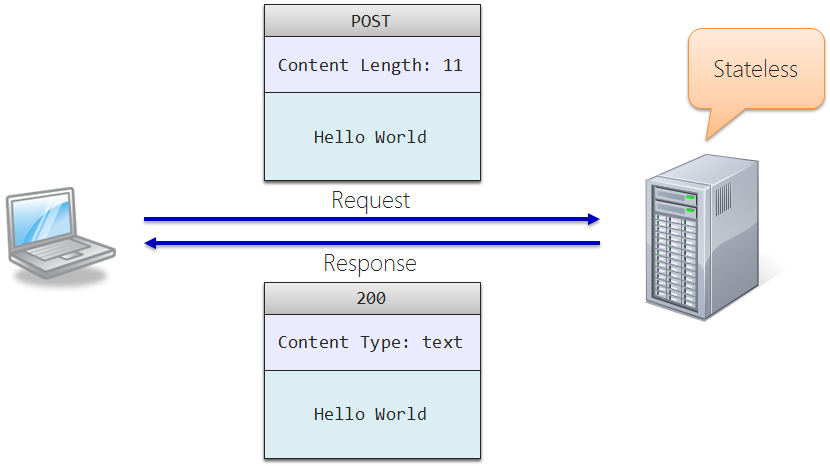
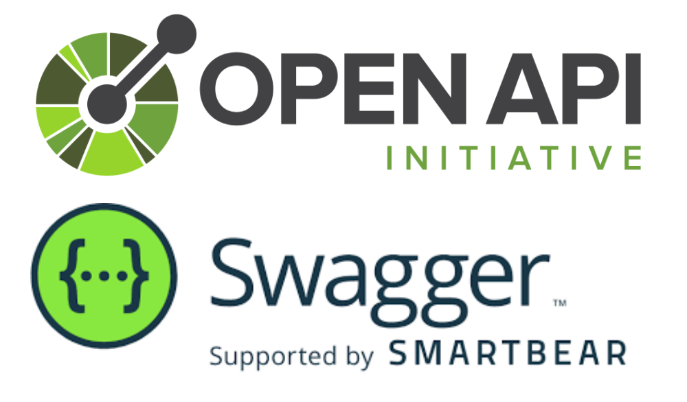
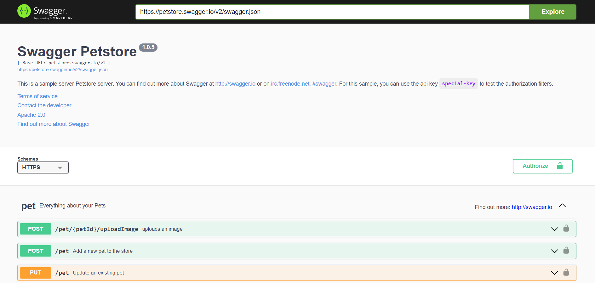
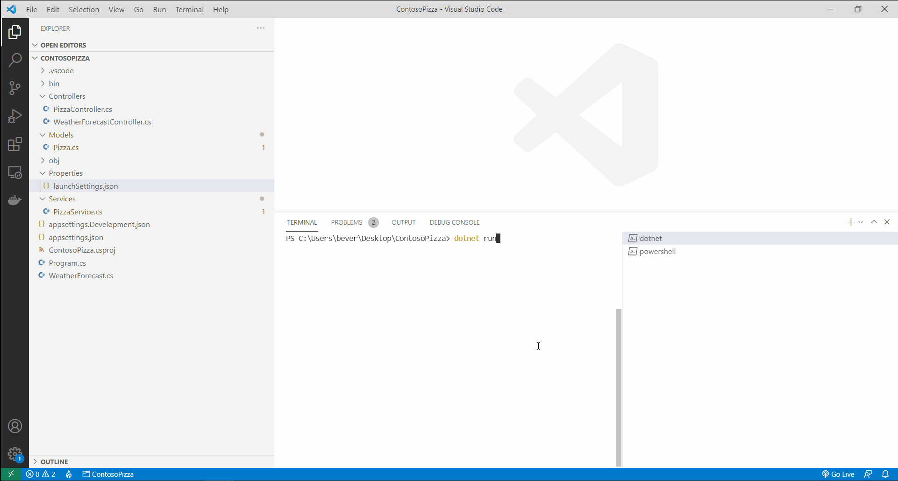

class: dark middle

# Enterprise Web Development C&#35;
> Chapter 7 - Ain't no REST for the wicked
---

### Chapter 7 - Ain't no REST for the wicked
# Table of contents

- [What is an API?](#api)
- [What is REST?](#rest)
- [HTTP methods and status ranges](#http)
- [Document your API](#documentation)
- [Building a REST API](#building-rest-api)
- [Input validation](#input-validation)
- [gRPC](#grpc)
- [Summary](#summary)
- [GraphQL (extra)](#graphql)
- [OData (extra)](#odata)

---
name: api
class: dark middle

# Ain't no REST for the wicked
> What is an API?

---
### Ain't no REST for the wicked
# What is an API?

* **A**pplication **P**rogramming **I**nterface
* approach to make software work with other software
* <=> User Interface: let's users work with software
* nowadays mostly in the context of the Web (HTTP)

---
name: rest
class: dark middle

# Ain't no REST for the wicked
> What is REST?

---
### Ain't no REST for the wicked
# What is REST?

- **R**epresentational **S**tate **T**ransfer, [°Roy Fielding in 2000](http://www.ics.uci.edu/~fielding/pubs/dissertation/top.htm)
- **architectural style** for designing networked applications
- nothing more but **using current features of the web**
  - 40y old matured and widely accepted HTTP protocol
  - standard and unified methods (POST, GET, PUT and DELETE)
  - stateless nature of HTTP
  - easy to use **U**niform **R**esource **I**dentifier

---
### Ain't no REST for the wicked
# What is REST?

- leverages these features with 5 constraints:
  - uniform interface
  - client-server
  - stateless
  - cachable
  - layered system

> <a href="https://restfulapi.net/rest-architectural-constraints/" target="_blank">Read more about these constraints</a>

---
### What is REST?
# Uniform interface

> Everything is a **Resource**

- fundamental concept of REST
- has
  - data
  - relationships to other resources
  - methods that operates against it to allow for accessing and manipulating the associated information

Examples:
- [www.hogent.be/image/logo.gif]() (Image resource)
- [www.hogent.be/students/1001]() (Dynamically pulled resource)
- [www.hogent.be/videos/v001]() (Video resource)
- [www.hogent.be/home.html]() (Static resource)

---
### What is REST?
# Uniform interface

> Every resource is identified by a **Unique Identifier**

- **U**nifirm **R**esource **L**ocator identifies the online location of a resource
- directory structure-like URIs

Examples:
- Get customer details with name "Shiv": [www.hogent.be/Customers/Shiv]()
- Get customer details with name "Raju": [www.hogent.be/Customers/Raju]()
- Get orders for customer "Shiv": [www.hogent.be/Customers/Shiv/Orders]()
- Get orders for customer "Raju": [www.hogent.be/Customers/Raju/Orders]()

---
### What is REST?
# Uniform interface

> Communication is done by **Representation**

- use some **media type**
  - often JSON (`application/json`)
  - or XML (`application/xml`)
- set the appropriate **HTTP headers**
  - `Accept`: what do you expect as input?
  - `Content-Type`: what are you returning?

---
### What is REST?
# Client-Server

* client and server should be able to evolve independently
* client should be able to do all it needs with the available resource URI's

---
### What is REST?
# Stateless

- every request is independent
- server does not need to remember previous requests and state
- no sessions, no history...

<br />


---
### What is REST?
# Cacheable

* all responses should be made cachable (if possible)
* good caching ensures the server scales better (less requests to process)
* and the client responds faster

---
### What is REST?
# Layered System

* REST allows to spread data and API over several servers
* example:
  * Server A: API
  * Server B: data storage
  * Server C: authentication
* big advantage: servers are able to scale independently

---
name: http
class: dark middle

# Ain't no REST for the wicked
> HTTP methods and status ranges

---
### What is REST?
# HTTP methods

> Describe resource **functionality** with **HTTP methods**

.center[
| Method | Description                             |
| ------ | --------------------------------------- |
| GET    | retrieve a representation of a resource |
| POST   | create new resources and sub-resources  |
| PUT    | update existing resources               |
| PATCH  | partially update existing resources     |
| DELETE | delete existing resources               |
]

This ensures **uniform interfaces** accross multiple REST APIs

---
### What is REST?
# HTTP status ranges in a nutshell

- `1xx`: hold on
  - the request was received, continuing process
- `2xx`: here you go
  - the request was successfully received, understood, and accepted
- `3xx`: redirection
  - further action needs to be taken in order to complete the request
- `4xx`: you made a boo boo
  -  the request contains bad syntax or cannot be fulfilled
- `5xx`: I made a boo boo up
  - the server failed to fulfil an apparently valid request

> <a href="https://en.wikipedia.org/wiki/List_of_HTTP_status_codes" target="_blank">Read about all HTTP status codes yourself</a>

---
name: documentation
class: dark middle

# Ain't no REST for the wicked
> Document your API

---
### Ain't no REST for the wicked
# Document your API

- OpenAPI = specification
- Swagger = tools (for displaying OpenAPI specs, etc.)


<br />


> **An API is only as good as you (yes, you) document it.**

---
### Document your API
# OpenAPI

- **O**pen**A**PI **S**pecification (OAS)
- formerly known as Swagger
- YAML or JSON
- standard, programming language independent description of a REST API
- only specifies functionality
  - not which implementation
  - not what dataset
- **OAS 3.0**: both people and machines can view, understand and interpret the functionality of a REST API
- from documentation the client code can be generated

---
### Document your API
# swagger.json

<iframe src="https://codebeautify.org/jsonviewer?url=https://petstore.swagger.io/v2/swagger.json" title="Swagger example Pet Store" width="100%" height="70%"></iframe>

> <a href="https://codebeautify.org/jsonviewer?url=https://petstore.swagger.io/v2/swagger.json" target="_blank">Live View</a> of  https://petstore.swagger.io/v2/swagger.json

---
### Document your API
# Swagger UI

- to visualize and interact with the API's resources
- auto-generated from OAS



---
### Document your API
# Swagger UI
In the default template of a WebAPI Swagger is automatically added.
```
dotnet new webapi
dotnet watch run
```

---
### What is REST?
# Consumer

Who can consume a REST API?

- MVC application
- SPA application (Blazor, Angular, React, Vue...)
- The Swagger UI
- Postman app
- .NET HTTP REPL
- ...

---
name: building-rest-api
class: dark middle

# Ain't no REST for the wicked
> Building a REST API

---
### Ain't no REST for the wicked
# Building a REST API

Complete the following tutorial
[Create a web API with ASP.NET Core](https://docs.microsoft.com/en-us/learn/modules/build-web-api-aspnet-core/)

> The tutorial is great but has some flaws, which we will tackle later.

> Note that the tutorial is **mandatory** to go forward.

---
### Ain't no REST for the wicked
# .NET HTTP REPL
Running the REPL is awesome but complex requests like POST or PUT can be quite tedious, we'd rather type in complex objects in a text editor we love (VS Code). Let's do something about that first.

- Install REPL (if not already done)

```
dotnet tool install -g Microsoft.dotnet-httprepl
```

- Connect to the REPL and set the default editor Visual Studio Code on Windows in this case (you only have to do this once)

```
httprepl http://localhost:5000
pref set editor.command.default "C:\Program Files\Microsoft VS Code\Code.exe"
pref set editor.command.default.arguments "-w"
```

> Linux and macOS are also supported by reading the <a href="https://docs.microsoft.com/en-us/aspnet/core/web-api/http-repl/?view=aspnetcore-5.0&tabs=macos#set-the-default-text-editor">docs</a>

---
### Ain't no REST for the wicked
# .NET HTTP REPL
- Start the REST API in the terminal
```
dotnet run
```
- In another terminal connect to the REPL or re-use the one you had before
```
httprepl http://localhost:5000
```
- POST Request in to the `PizzaController`
```
cd pizza
post
```
- Edit the JSON file that popped-up in VS Code
- Save the file and close (CTRL+S and CTRL+W)

---
### Ain't no REST for the wicked
# .NET HTTP REPL


<a href="images/REPL.gif" target="_blank">Fullscreen</a>

---
### Ain't no REST for the wicked
# Issues with the tutorial
Let's say we want to add a property to the `Pizza` class.
```
public class Pizza
{
    public int Id { get; set; }
    public string Name { get; set; }
    public bool IsGlutenFree { get; set; }
*   public DateTime Created { get; set; }
}
```
- The `Pizza` model is used as a `DTO` and a `Domain` class.
- **Overposting** is possible
  - What if the client should not be able to set this property?
- **Overfetching** is possible
  - What if the `Pizza` has an entire Graph of properties and lists?
- **No validation **
  - What if the max size of the name should be 200 characters?

---
### Ain't no REST for the wicked
# Overposting
```
public class Pizza
{
    public int Id { get; set; }
    public string Name { get; set; }
    public bool IsGlutenFree { get; set; }
*   public DateTime Created { get; set; }
}
```
- Run the following .NET HTTP REPL commamds and fill in

```
cd pizza
post 
```
```
{
  "id": 0, // Why should a POST set the Id, database should do this
  "name": "",
  "isGlutenFree": true,
  "created": "2021-10-19" // We should not be able to set this
}
```

---
### Ain't no REST for the wicked
# Overfetching
```
public class Pizza
{
    public int Id { get; set; }
    public string Name { get; set; }
    public bool IsGlutenFree { get; set; }
*   public List<Ingredient> Ingredients {get;set;} //Example
*   public List<Person> OrderedBy {get;set;} //Example
*   public DateTime Created { get; set; }
}
```
- Should a client be able to see all the ingredients?
  - `List` of pizza's is different then a `Detail` view
- Should a client be able to see all the people who ordered this Pizza?
  - Depends, who is the client and what can he/she see?
- Should a customer know when we first introduced the pizza?
  - Probably not

> **It depends on the use case/client**

---
### Ain't no REST for the wicked
# Versioning
```
public class Pizza
{
    public int Id { get; set; }
    public string DisplayName { get; set; } // Renamed
*   public bool IsGlutenFree { get; set; } // We'll remove this one
}
```
- Let's rename `Name` to `DisplayName`
- Remove `IsGlutenFree` because nobody cares anymore

> You can no longer **update the Domain model** since you'll break clients that rely on it.

---
### Ain't no REST for the wicked
# Versioning
Are you the only one using your API and **are you in control** when the client and server are updated?
- **Don't** version your API, there is no need to.

For **all other reasons**, version your API.
- Note that mobile clients aren't updated that easily. A user of the mobile app needs to update the app even if the new version is pushed.

> We won't go into versioning in this course since <a target="_blank" href="https://www.infoworld.com/article/3562355/how-to-use-api-versioning-in-aspnet-core.html">this tutorial</a> explains everything you need to know.

---
### Ain't no REST for the wicked
# **D**ata **T**ransfer **O**bjects
Fixes the following issues:
- Overposting
- Overfetching
- Updating Domain classes and not breaking clients
- ~~No validation~~ (see later)

Characteristics:
- Don’t contain any business logic
- Only contain data
- Can be shared with (C#) clients

---
### **D**ata **T**ransfer **O**bjects
# Example
```
public static class PizzaDto{
  public class Index {
    public int Id { get; set; }
    public string Name { get; set; }
    public decimal Price { get; set; }
  }
  public class Detail {
    public int Id { get; set; }
    public string Name { get; set; }
    public decimal Price { get; set; }
    public List<IngredientDto.Index> Ingredients { get; set; }
  }
  public class Create {
    public string Name { get; set; }
    public decimal Price { get; set; }
  }
  public class Edit : Create { // Caution with Inheritance
    public int Id { get; set; }
  }
}
```

> Read more about DTO's <a target="_blank" href="https://www.infoworld.com/article/3562271/how-to-use-data-transfer-objects-in-aspnet-core-31.html">here</a>

---
### **D**ata **T**ransfer **O**bjects
# DTO vs Domain
Suffix or make it clear it's a DTO, can be in a /Shared folder or project
```
public static class PizzaDto{
  public class Index {
    public int Id { get; set; }
    public string Name { get; set; }
    public decimal Price { get; set; }
  }
}
```
Usually in the /Models folder or in a separate project called Domain
```
public class Pizza
{
    public int Id { get; set; }
    public string DisplayName { get; set; }
    public bool IsGlutenFree { get; set; }
}
```

> Read more about DTO vs Domain vs ValueObject <a target="_blank" href="https://enterprisecraftsmanship.com/posts/dto-vs-value-object-vs-poco/">here</a>.

---
### **D**ata **T**ransfer **O**bjects
# Exercise
- Make a /Shared folder in the `ContosoPizza` project
- Add a `PizzaDto` class as you see fit.
- Adjust the `PizzaController`
  - Receives a DTO when needed
  - Returns a DTO when needed.
    - Map the Domain `Pizza` class to a DTO.

---
### **D**ata **T**ransfer **O**bjects
# Solution
It all depends on the use case, so there is no real solution here.

---
name: input-validation
### Ain't no REST for the wicked
# Input validation?

- **Testing the incoming data** to make sure it's **valid**
- User or application may send malicious/wrong data
- **Prevents improperly formed data** from entering the system
- Databases usually check data, but the earlier you check, the better
- Prevents input validation attacks:
    - SQL injection
    - XSS attacks
    - Buffer overflow
    - Overposting

---
### Input validation
# FluentValidation

<a target="_blank" href="https://docs.fluentvalidation.net/en/latest/index.html">FluentValidation</a> is one library to validate in .NET

Installation using the dotnet CLI

```
dotnet add package FluentValidation
```

---
### FluentValidation
# How does it work?

Take the following class as an example

```
public class CustomerDto {
  public int Id { get; set; }
  public string LastName { get; set; }
  public string FirstName { get; set; }
  public decimal Discount { get; set; }
  public string Address { get; set; }
}
```

---
### FluentValidation
# How does it work?

If we want to validate the given `CustomerDto` class, we should create a validator
class which inherits from `AbstractValidator`.

```{cs}
public class CustomerDtoValidator : `AbstractValidator<CustomerDto>` { }
```

---
### FluentValidation
# How does it work?

Within this class, define a constructor with all validation rules.

```{cs}
public class CustomerDtoValidator : AbstractValidator<CustomerDto> {

  public CustomerDtoValidator() {
    `RuleFor(customer => customer.FirstName).NotNull();`
    `RuleFor(customer => customer.Discount).GreaterThan(0).LessThan(1);`
  }
}
```
You should never validate domain models this way, since they should be valid from the point-of-creation.
DTO's however, are different and can be validated this way. 

> Read more about Always valid vs not always valid <a href="https://enterprisecraftsmanship.com/posts/always-valid-domain-model/" target="_blank">here</a>.

---
### FluentValidation
# As nested classes

```
public class CustomerDto {
  public int Id { get; set; }
  public string LastName { get; set; }
  public string FirstName { get; set; }
  public decimal Discount { get; set; }
  public string Address { get; set; }
  
  public class Validator : AbstractValidator<CustomerDto> {
    public Validator() {
    RuleFor(customer => customer.FirstName).NotNull();
    RuleFor(customer => customer.Discount).GreaterThan(0).LessThan(1);
    }
  }
}
```

> This can improve the readability and maintainability.

---
### Input validation
# FluentValidation

Read through these documentation sections

- <a href="https://docs.fluentvalidation.net/en/latest/configuring.html" target="_blank">Overriding the Message</a>
- <a href="https://docs.fluentvalidation.net/en/latest/conditions.html" target="_blank">Conditions</a>
- <a href="https://docs.fluentvalidation.net/en/latest/built-in-validators.html" target="_blank">Built-in Validators</a>
- <a href="https://docs.fluentvalidation.net/en/latest/custom-validators.html" target="_blank">Custom Validators</a>

---
### Input validation
# FluentValidation Middleware
Middleware is triggered **before or after a request** to a controller comes in. You can use it to automagically validate the DTO's. Without having to worry if the request is valid.
Change the `Create` method of the `PizzaController`
```
[HttpPost]
public IActionResult Create(PizzaDto.Create dto)
{    
    var pizza = PizzaService.Add(new Pizza{Name = dto.Name,IsGlutenFree = dto.IsGlutenFree});
    return CreatedAtAction(nameof(Create), new { id = pizza.Id });
}
```

> Note that the `Pizza` is using a default constructor which is valid for a demo purpose. But not in production applications.

---
### Input validation
# FluentValidation Middleware
Change the `PizzaService.Add` to return a `Pizza` object
```
public static Pizza Add(Pizza pizza)
{
    pizza.Id = nextId++;
    Pizzas.Add(pizza);
    return pizza;
}
```
Add the ASP.NET Core package
```
dotnet add package FluentValidation.AspNetCore
```

Add FluentValidation as middleware in Startup.cs
```
services.AddControllers()
        .AddFluentValidation(fv => {
            fv.RegisterValidatorsFromAssemblyContaining<PizzaDto.Create.Validator>();
            fv.ImplicitlyValidateChildProperties = true;
        });
```
> Read more about middleware validation in ASP.NET <a href="https://docs.fluentvalidation.net/en/latest/aspnet.html" target="_blank">here</a>.

---
### Input validation
# FluentValidation Middleware
Run the REPL:
```
cd pizza
post
```

```
{ // Edit the file as follows:
  "name": "",
  "price": -15,
  "isGlutenFree": true
} // Save and close the file in vs code
```
Response:
```
{ // some stuff is left out here for brevity.
  "title": "One or more validation errors occurred.",
  "status": 400,
  "errors": {"Name": ["'Name' mag niet leeg zijn."],
    "Price": ["'Price' moet groter zijn dan '0'."]
  }
}
```
---
### Input validation
# FluentValidation in Blazor

Read through the <a href="https://github.com/Blazored/FluentValidation" target="_blank">GitHub's README</a>
of the Blazor integration for FluentValidation.

---
name: grpc
class: dark middle

# Ain't no REST for the wicked
> gRPC

---
### gRPC
# What is gRPC?

- **R**emote **P**rocedure **C**all
- Open-source
- Developed at Google
- **Call a method on a server as if it's a local method** on the client
- Uses **protocol buffers**
- Defines
    - **services**: expose the methods
    - **messages**: what is sent around

> <a href="https://grpc.io/docs" target="_blank">Read the official docs</a>

> Watch a conference talk: <a href="https://www.youtube.com/watch?v=RoXT_Rkg8LA" target="_blank">Intro to gRPC: A Modern Toolkit for Microservice Communication</a>

---
### gRPC
# What is gRPC?


> Clients and servers can talk to each other in a variety of languages/environments

---
### gRPC
# Protocol buffers

- Mechanism to **serialize data**
- **Independent** of language, platform...
- Like XML or JSON but smaller, faster and simpler
- Works with so called messages
- Messages transformed into a **binary** format before being sent
- Every property of a message gets a number
    - Used to parse incoming/create outgoing buffers


```{proto}
message Person {
  required string name = 1;
  required int32 id = 2;
  optional string email = 3;
}
```

---
### gRPC
# Typical protocol buffers

- Domain objects
- Requests
- Replies

---
### gRPC
# Services

- **Expose methods** on a server
- Clients can call these methods
- Defines methods which
    - take a **message as argument**
    - can **return a message**

```{protobuf}
service Greeter {
  rpc SayHello (HelloRequest) returns (HelloReply) {}
}

message HelloRequest {
  string name = 1;
}

message HelloReply {
  string message = 1;
}
```

---
### Ain't no REST for the wicked
# gRPC

Read through the following tutorial:
- <a target="_blank" href="https://docs.microsoft.com/en-us/aspnet/core/grpc/code-first?view=aspnetcore-5.0">Code-first gRPC services and clients with .NET</a>

Read the readme of the following repository to integrate with Blazor:
- <a target="_blank" href="https://github.com/hakenr/BlazorGrpcWebCodeFirst">Blazor gRPC Web Code First</a>

> If you want to try this, create a new hosted Blazor WASM project:
>
> `dotnet new blazorwasm --hosted -o gRPCDemo`

---
name: exercise
class: dark middle

# Ain't no REST for the wicked
> Exercise

---
### Ain't no REST for the wicked
# Exercise

Complete the following exercises:
1. <a href="https://github.com/HOGENT-Web/csharp-ch-7-exercise-1" target="_blank">SportStore Api</a>

---
name: solution
class: dark middle

# Ain't no REST for the wicked
> Solution

---
### Ain't no REST for the wicked
# Solution

On the following links you can find the solutions for the exercises.
1. <a href="https://github.com/HOGENT-Web/csharp-ch-7-exercise-1/tree/solution/src" target="_blank">SportStore Api</a>


---
name: summary
class: dark middle

# Ain't no REST for the wicked
> Summary

---
### Ain't no REST for the wicked
# Summary

- REST is **not a standard**
- set of **5 constraints** to call an API **RESTful**
  - Uniform interface
  - Client-server separated
  - Stateless
  - Cachable
  - Layered system
- Documentation is really important when sharing your (Web) API
- Don't use Domain objects as DTO's

---
name: graphql
class: dark middle

# Ain't no REST for the wicked
> GraphQL (extra)

---
### Ain't no REST for the wicked
# GraphQL (extra)

As an extra you might want to use GraphQL in .NET. Go through this LinkedIN Learning
tutorial on your own (not mandatory).

[API Development in .NET with GraphQL](https://www.lynda.com/NET-tutorials/API-Development-NET-GraphQL/664823-2.html)

> You should be able to register using your HOGENT account

> The next slides contain some information about **outdated sections**

---
### GraphQL (extra)
# Solution setup (1/2)

This is how to create the initial project setup:


```
mkdir GraphQLDemo
cd GraphQLDemo

dotnet new webapi -o Server
dotnet new classlib -o Orders
dotnet new sln -o .

dotnet sln .\GraphQLDemo.sln add .\Server\Server.csproj
dotnet sln .\GraphQLDemo.sln add .\Orders\Orders.csproj

cd Orders
rm .\Class1.cs
dotnet add package Bogus
dotnet add package GraphQL
dotnet add package Microsoft.Extensions.DependencyInjection
```

---
### GraphQL (extra)
# Solution setup (2/2)

```
cd ..\Server
# You don't need the Microsoft.AspNetCore.StaticFiles package
dotnet add package GraphQL.Server.Transports.AspNetCore
dotnet add package GraphQL.Server.Transports.Subscriptions.WebSockets
dotnet add package GraphQL.Server.Transports.AspNetCore.SystemTextJson
# Don't use GraphiQL, this playground is easier:
dotnet add package GraphQL.Server.Ui.Playground

dotnet add .\Server.csproj reference ..\Orders\Orders.csproj

dotnet remove package Swashbuckle.AspNetCore
rm -Recurse -Force .\Controllers
rm WeatherForecast.cs
```

In the `launchSettings.json`, change the `launchUrl` to `ui/playground`. This assumes
you have configured the GraphQL Playground instead of the GraphiQL playground.

Now open the solution remove the REST and Swagger stuff from the `Startup.cs` and move on with the tutorial!

---
### GraphQL (extra)
# Notes on the tutorial

- The tutorial is a little outdated, use the [GitHub](https://github.com/graphql-dotnet/server#configure) and [documentation](https://graphql-dotnet.github.io/docs/getting-started/introduction) to check which packages and APIs to use.
- You should not add the NuGet package resource
- Don't use any static files, there is a package for [GraphiQL](https://graphql-dotnet.github.io/docs/getting-started/graphiql)
- Use Bogus to fake data
- You know the project and folder structure can be done better

---
### GraphQL (extra)
# Notes on the tutorial

- Inject and hold a reference to the `IWebHostEnvironment`
- You also need this code in the `ConfigureServices` method

```
services.AddSingleton<IDocumentWriter, DocumentWriter>();
// singletons hier
services.AddGraphQL((options, provider) =>
  {
      options.EnableMetrics = Environment.IsDevelopment();
      var logger = provider.GetRequiredService<ILogger<Startup>>();
      options.UnhandledExceptionDelegate = ctx => logger.LogError("{Error} occurred", ctx.OriginalException.Message);
  })
  .AddSystemTextJson()
  .AddErrorInfoProvider(opt => opt.ExposeExceptionStackTrace = Environment.IsDevelopment())
  .AddGraphTypes(typeof(OrdersSchema));
```

---
name: odata
class: dark middle

# Ain't no REST for the wicked
> OData (extra)

---
### Ain't no REST for the wicked
# OData (extra)

OData (Open Data) is an open protocol which allows to create and consume queryable and interoperable REST APIs. It provides all necessary documentation and information right in the API, in a simple and standard way.

Have a look at the next video and try to follow the example.

[Supercharging your Web APIs with OData and ASP.NET Core](https://www.youtube.com/watch?v=ZCDWUBOJ5FU)
