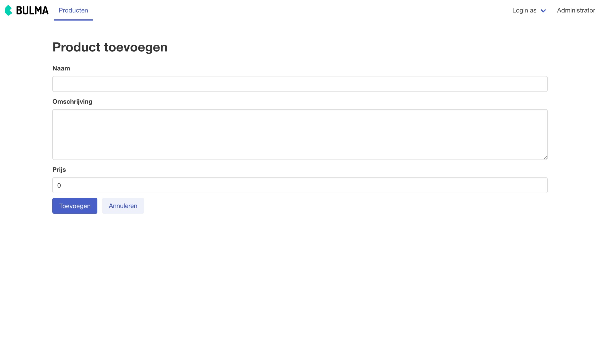
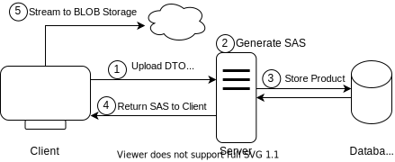
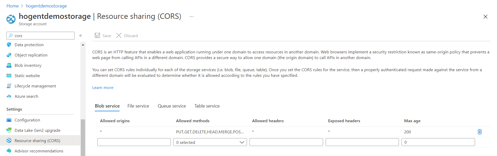

class: dark middle

# Enterprise Web Development C&#35;
> Chapter 8 - Suit up, wear a fancy Blazor

---
### Suit up, wear a fancy Blazor
# Table of contents
- [Component Libraries](#component-libraries)
- [Bogus Store example](#bogustore-example)
    - [Delete](#delete)
    - [Create](#create)
    - [Edit](#edit)
    - [Filter](#filter)
    - [Upload Image](#upload-image)
    - [Shopping Cart](#shopping-cart)
- [Exercise](#exercise)

---
class: dark middle
name:component-libraries
# Suit up, wear a fancy Blazor
> Component Libraries

---
### Component Libraries
# Introduction
Components can be shared in a Razor class library (RCL) across projects. Include components and static assets in an app from:
- Another project in the solution.
- A referenced .NET library.
- A NuGet package.

Just as components are regular .NET types, components provided by an RCL are normal .NET assemblies. Just like class libraries.

> More information about Razor Class Libraries can be found <a target="_blank" href="https://docs.microsoft.com/en-us/aspnet/core/blazor/components/class-libraries?view=aspnetcore-5.0&tabs=visual-studio">here</a>.

---
### Component Libraries
# Open source
A lot of components have already been created by the Blazor community and can be found on <a target="_blank" href="https://github.com/AdrienTorris/awesome-blazor#component-bundles">GitHub</a>.
Please note that:
- Some are pay-to-use
- Simply bad
- Outdated
- Duplicate

However, some are worth mentioning:
- <a target="_blank" href="https://github.com/Blazored">Blazored</a>, small but extendable
- <a target="_blank" href="https://github.com/MudBlazor/MudBlazor">MudBlazor</a>, full suite of components
- <a target="_blank" href="https://github.com/bUnit-dev/bUnit">bUnit</a>, testing library

> You can always implement and package your own components if you don't like any.

---
### Component Libraries
# Open source
The biggest pittfalls:
- Not reading the documentation
- Swashbuckling with how the library is setup
- Not doing research before you implement it in your project
  - Some are just wrappers around JavaScript and **really** slow
- The README of a GitHub repository is your documentation, use it
- If the documentation is bad, the package normally is too.
- Try not to use libraries which extensively use JavaScript, which can interfere with the virtual DOM of Blazor.

In this chapter, we'll use certain open source package, e.g.
- <a target="_blank" href="https://github.com/Blazored/Toast">Blazored.Toast</a>
- <a target="_blank" href="https://github.com/Append-IT/Blazor.Sidepanel">Append.Blazor.Sidepanel</a>
- <a target="_blank" href="https://github.com/Blazored/FluentValidation">Blazored.FluentValidation</a>

---
class: dark middle
name:bogusstore-example
# Suit up, wear a fancy Blazor
> Bogus Store

---
### Sportstore
# Flashback
In chapter 6, we created a `blazorwasm --hosted` application. We used fakers and Bogus to get some initial data in our `client`. The `Client` was runnable, since everything was done on the `Client` and the `Server` was not yet involved.

In chapter 7, we created our business logic in 2 libraries, `Domain` and `Services`, so we can easily use a console app to do our bidding. We exposed our Data Transfer Objects using a REST API and made it possible to call the Server using the HTTPREPL and Swagger.

---
### Bogus Store
# Leap forward
In the following example we combined both applicaties so that:
- The `Server` serves the `Client`.
- The `Server` exposes REST API endpoints which are **partly** implemented.
    - You can navigate to `/swagger/index.html` to see the endpoints.
- The `Client` uses the <a target="_blank" href="https://bulma.io/">BULMA.io</a> CSS framework
    - It's like <a target="_blank" href="https://getbootstrap.com/">Bootstrap</a> but **without any JavaScript**
- The `Client` calls the REST API endpoints using the `(I)ProductService` and a `HTTPClient`.
- The `Client` has it's authentication / authorization mocked in the `FakeAuthenticationProvider`.
- The `Server` has it's authentication / authorization mocked in the `FakeAuthenticationHandler`.
- The `Client` shows some functionality which is currently not working:
    - Filtering
    - Adding a product
    - Editing a product
    - ...

---
### Bogus Store - As is
<video controls width="100%" class="center" >
  <source src="images/bogusstore-as-is.mp4" type="video/mp4">
Your browser does not support the video tag.
</video>

---
class: dark middle
# Suit up, wear a fancy Blazor
> Bogus Store - Going further

---
### Bogus Store
# Going further
We'll implement the following:
- Possibility to delete a product
- Create a new product
- Edit an existing product
- Filter existing products based on certain criteria

> In a later chapter, we'll introduce real authentication and a real database, we'll be using the Fakers for now.

---
### Bogus Store
# What we're building
<video controls width="100%" class="center" >
  <source src="images/bogusstore-final-result.mp4" type="video/mp4">
Your browser does not support the video tag.
</video>

---
### Bogus Store
# Start
1. Clone <a target="_blank" href="https://github.com/HOGENT-Web/csharp-ch-8-example-2">this GitHub Repository</a>
2. Run the project
3. Try to understand how:
    - The `Client` calls the `Server`
    - How the Authentication is mocked

> All commits are done in the `solution` branch, which can be found <a href="https://github.com/HOGENT-Web/csharp-ch-8-example-2/tree/solution/src" target="_blank">here</a>.

---
class: dark middle
# Suit up, wear a fancy Blazor
> 📝 Commit: Add Project Files

---
name:delete
### Bogus Store
# Delete Product
Implement the Delete Functionality.

On the Details page, there is a button called "Verwijderen", make it call the `IProductService` to actually delete the Product and navigate back to the Product Index page.
- Create a `onclick` EventHandler to call a function called `DeleteProductAsync`
- In the `DeleteProductAsync`, use the `IProductService`
- Inject the `NavigationManager` in the Detail component and use it to `navigate` to the list of products page.

---
class: dark middle
# Suit up, wear a fancy Blazor
> 📝 Commit: Implement Delete

---
name:delete-confirmation
### Bogus Store
# Delete Comfirmation
Implement the Delete Confirmation Functionality.

- Deleting something without a confirmation is **a big no-no**. Ask the user if he **really** wants to delete the product, if the answer is `yes`, delete the product else cancel the request.

> See next slide for example

---
### Bogus Store - Delete confirmation
<br/>
<br/>
<br/>
<video controls width="100%" class="center" >
  <source src="images/bogusstore-delete-confirmation.mp4" type="video/mp4">
Your browser does not support the video tag.
</video>

---
class: dark middle
# Suit up, wear a fancy Blazor
> 📝 Commit: Delete Confirmation

---
name:create
### Bogus Store
# Create Product
Implement the Create Functionality.

- Create a new page with a code-behind file in the Client/Products folder called Create, with url `/product/create`.
- Make sure you can navigate from the `Toevoegen` button in the index page.
- Use the <a target="_blank" href="https://github.com/Blazored/FluentValidation">Blazored.FluentValidation</a> library to create the form.
- Use the `ProductDto.Mutate` as model for the `EditForm`
- Use <a target="_blank" href="https://bulma.io/documentation/form/general/">BULMA's form components</a> to style the form accordingly
- After creation, navigate to the newly created product's detail page

> Form example on the next slide

---
### Bogus Store
# Create Product


---
class: dark middle
# Suit up, wear a fancy Blazor
> 📝 Commit: Create Product

---
### Sportstore
# Create Product (Sidepanel)
Sometimes the user experience can be better when rendering a small sidepanel to show the form, so that we're not actually navigating away from the index page.
- Investigate the <a target="_blank" href="https://github.com/Append-IT/Blazor.Sidepanel">Append.Blazor.Sidepanel</a> package on GitHub, especially the Forms functionality on the documentation website.
- Instead of navigating to the Product Create Page, use the Sidepanel component to show the form.

> Example on the next slide

---
### Bogus Store - Create via Sidepanel
<video controls width="100%" class="center" >
  <source src="images/bogusstore-create-sidepanel.mp4" type="video/mp4">
Your browser does not support the video tag.
</video>

---
class: dark middle
# Suit up, wear a fancy Blazor
> 📝 Commit: Create Product Via Sidepanel

---
name:edit
### Bogus Store
# Edit Product
Implement the Edit Functionality.

On the details page it should be possible to open a sidepanel which makes it possible to edit a product. Note that you should provide additional parameters to the sidepanel and a callback to refresh the details page once the edit is finished, since you'll be staying on the same page. Some help can be found <a target="_blank" href="https://github.com/Append-IT/Blazor.Sidepanel/blob/3da32a817e93bf28efa29053d510169f1d7ae196/docs/Pages/Callbacks.razor#L36">here</a>.

- Implement the `ProductService` functionality.
- Create a new component with a code-behind file in the Client/Products folder called Edit.
- On the Detail page, Show the Edit form in the Sidepanel component, make sure to refresh the Detail page when the edit is finished.
- In the `ProductListItem` component, show the edit form in the Sidepanel component. Make sure to navigate to the Detail page when the edit is finished.

> Example on the next slide

---
### Bogus Store - Edit via Sidepanel
<video controls width="100%" class="center" >
  <source src="images/bogusstore-edit-sidepanel.mp4" type="video/mp4">
Your browser does not support the video tag.
</video>

---
class: dark middle
# Suit up, wear a fancy Blazor
> 📝 Commit: Edit Product Via Sidepanel

---
name:filter
### Bogus Store
# Filter Products
What we'll be building

<video controls width="100%" class="center" >
  <source src="images/bogusstore-filter.mp4" type="video/mp4">
Your browser does not support the video tag.
</video>

---
### Bogus Store
# Filter Products
Implement the filter functionality.  We'll implement the `SearchTerm` together, but you'll have to implement the other filters yourself.

The `SearchTerm` is a string which is used to filter the products by name and provided in the query string. e.g. `?searchTerm=product`

We'll be using `[Parameter, SupplyParameterFromQuery]`
```cs
    [Parameter]
    `[SupplyParameterFromQuery]`
    public string? Searchterm { get; set; }
```

> Note that **only** components with a `page "/"` directive can use the `[SupplyParameterFromQuery]` functionality. Which makes it impossible to use this functionality in the `ProductFilters` component. So we'll have to pass the `SearchTerm` to the `ProductFilters` component from the `Index` component.
>
> More information about providing parameters from the query string can be found in the <a target="_blank" href="https://learn.microsoft.com/en-us/aspnet/core/blazor/fundamentals/routing?view=aspnetcore-6.0#query-strings-1">official docs</a>.

---
### Filter Products
**Index.razor.cs**

Add a `SearchTerm` parameter to the `Index` component.
```cs
[Parameter]
[SupplyParameterFromQuery]
public string? SearchTerm { get; set; }
```
Change the `OnInitializedAsync` lifecycle method to a `OnParametersSetAsync` and change the request to include the `SearchTerm`.
```cs
protected override async Task `OnParametersSetAsync()`
{
*   ProductRequest.Index request = new()
*   {
*       Searchterm = Searchterm,
*   };

    var response = await ProductService.GetIndexAsync(request);
    products = response.Products;
}
```

> Read more about lifecycle methods <a target="_blank" href="https://learn.microsoft.com/en-us/aspnet/core/blazor/components/lifecycle?view=aspnetcore-7.0#when-parameters-are-set-setparametersasync">here</a>.

---
### Filter Products
**Client/Products/ProductService.cs**

Use the `Searchterm` in the `GetIndexAsync` method.

```cs
public async Task<ProductResult.Index> 
GetIndexAsync(ProductRequest.Index request)
{
    var response = await client.GetFromJsonAsync
    <ProductResult.Index>
    ($"{endpoint}`?searchterm={request.Searchterm}`");
    return response!;
}
```

> Notice the `?searchterm={request.Searchterm}` at the end of the url/query string. You can use a helper to create the url, but for now we'll just use string interpolation.

---
### Filter Products
Pass the parameter to the `ProductFilters` component.

**ProductFilters.razor.cs**
```cs
[Parameter, `EditorRequired`] 
public string? Searchterm { get; set; } = default!;
```

> Using the `EditorRequired` the compiler will shown a warning if the parameter is not provided when using the `<ProductFilter/>` component.

**Client/Products/Index.razor**
```cs
<ProductFilters `Searchterm="@Searchterm"`/>
```

---
### Filter Products
Bind the `Searchterm` to the input field.

**ProductFilters.razor**
```cs
<input class="input" type="search" placeholder="Zoeken..." 
       `value="@searchTerm" @onchange="SearchTermChanged"`>
```
> Notice that we cannot use the `@bind` syntax here, since we need to do some extra work when the value changes.
> 
> We'll use the `SearchTermChanged` method to update the `searchTerm` (field!) and navigate to the current page with the new `SearchTerm` parameters.
>
> Don't create a component that writes to its own parameters after the component is rendered for the first time. For more information, see the <a href="https://learn.microsoft.com/en-us/aspnet/core/blazor/components/?view=aspnetcore-6.0#overwritten-parameters-1" target="_blank"> official docs</a>.

---
### Filter Products
**ProductFilters.razor.cs**
```cs
[Parameter, EditorRequired] 
public string? Searchterm { get; set; } = default!;

private string? searchTerm;

protected override void OnParametersSet()
{
    //Set the field equal to the parameter.
    searchTerm = Searchterm; 
}

private void SearchTermChanged(ChangeEventArgs args)
{
    // When the inputfield changes...
    searchTerm = args.Value?.ToString();
    FilterProducts();
}

private void FilterProducts()
{ // Navigate to the current page with the new SearchTerm parameter.
  Dictionary<string, object?> parameters = new();
  parameters.Add(nameof(searchTerm), searchTerm);
  var uri = NavigationManager.GetUriWithQueryParameters(parameters);
  NavigationManager.NavigateTo(uri);
}
```

---
### Filter Products
# Exercise
- Implement the other filters.
    - Minimum Price
    - Maximum Price
    - Category / Tag use `Id` of the tag

> Notice that the `Category` / `Tag` filters are not strings, but integers. So you'll have to use the `int.TryParse` method to convert the string to an integer.
>
> Notice that the `Price` filters are not strings, but decimals. So you'll have to use the `decimal.TryParse` method to convert the string to a decimal.
> 
> For now the Tags are hard coded but you can make them generic if you want by requesting them from the Server on load of the component.
> Do not forget to adjust the `ProductService`(s) as well.

---
class: dark middle
# Suit up, wear a fancy Blazor
> 📝 Commit: Filter Products

---
name:tags
### Exercise
# Tags
Make it possible to:
 - Show all tags in a table on the `/tag` page
    - Use 1 search parameter to filter the tags on name.
    - Use <a target="_blank" href="https://bulma.io/documentation/elements/table/">BULMA's table component</a> to style the table.
    - Only administrators can see the `tag` page and create them.
 - Create a new tag using the sidepanel component, make sure to refresh the table when the tag is created.

> Example on the next slide

---
### Bogus Store - Tags
<video controls width="100%" class="center" >
  <source src="images/exercise-tags.mp4" type="video/mp4">
Your browser does not support the video tag.
</video>

---
class: dark middle
# Suit up, wear a fancy Blazor
> 📝 Commit: Tags : Index / Create

---
name:image-uploading
class: dark middle
# Suit up, wear a fancy Blazor
> Uploading images

---
### Image uploading
# Best practises
- **Don't store images in your database**, unless they're small
    - A browser cannot **cache** the images
    - Server takes a **big perf. hit** when requesting multiple files
    - Usually a reference(**URI**) to where the image is stored is kept
- Store your images somewhere they can be **backed-up**
    - Usually a wwwroot folder is not backed-up by default
- Binary Large Object(**BLOB**) storage is generally a good choice
- Who can upload/download the images?
    - Depending on the use-case
    - Most of the time **only certain users can upload**
    - Some images can be public and some should be private
    - Think about Facebook, who can see these images?
- Let your **client stream images** to a BLOB storage

---
### Image uploading
# **B**inary **L**arge **Ob**ject Storage
Blob storage is a feature in Microsoft Azure that lets developers store **unstructured data** in Microsoft's cloud platform. This data can be accessed from anywhere in the world and can include **audio, video and text**. Blobs are grouped into "**containers**" that are tied to user accounts. 

Blob storage is designed for:

- Serving images or documents directly to a browser.
- Storing files for distributed access.
- Streaming video and audio.
- Writing to log files.
- Storing data for backup and restore and archiving.

> There are other solutions as well, but we'll use Microsoft's BLOB storage, read more about it <a target="_blank" href="https://docs.microsoft.com/en-us/azure/storage/blobs/storage-blobs-introduction">here

---
### BLOB Storage
# Resources
Blob storage offers three types of resources:

- The storage account
- A container in the storage account
- A blob in a container


---
### BLOB Storage
# Storage account
A storage account provides a unique namespace in Azure for your data. Every object that you store in Azure Storage has an address that includes your unique account name. The combination of the account name and the Azure Storage blob endpoint forms the base address for the objects in your storage account.

For example, if your storage account is named mystorageaccount, then the default endpoint for Blob storage is:

```
http://mystorageaccount.blob.core.windows.net
```

---
### BLOB Storage
# Containers
A container organizes a set of blobs, similar to a directory in a file system. A storage account can include an unlimited number of containers, and a container can store an unlimited number of blobs. A container can be public or private, most of the time you want private Create or Write and public Read access.

You can even have a hierarcical file structure in the container

```
- images
|-- user1
    |-- image1.jpg
    |-- image2.jpg
|-- user2
    |-- image1.jpg
```

> TIP: It's best to use simple file names and lowercase for the Container / BLOBS

---
### BLOB Storage
# Blobs

Azure Storage supports three types of blobs:

- **Block blobs** store text and binary data. Block blobs are made up of blocks of data that can be managed individually. Block blobs can store up to about 190.7 TiB. (we'll be using this)
- **Append blob**s are made up of blocks like block blobs, but are optimized for append operations. Append blobs are ideal for scenarios such as logging data. (not using this)
- **Page blobs** store random access files up to 8 TiB in size. Page blobs store virtual hard drive (VHD) files and serve as disks for Azure virtual machines. (not using this)

> More information about the different types can be found <a target="_blank" href="https://docs.microsoft.com/en-us/rest/api/storageservices/understanding-block-blobs--append-blobs--and-page-blobs">here</a>

---
### BLOB Storage
# Creating the account

Follow the steps in the GIF, if you don't have a Free Azure Accounts yet, activate one first by going to <a target="_blank" href="https://azure.microsoft.com/nl-nl/free/">this link</a>.

<video controls width="95%" class="center" >
  <source src="images/blob-storage-account.mp4" type="video/mp4">
Your browser does not support the video tag.
</video>

---
### BLOB Storage
# Creating the container

<video controls width="95%" class="center" >
  <source src="images/blob-storage-container.mp4" type="video/mp4">
Your browser does not support the video tag.
</video>

---
### BLOB Storage
# Upload an image (portal)

<video controls width="95%" class="center" >
  <source src="images/blob-storage-image-upload.mp4" type="video/mp4">
Your browser does not support the video tag.
</video>

---
### BLOB Storage
# Uploading images
- All images are public (since the container is public read in this case) and can be viewed, creating or manipulating should be secured by a connectionstring.
- Do NOT share the connectionstring with anyone, only use it on the server, where it's safe.
- You can use Shared Access Signatures (SAS) to give someone a timeslot to upload or edit block blobs, without sharing your account information (it's a bit like a JWT)

---
### BLOB Storage
# Shared Access Signatures (SAS)
A shared access signature is a signed URI that points to one or more storage resources. The URI includes a token that contains a special set of query parameters. The token indicates how the resources may be accessed by the client. One of the query parameters, the signature, is constructed from the SAS parameters and signed with the key that was used to create the SAS. This signature is used by Azure Storage to authorize access to the storage resource.

Using a SAS we can give the client access for a few minutes (not too long) to upload an image directly without streaming the image to our server and then to the Azure Storage Container. Therefore the load is never on our server but on the client and Azure itself. 

---
### Image uploading
# Strategy


---
### Uploading via SAS and Postman
# Storage account Connectionstring
Grab the connectionstring of your storage account, don't share it!
<video controls width="95%" class="center" >
  <source src="images/blob-storage-connectionstring.mp4" type="video/mp4">
Your browser does not support the video tag.
</video>

---
### Uploading via SAS and Postman
# Console app for prototyping
Create a new console app
```
dotnet new console -o Hogent.Sas

cd .\Hogent.Sas
dotnet add package Azure.Storage.Blobs
```

On the next slide, copy-paste the code and replace YOUR_CONNECTION_STRING_HERE, with yours and run the console app.

---
### Uploading via SAS and Postman
# Console app for prototyping
```
using Azure.Storage.Blobs;
using Azure.Storage.Sas;
using System;

const string connectionString = "YOUR_CONNECTION_STRING_HERE";
const string containerName = "images";
const string filename = "filename.gif";

BlobServiceClient client = new BlobServiceClient(connectionString);
var containerClient = client.GetBlobContainerClient(containerName);
BlobClient blobClient = containerClient.GetBlobClient(filename);

var blobSasBuilder = new BlobSasBuilder
{
    ExpiresOn = DateTime.UtcNow.AddMinutes(5),
    BlobContainerName = containerName,
    BlobName = filename,
};
blobSasBuilder.SetPermissions(BlobSasPermissions.Write | BlobSasPermissions.Create);

var sas = blobClient.GenerateSasUri(blobSasBuilder);
Console.WriteLine(sas);
```

---
### Uploading via SAS and Postman
# Console app for prototyping
1. Copy the generated URI from the console window and copy-paste it into Postman
2. Set the HTTP Method to `PUT`
3. Click on the Body tab and select a random image file.
4. Set a header named `x-ms-blob-type` to `BlockBlob`
5. Press Send
6. View the image in the Azure Storage Container

> GIF on next slide

---
### Uploading via SAS and Postman
# Postman call and upload
<video controls width="100%" class="center" >
  <source src="images/blob-storage-sas-token-upload-postman.mp4" type="video/mp4">
Your browser does not support the video tag.
</video>

---
name:upload-image
### Exercise
# Upload on Create
Implement the functionality to upload an image when creating a product. 

- When creating a product it should be possible to upload an image after the product is created on the server side.
- We'll use a `<InputFile/>` component and BULMA CSS' goodness to style it.

> Result on next slide

---
### Upload on Create
# Final Outcome
<video controls width="100%" class="center" >
  <source src="images/blob-storage-create-with-image.mp4" type="video/mp4">
Your browser does not support the video tag.
</video>

---
### Client
# StorageService
Using a normal HttpClient we can upload files to BLOB based on the SAS returned from the Server.

Client/Files/AzureBlobStorageService.cs
```
public class AzureBlobStorageService : IStorageService
{
    private readonly HttpClient httpClient;
    public static long MaxFileSize => 1024 * 1024 * 10; // 10MB

    public AzureBlobStorageService(HttpClient httpClient)
    {
        this.httpClient = httpClient;
    }

    public async Task UploadImageAsync(string sas, IBrowserFile file)
    {
        var content = new StreamContent(file.OpenReadStream(MaxFileSize));
        content.Headers.Add("x-ms-blob-type", "BlockBlob");
        content.Headers.Add("Content-Type", file.ContentType);
        var response = await httpClient.PutAsync(sas, content);
        response.EnsureSuccessStatusCode();
    }
}
```

---
### Client
# StorageService in DI

Client/Files/IStorageService.cs
```cs
public interface IStorageService
{
    Task UploadImageAsync(string sas, IBrowserFile file);
}
```

Add a Typed HttpClient in Dependency Injection

Client/Program.cs
```cs
// Other services
builder.Services.AddHttpClient<IStorageService,
                               AzureBlobStorageService>();
```

> Doing this will allow us to inject the HttpClient in the StorageService and mock it when testing.
---
### Client
# InputFile
Client/Products/Create.razor
```
<div class="field">
    <div class="file has-name is-boxed is-fullwidth">
        <label class="file-label">
*           <InputFile class="file-input" OnChange="@LoadImage" accept="image/*" />
            <span class="file-cta">
                <span class="file-icon">
                    <i class="fas fa-upload"></i>
                </span>
                <span class="file-label has-text-centered">
                    <span>Selecteer een afbeelding</span>
                </span>
            </span>
            @if (image is not null)
            {
                <span class="file-name">
                    @image.Name
                </span>
            }
        </label>
    </div>
</div>
```

---
### Client
# InputFile
Client/Products/Create.razor.cs
```
public partial class Create
{
    private ProductDto.Mutate product = new();
*   private IBrowserFile image;

    [Inject] public IProductService ProductService { get; set; }
    [Inject] public NavigationManager NavigationManager { get; set; }
*   [Inject] public IStorageService StorageService { get; set; }

    private async Task CreateProductAsync()
    {
        ProductResult.Create result = await ProductService.CreateAsync(product);
*       await StorageService.UploadImageAsync(result.UploadUri, image!);
        NavigationManager.NavigateTo($"product/{result.ProductId}");
    }

*   private void LoadImage(InputFileChangeEventArgs e)
*   {
*       image = e.File;
*       product.ImageContentType = image.ContentType;
*   }
}
```

---
### Shared
# ProductResult
Shared/Products/ProductResult.cs
Create a new class to return the result of creating a product.

Adding the UploadUri to the Create Response, so we can upload from the client.
```
public abstract class ProductResult
{
    public class Index
    {
        public IEnumerable<ProductDto.Index>? Products { get; set; }
        public int TotalAmount { get; set; }
    }

*   public class Create
*   {
*       public int ProductId { get; set; }
*       public string UploadUri { get; set; } = default!;
*   }
}
```

---
### Shared
# ProductDto
Shared/Products/ProductDto.cs

`ImageContentType` is the MIME type e.g. `image/jpeg`, `image/png`, `image/gif` etc. We need it to create a valid filename on the server.

```
```cs
public static class ProductDto
{
    // Other DTO's
    public class Mutate
    {
        public string Name { get; set; }
        // Other properties
*       public string? ImageContentType { get; set; }
    }
}
```

---
### Domain
# Add an Image class
Domain/Files/Image.cs

```cs
public class Image : ValueObject
{
    public Uri BasePath { get; }
    public Guid Identifier { get; }
    public string Extension { get; }

    public string Filename => $"{Identifier}.{Extension}";
    public Uri FileUri => new Uri($"{BasePath}/{Filename}");

    public Image(Uri basePath, string contentType)
    {
       Identifier = Guid.NewGuid();
*      Extension = MimeTypesMap.GetExtension(contentType).ToLower();
       BasePath = Guard.Against.Null(basePath,nameof(basePath));
    }

    protected override IEnumerable<object?> GetEqualityComponents()
    {
        yield return Extension.ToLower();
        yield return Identifier;
        yield return BasePath;
    }
}
```

---
### Services
# IStorageService
We'll use an interface here so we can easily switch from Azure BLOB to another storage provider.
Notice the abstract name, we're not referring to Azure at all, since it doesn't matter.

Services/Files/IStorageService.cs
```cs
public interface IStorageService
{
    Uri BasePath { get; }
    Uri GenerateImageUploadSas(Image image);
}
```

---
### Services
# Add Azure and Configuration 

Using the Azure SDK it makes our lives easier to use the built-in classes. However we'll still need the connectionString somewhere, it's best to use AppSettings.json for this.

Services/Services.csproj
```
dotnet add package Azure.Storage.Blobs
dotnet add package Microsoft.Extensions.Configuration.Abstractions
```

Server/AppSettings.json
```
  "ConnectionStrings": {
    "Storage": "YOUR_CONNECTION_STRING_HERE"
  },
```

> Adding ConnectionStrings to your repo is not the best practise in the world, make sure to take appropriate action, using environment secrets. Read more about <a target="_blank" href="https://docs.microsoft.com/en-us/aspnet/core/security/app-secrets?view=aspnetcore-5.0&tabs=windows">Storing Secrets</a>

---
### Domain
# Get the extension from the MIME

Domain/Domain.csproj
```
dotnet add package MimeTypesMap
```
Which is a NuGet package that maps MIME types to extensions.

```cs
using HeyRed.Mime;

MimeTypesMap.GetExtension("image/jpeg"); // => jpeg
MimeTypesMap.GetMimeType("filename.jpeg"); // => image/jpeg

MimeTypesMap.AddOrUpdate(string mime, string extension);
```

More information about the package can be found <a target="_blank" href="https://github.com/hey-red/MimeTypesMap">here</a>.
---
### BlobStorageService
Services/Files/BlobStorageService.cs

```cs
public class BlobStorageService : IStorageService
{
    private readonly string connectionString;
    public Uri BasePath => new Uri("https://hogentdemostorage.blob.core.windows.net/images");
    public BlobStorageService(IConfiguration configuration)
    {
        connectionString = configuration.GetConnectionString("Storage");
    }
    public Uri GenerateImageUploadSas(Image image)
    {
        string containerName = "images";
        var blobServiceClient = new BlobServiceClient(connectionString);
        var containerClient = blobServiceClient.GetBlobContainerClient(containerName);
        BlobClient blobClient = containerClient.GetBlobClient(image.Filename);
        var blobSasBuilder = new BlobSasBuilder
        {
            ExpiresOn = DateTime.UtcNow.AddMinutes(5),
            BlobContainerName = containerName,
            BlobName = image.Filename,
        };
        blobSasBuilder.SetPermissions(BlobSasPermissions.Create | BlobSasPermissions.Write);
        var sas = blobClient.GenerateSasUri(blobSasBuilder);
        return sas;
    }
}
```
---
### Services/Products/FakeProductService.cs
```
public class ProductService : IProductService {
*  private readonly IStorageService storageService;
   private readonly BogusDbContext dbContext;
   public FakeProductService(`IStorageService storageService`, BogusDbContext dbContext)
   {
        this.dbContext = dbContext;
*       this.storageService = storageService;
*  }
    public async Task<`ProductResult.Create`> CreateAsync(ProductDto.Mutate model)
    {
        // Check if the product already exists

*       Image image = new Image(storageService.BasePath, model.ImageContentType!);
        Money price = new(model.Price);
        Product product = new(model.Name!, model.Description!, price, `image.FileUri.ToString()`);

        dbContext.Products.Add(product);
        await dbContext.SaveChangesAsync();

*       Uri uploadSas = storageService.GenerateImageUploadSas(image);

        return new ProductResult.Create()
        {
            ProductId = product.Id,
            UploadUri = uploadSas.ToString()
        };
    }
```

---
### CORS
# Allow CORS
Since we're in a Browser, due to CORS we cannot upload the image. Let's allow all CORS for now, but in production you'll want to be more specific.



<a href="images/cors.png" target="_blank">Fullscreen</a>

---
### Upload on Create
# Done.
<video controls width="100%" class="center" >
  <source src="images/blob-storage-create-with-image.mp4" type="video/mp4">
Your browser does not support the video tag.
</video>

---
class: dark middle
# Suit up, wear a fancy Blazor
> 📝 Commit: Add Image Upload On Create

---
name:shopping-cart
### Exercise
# Shopping Cart
Implement the Shopping Cart functionality, **only  client side**.

Make it possible to:
- Add products in a Shopping Cart.
- Remove products from the  Shopping Cart.
- Increase / Decrease quantity.
- Show the amount of items in the `Cart` in the `Header` component
- Show the total price all items.
- Show the Shopping Cart in a sidepanel component

Tips:
- Use the <a href="https://docs.microsoft.com/en-us/aspnet/core/blazor/state-management?view=aspnetcore-6.0&pivots=webassembly" target="_blank">State Management article</a> to put a `Cart` class in DI. 
- Make it possible for components to subscribe to the `OnCartChanged` event and make them re-render themselves when changes occur.
- New classes you'll need:
    - `Cart` Store in DI and inject it into components (See next slide)
    - `CartItem`
    - `ShoppingCart` (Component to render in the sidepanel)

---
### Shopping Cart
# Final Result
<video controls width="100%" class="center" >
  <source src="images/shopping-cart.mp4" type="video/mp4">
Your browser does not support the video tag.
</video>

> See next slides for some help.

---
### Shopping Cart
**Cart.cs**
Example Cart class (Store in DI)
```cs
public class Cart
{
    private readonly List<CartItem> items = new();
    public IReadOnlyList<CartItem> Items => items.AsReadOnly();
    public event Action? OnCartChanged;
    public decimal Total => items.Sum(x => x.Total);
    public void AddItem(int productId, string name, decimal price)
    {
        var existingItem = items.SingleOrDefault(x => x.ProductId == productId);
        if (existingItem == null)
        {
            CartItem item = new CartItem(productId, name, price, 1);
            items.Add(item);
        }else
        {
            existingItem.Amount++;
        }
        OnCartChanged?.Invoke();
    }

    public void RemoveItem(CartItem item)
    {
        items.Remove(item);
        OnCartChanged?.Invoke();
    }
}
```

---
### Shopping Cart
**Header.razor.cs**
Part of code-behind of the `Header` component.
```cs
public partial class Header : IDisposable
{
    [Inject] public ISidepanelService Sidepanel { get; set; }
    [Inject] public Cart Cart { get; set; }

    protected override void OnInitialized()
    {
        Cart.OnCartChanged += StateHasChanged;
    }
    public void Dispose()
    {
        Cart.OnCartChanged -= StateHasChanged;
    }
    private void OpenShoppingCart()
    {
        Sidepanel.Open<ShoppingCart>("Winkelwagen");
    }
}
```

---
class: dark middle
# Suit up, wear a fancy Blazor
> 📝 Commit: Add Shopping Cart

---
name:edit-image
### Exercise
# Edit Product with Image
Fix the Edit Functionality. 

- Make it possible to edit the product's image, since we broke the functionaltity.

Tips:
- Notice that the browser will cache the images, a workaround for this is:
    - If the image is changed (LoadImage is called) create a new Identifier for it (new GUID) 
    - Save the changes to the database
    - Delete the old Block Blob Image
    - Return a new SAS token and let the client upload to BLOB

---
name: exercise
class: dark middle

# Suit up, wear a fancy Blazor
> Exercise

---
### Exercise
# Customers
Implement the following functionalities:
- An administrator can see a **list of all customers** and filter them by name(s) and email address, use a query string.
- An administrator can **create** a new customer.
- An administrator can see the **details** of a customer.
- An administrator can **edit** a customer.

Tip:
- Use the Tags/Products as a reference.
- See next slide for a small demo.

> In the next chapters we'll implement the Customer side of the application.

---
### Customers
# Final Result
<video controls width="100%" class="center" >
  <source src="images/exercise-customers.mp4" type="video/mp4">
Your browser does not support the video tag.
</video>

---
name: solution
class: dark middle

# Suit up, wear a fancy Blazor
> Solution 

---
### Suit up, wear a fancy Blazor
# Solution
Following commits achieve a possible solution:
- 📝 Commit: List Customers
- 📝 Commit: Add Customer
- 📝 Commit: Detail Customer
- 📝 Commit: Edit Customer

---
class: dark middle
# Suit up, wear a fancy Blazor
> Switch to Blazor Server

---
### Switch to Blazor Server
# Tutorial.
Using the correct architecture you can (at this point) switch from Blazor WASM to Blazor Server. In a later stage the conversion becomes more difficult due to Authentication, Database access is not really a big problem. In most Blazor Server Apps, Cookies are used instead of JWT tokens.

We won't go into too much detail and leave it as an exercise, since the process how you can convert to Blazor Server is a great way to see if you understood the material of this and previous chapters.

- Tips:
    - Use <a target="_blank" href="https://www.appvnext.com/blog/2020/2/2/reuse-blazor-wasm-ui-in-blazor-server">this article</a> as a starting point.
    - You won't be needing the Client's services anymore, the interfaces of the shared project will suffice.

---
### Switch to gRPC
# Extra
Switch from REST to gRPC, we consider this as an extra exercise if you want to learn more about gRPC in combination with Blazor. 

> Note that this is not part of the course for the examination. 

---
### Suit up, wear a fancy Blazor
# Summary

In this module you learned:
- The ins-and-outs of Blazor
- It's pretty powerful for native C# speakers
- Keep State in State objects via Dependency Injection
- Pass parameters and callbacks to other components
- Be aware of the render tree
- Uploading files to BLOB storage
- Use the EditForm component for advanced validated forms
- Do not mutate incoming parameters in components.
- Connect client-to-server via REST
- It's quite easy to switch from Blazor WASM to Blazor Server using the correct architecture
