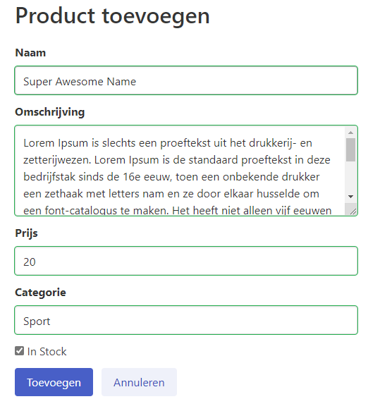
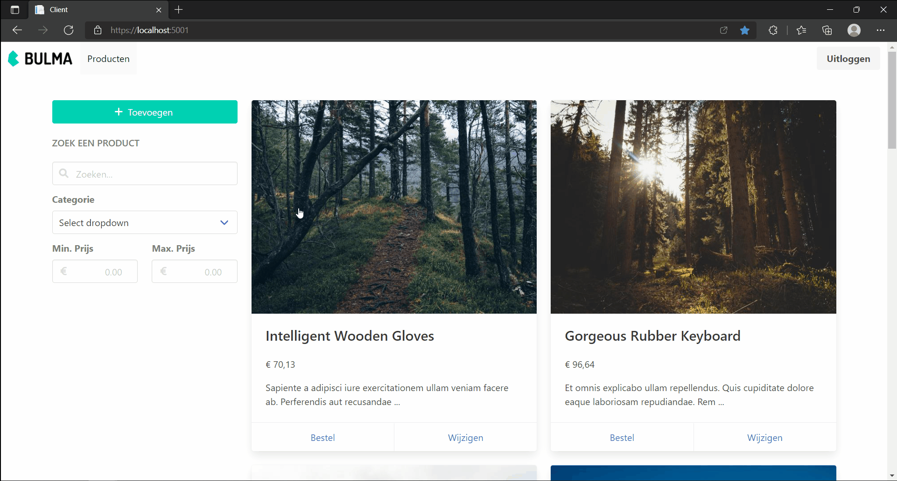
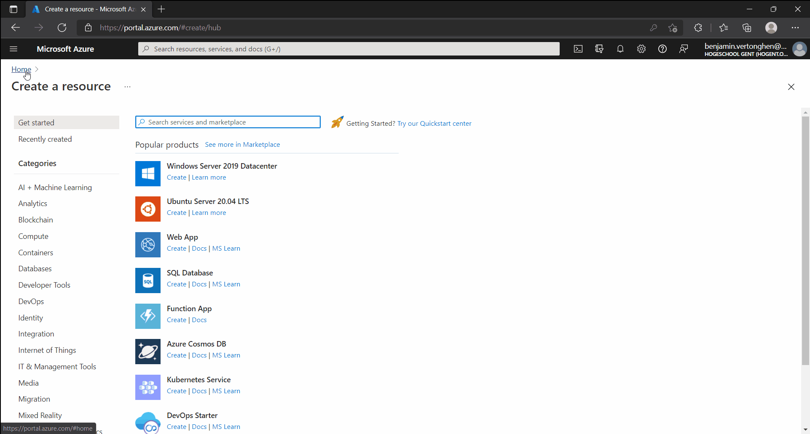
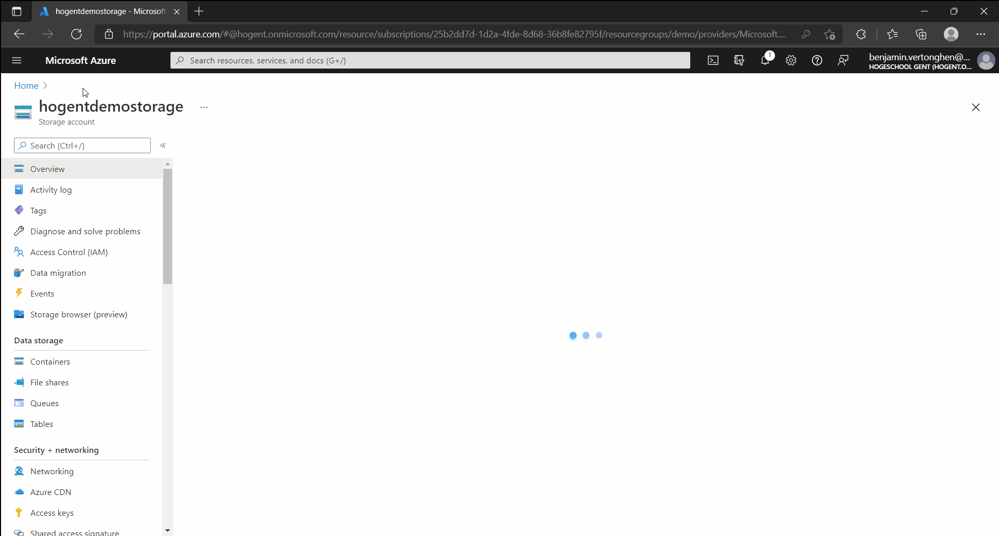

class: dark middle

# Enterprise Web Development C&#35;
> Chapter 8 - Suit up, wear a fancy Blazor

---
### Suit up, wear a fancy Blazor
# Table of contents
- [Workshop](#workshop)
- [Component Libraries](#component-libraries)
- [Sportstore example](#sportstore-example)
    - [Delete](#delete)
    - [Create](#create)
    - [Edit](#edit)
    - [Filter](#filter)
    - [Paging](#paging)
    - [Upload Image](#upload-image)
    - [Shopping Cart](#shopping-cart)

---
name:workshop
### Suit up, wear a fancy Blazor
# Blazor Workshop

Follow the following tutorial:
- <a href="https://github.com/dotnet-presentations/blazor-workshop" target="_blank">Blazor Workshop</a>

---
class: dark middle
name:component-libraries
# Suit up, wear a fancy Blazor
> Component Libraries

---
### Component Libraries
# Introduction
Components can be shared in a Razor class library (RCL) across projects. Include components and static assets in an app from:
- Another project in the solution.
- A referenced .NET library.
- A NuGet package.

Just as components are regular .NET types, components provided by an RCL are normal .NET assemblies. Just like class libraries.

> More information about Razor Class Libraries can be found <a target="_blank" href="https://docs.microsoft.com/en-us/aspnet/core/blazor/components/class-libraries?view=aspnetcore-5.0&tabs=visual-studio">here</a>.

---
### Component Libraries
# Open source
A lot of components have already been created by the Blazor community and can be found on <a target="_blank" href="https://github.com/AdrienTorris/awesome-blazor#component-bundles">GitHub</a>.
Please note that:
- Some are pay-to-use
- Simply bad
- Outdated
- Duplicate

However, some are worth mentioning:
- <a target="_blank" href="https://github.com/Blazored">Blazored</a>, small but extenable
- <a target="_blank" href="https://github.com/MudBlazor/MudBlazor">MudBlazor</a>, full suite of components
- <a target="_blank" href="https://github.com/bUnit-dev/bUnit">bUnit</a>, testing library

> You can always implement and package your own components if you don't like any.

---
### Component Libraries
# Open source
The biggest pittfalls:
- Not reading the documentation
- Swashbuckling with how the library is setup
- Not doing research before you implement it in your project
  - Some are just wrappers around JavaScript and **really** slow
- The README of a GitHub repository is your documentation, use it
- If the documentation is bad, the package normally is too.
- Try not to use libraries which extensively use JavaScript, which can interfere with the virtual DOM of Blazor.

In this chapter, we'll use certain open source package, e.g.
- <a target="_blank" href="https://github.com/Blazored/Toast">Blazored.Toast</a>
- <a target="_blank" href="https://github.com/Append-IT/Blazor.Sidepanel">Append.Blazor.Sidepanel</a>
- <a target="_blank" href="https://github.com/Blazored/FluentValidation">Blazored.FluentValidation</a>

---
class: dark middle
name:sportstore-example
# Suit up, wear a fancy Blazor
> Sportstore

---
### Sportstore
# Flashback
In chapter 6, we created a `blazorwasm --hosted` application. We used fakers and Bogus to get some initial data in our `client`. The `Client` was runnable, since everything was done on the `Client` and the `Server` was not yet involved.

In chapter 7, we created our business logic in 2 libraries, `Domain` and `Services`, so we can easily use a console app to do our bidding. We exposed our Data Transfer Objects using a REST API and made it possible to call the Server using the REPL CLI.

---
### Sportstore
# Leap forward
In the following example we combined both applicaties so that:
- The `Server` serves the `Client`, which makes <a target="_blank" href="https://developer.mozilla.org/en-US/docs/Web/HTTP/CORS">CORS</a> non-existent.
- The `Server` exposes REST API endpoints which are **partly** implemented.
    - You can navigate to `/swagger/index.html` to see the endpoints.
- The `Client` uses the <a target="_blank" href="https://bulma.io/">BULMA.io</a> CSS framework
    - It's like <a target="_blank" href="https://getbootstrap.com/">Bootstrap</a> but **without any JavaScript**
- The `Client` calls the REST API endpoints using the `(I)ProductService` and a `HTTPClient`.
- The `Client` has it's authentication / authorization mocked in the `FakeAuthenticationProvider`.
- The `Client` shows some functionality which is currently not working:
    - Filtering
    - Adding a product
    - Editing a product
    - ...

---
### Sportstore - As is


<a href="images/sportstore-as-is.gif" target="_blank">Fullscreen</a>

---
class: dark middle
# Suit up, wear a fancy Blazor
> Sportstore - Going further

---
### Sportstore
# Going further
We'll implement the following:
- Possibility to delete a product
- Create a new product
- Edit an existing product
- Filter existing products based on certain criteria

> In a later chapter, we'll introduce real authentication and a real database, we'll be using the Fakers for now.

---
### Sportstore
# What we're building


<a href="images/sportstore-final-result.gif" target="_blank">Fullscreen</a>

---
### Sportstore
# Start
1. Clone <a target="_blank" href="https://github.com/HOGENT-Web/csharp-ch-8-example-1">this GitHub Repository</a>
2. Run the project
3. Try to understand how the `Client` calls the `Server`

> All commits are done in the `solution` branch, which can be found <a href="https://github.com/HOGENT-Web/csharp-ch-8-example-1/tree/solution/src" target="_blank">here</a>.

---
class: dark middle
# Suit up, wear a fancy Blazor
> 📝 Commit: Add Project Files

---
name:delete
### Sportstore
# Delete Product
Implement the Delete Functionality.

On the Details page, there is a button called "Verwijderen", make it call the `IProductService` to actually delete the Product and navigate back to the Product Index page.
- Create a `onclick` EventHandler to call a function called `DeleteProductAsync`
- In the `DeleteProductAsync`, use the `IProductService`
- Inject the `NavigationManager` in the Detail component and use it to `navigate` to the index page.
- Deleting something without a confirmation is **a big no-no**. Ask the user if he **really** wants to delete the product, if the answer is `yes`, delete else don't.

---
class: dark middle
# Suit up, wear a fancy Blazor
> 📝 Commit: Delete Confirmation

---
name:create
### Sportstore
# Create Product
Implement the Create Functionality.

- Create a new page with a code-behind file in the Client/Products folder called Create, with url `/product/create`.
- Make sure you can navigate from the `Toevoegen` knop in the index page.
- Use the <a target="_blank" href="https://github.com/Blazored/FluentValidation">Blazored.FluentValidation</a> library to create the form.
- Use the `ProductDto.Create` as model for the `EditForm`
- Use <a target="_blank" href="https://bulma.io/documentation/form/general/">BULMA's form components</a> to style the form accordingly
- After creation, navigate to the newly created product's detail page

> Form example on the next slide

---
### Sportstore
# Create Product


---
class: dark middle
# Suit up, wear a fancy Blazor
> 📝 Commit: Create Product

---
### Sportstore
# Create Product (Sidepanel)
Sometimes the user experience can be better when rendering a small sidepanel to show the form, so that we're not actually navigating away from the index page.
- Investigate the <a target="_blank" href="https://github.com/Append-IT/Blazor.Sidepanel">Append.Blazor.Sidepanel</a> package on GitHub, especially the Forms functionality on the documentation website.
- Instead of navigating to the Product Create Page, use the Sidepanel component to show the form in.
   - Make sure to use version 1.0.1, since version 6.0.0 is for .NET 6.0

> Example on the next slide

---
### Sportstore - Create via Sidepanel


<a href="images/sportstore-create-sidepanel.gif" target="_blank">Fullscreen</a>

---
class: dark middle
# Suit up, wear a fancy Blazor
> 📝 Commit: Create Product Via Sidepanel

---
name:edit
### Sportstore
# Edit Product
Implement the Edit Functionality.

This time you're on your own, on the details page it should be possible to open a sidepanel which makes it possible to edit a product. Note that you should provide additional parameters to the sidepanel and a callback to refresh the details page once the edit is finished, since you'll be staying on the same page. Some help can be found <a target="_blank" href="https://github.com/Append-IT/Blazor.Sidepanel/blob/3da32a817e93bf28efa29053d510169f1d7ae196/docs/Pages/Callbacks.razor#L36">here</a>.

- Implement the `ProductService` functionality on both, the client and server side.
- Implement the `ProductController` with a `PUT` endpoint.
- Create or re-use DTO's, don't re-use `ProductRequest` nor `ProductResponse`
- You can test the back-end via Swagger.

> Example on the next slide

---
### Sportstore - Edit via Sidepanel


<a href="images/sportstore-edit-sidepanel.gif" target="_blank">Fullscreen</a>

---
class: dark middle
# Suit up, wear a fancy Blazor
> 📝 Commit: Edit Product Via Sidepanel

---
name:filter
### Sportstore
# Filter Products
What we'll be building


<a href="images/sportstore-filter.gif" target="_blank">Fullscreen</a>

---
### Sportstore
# Filter Products
Implement the Filter Functionality. 

- How would you tackle this feature?
- Try to draw it on a piece of paper, since multiple components are working together and both of them require the same state.

In the Blazing Pizza tutorial you learned about <a target="_blank" href="https://docs.microsoft.com/en-us/aspnet/core/blazor/state-management?view=aspnetcore-6.0&pivots=webassembly#in-memory-state-container-service-wasm">State Management</a>. It might be a good idea to use it here. However you can still pass parameters from the `Index` page to the `ProductFilters` component.

> The categories are hard-coded for now, you can however create a new `Controller` and `Service` to make them dynamic.

---
### Sportstore
# Filter Products
Some guidance in implementing this feature:
- The concept is that the filter is a separate class with all filterable properties, which binds to the input elements of the `ProductFilters` component.
- Each time a property is changed, the `ProductFilter` notifies the `Index` component that it did, therefore you need to have an event which the `Index` component can (un)subscribe to on the `ProductFilter`. Each time this happens, you'll have to fetch the products which are filtered based on all the properties that are passed as querystring parameters. The best part is, that it's filtered on the server-side and not on the client.

---
### Sportstore
# ProductFilter.cs
```
public class ProductFilter
{
*   public event Action OnProductFilterChanged;
    private string searchTerm;
*   private void NotifyStateChanged() => OnProductFilterChanged.Invoke();
    public string SearchTerm
    {
        get => searchTerm;
        set
        {
            searchTerm = value;
*           NotifyStateChanged();
        }
    }
    // Other properties / fields
}
```

---
### Sportstore
# Index.razor.cs
```
public partial class Index
{
    // Other stuff
*   private ProductFilter filter = new();
    protected override async Task OnInitializedAsync()
    {
*       filter.OnProductFilterChanged += FilterProductsAsync;
        // Other stuff
    }
    private async void FilterProductsAsync()
    {
        ProductRequest.GetIndex request = new()
        {
            MaximumPrice = filter.MaximumPrice,
            Category = filter.Category,
            MinimumPrice = filter.MinimumPrice,
            SearchTerm = filter.SearchTerm,
        };
        var response = await ProductService.GetIndexAsync(request);
        products = response.Products;
        StateHasChanged(); // Since it's not a UI-event.
    }
}
```

---
### Sportstore
# Index.razor.cs
Fixing the memory leak:
```
public partial class Index : `IDisposable`
{
    // Other stuff
    private ProductFilter filter = new();
    protected override async Task OnInitializedAsync()
    {
*       filter.OnProductFilterChanged += FilterProductsAsync;
        // Other stuff
    }
    private async void FilterProductsAsync()
    {
        // See previous slide
    }
*   public void Dispose()
*   { // If we don't do this, we'll have memory leaks.
*       filter.OnProductFilterChanged -= FilterProductsAsync;
*   }
}
```
> `Dispose` is called when the component is gone from the rendertree

---
### Sportstore
# Passing the Parameter down
Index.razor
```razor
<ProductFilters `Filter="filter"` />
```

ProductFilters.razor.cs
```
public partial class ProductFilters
{
    [Parameter] public ProductFilter Filter { get; set; }
}
```
ProductFilters.razor

Binding the property to the `<input>`
```
<input `@bind="Filter.SearchTerm"` class="input" type="search" />
```

---
### Sportstore
# Passing querystring parameters
Client/ProductService.cs
```
public async Task<ProductResponse.GetIndex> GetIndexAsync
(ProductRequest.GetIndex request)
{
*   var queryParameters = request.GetQueryString();
    var response = await client.GetFromJsonAsync
    <ProductResponse.GetIndex>($"{endpoint}`?{queryParameters}`");
    return response;
}
```

Convert object to Query String parameters (name-value pairs)
```
public static string GetQueryString(this object obj)
{
    var properties = 
    from p in obj.GetType().GetProperties()
    where p.GetValue(obj, null) != null
    select p.Name + "=" + 
    HttpUtility.UrlEncode(p.GetValue(obj, null).ToString());
    return string.Join("&", properties.ToArray());
}
```

---
### Sportstore
# Back-end filtering
Services/ProductService.cs
```
public async Task<ProductResponse.GetIndex> GetIndexAsync
                        (ProductRequest.GetIndex request)
{
    ProductResponse.GetIndex response = new();
*   var query = products.AsQueryable();
*   if (!string.IsNullOrWhiteSpace(request.SearchTerm))
*       query = query.Where(x => x.Name.Contains(request.SearchTerm));
    // Don't forget case sensitivity
    if (request.MinimumPrice is not null)
        query = query.Where(x => x.Price.Value >= request.MinimumPrice);
    // Other filters here
    response.TotalAmount = query.Count(); // Used for paging
    query = query.Take(request.Amount).Skip(request.Amount * request.Page);
    query.OrderBy(x => x.Name);
    response.Products = query.Select(x => new ProductDto.Index
    {
        Id = x.Id,
        Name = x.Name,
        // Other mappings
    }).ToList();
    return response;
}
```

---
class: dark middle
# Suit up, wear a fancy Blazor
> 📝 Commit: Filter Products

---
name:paging
### Exercise
# Add Paging
- Add a Previous and Next button on the Index.razor page (below the filter), to make paging possible.
- Make previous disabled if it's the first page
- Make next disabled if there are no other pages.
- When clicking on previous / next go to the previous or next page.

> <a target="_blank" href="https://bulma.io/documentation/components/pagination/"> BULMA - Pagination</a> can help you for the layout.

---
class: dark middle
# Suit up, wear a fancy Blazor
> 📝 Commit: Add Paging

---
name:image-uploading
class: dark middle
# Suit up, wear a fancy Blazor
> Uploading images

---
### Image uploading
# Best practises
- **Don't store images in your database**, unless they're small
    - A browser cannot **cache** the images
    - Server takes a **big perf. hit** when requesting multiple files
    - Usually a reference(**URI**) to where the image is stored is kept
- Store your images somewhere they can be **backed-up**
    - Usually a wwwroot folder is not backed-up by default
- Binary Large Object(**BLOB**) storage is generally a good choice
- Who can upload/download the images?
    - Depending on the use-case
    - Most of the time **only certain users can upload**
    - Some images can be public and some should be private
    - Think about Facebook, who can see these images?
- Let your **client stream images** to a BLOB storage

---
### Image uploading
# **B**inary **L**arge **Ob**ject Storage
Blob storage is a feature in Microsoft Azure that lets developers store **unstructured data** in Microsoft's cloud platform. This data can be accessed from anywhere in the world and can include **audio, video and text**. Blobs are grouped into "**containers**" that are tied to user accounts. 

Blob storage is designed for:

- Serving images or documents directly to a browser.
- Storing files for distributed access.
- Streaming video and audio.
- Writing to log files.
- Storing data for backup and restore and archiving.

> There are other solutions as well, but we'll use Microsoft's BLOB storage, read more about it <a target="_blank" href="https://docs.microsoft.com/en-us/azure/storage/blobs/storage-blobs-introduction">here

---
### BLOB Storage
# Resources
Blob storage offers three types of resources:

- The storage account
- A container in the storage account
- A blob in a container


---
### BLOB Storage
# Storage account
A storage account provides a unique namespace in Azure for your data. Every object that you store in Azure Storage has an address that includes your unique account name. The combination of the account name and the Azure Storage blob endpoint forms the base address for the objects in your storage account.

For example, if your storage account is named mystorageaccount, then the default endpoint for Blob storage is:

```
http://mystorageaccount.blob.core.windows.net
```

---
### BLOB Storage
# Containers
A container organizes a set of blobs, similar to a directory in a file system. A storage account can include an unlimited number of containers, and a container can store an unlimited number of blobs. A container can be public or private, most of the time you want private Create or Write and public Read access.

You can even have a hierarcical file structure in the container

```
- images
|-- user1
    |-- image1.jpg
    |-- image2.jpg
|-- user2
    |-- image1.jpg
```

> TIP: It's best to use simple file names and lowercase for the Container / BLOBS

---
### BLOB Storage
# Blobs

Azure Storage supports three types of blobs:

- **Block blobs** store text and binary data. Block blobs are made up of blocks of data that can be managed individually. Block blobs can store up to about 190.7 TiB. (we'll be using this)
- **Append blob**s are made up of blocks like block blobs, but are optimized for append operations. Append blobs are ideal for scenarios such as logging data. (not using this)
- **Page blobs** store random access files up to 8 TiB in size. Page blobs store virtual hard drive (VHD) files and serve as disks for Azure virtual machines. (not using this)

> More information about the different types can be found <a target="_blank" href="https://docs.microsoft.com/en-us/rest/api/storageservices/understanding-block-blobs--append-blobs--and-page-blobs">here</a>

---
### BLOB Storage
# Creating the account

Follow the steps in the GIF, if you don't have a Free Azure Accounts yet, activate one first by going to <a target="_blank" href="https://azure.microsoft.com/nl-nl/free/">this link</a>.



<a href="images/blob-storage-account.gif" target="_blank">Fullscreen</a>

---
### BLOB Storage
# Creating the container



<a href="images/blob-storage-container.gif" target="_blank">Fullscreen</a>

---
### BLOB Storage
# Upload an image (portal)


<a href="images/blob-storage-image-upload.gif" target="_blank">Fullscreen</a>

---
### BLOB Storage
# Uploading images
- All images are public (since the container is public read in this case) and can be viewed, creating or manipulating should be secured by a connectionstring.
- Do NOT share the connectionstring with anyone, only use it on the server, where it's safe.
- You can use Shared Access Signatures (SAS) to give someone a timeslot to upload or edit block blobs, without sharing your account information (it's a bit like a JWT)

---
### BLOB Storage
# Shared Access Signatures (SAS)
A shared access signature is a signed URI that points to one or more storage resources. The URI includes a token that contains a special set of query parameters. The token indicates how the resources may be accessed by the client. One of the query parameters, the signature, is constructed from the SAS parameters and signed with the key that was used to create the SAS. This signature is used by Azure Storage to authorize access to the storage resource.

Using a SAS we can give the client access for a few minutes (not to long) to upload an image directly without streaming the image to our server and then to the Azure Storage Container. Therefore the load is never on our server but on the client and Azure itself. 

---
### Image uploading
# Strategy


---
### Uploading via SAS and Postman
# Storage account Connectionstring
Grab the connectionstring of your storage account, don't share it!


<a href="images/blob-storage-connectionstring.gif" target="_blank">Fullscreen</a>

---
### Uploading via SAS and Postman
# Console app for prototyping
Create a new console app
```
dotnet new console -o Hogent.Sas

cd .\Hogent.Sas
dotnet add package Azure.Storage.Blobs
```

On the next slide, copy-paste the code and replace YOUR_CONNECTION_STRING_HERE, with yours and run the console app.

---
### Uploading via SAS and Postman
# Console app for prototyping
```
using Azure.Storage.Blobs;
using Azure.Storage.Sas;
using System;

const string connectionString = "YOUR_CONNECTION_STRING_HERE";
const string containerName = "images";
const string filename = "filename.gif";

BlobServiceClient client = new BlobServiceClient(connectionString);
var containerClient = client.GetBlobContainerClient(containerName);
BlobClient blobClient = containerClient.GetBlobClient(filename);

var blobSasBuilder = new BlobSasBuilder
{
    ExpiresOn = DateTime.UtcNow.AddMinutes(5),
    BlobContainerName = containerName,
    BlobName = filename,
};
blobSasBuilder.SetPermissions(BlobSasPermissions.Write | BlobSasPermissions.Create);

var sas = blobClient.GenerateSasUri(blobSasBuilder);
Console.WriteLine(sas);
```

---
### Uploading via SAS and Postman
# Console app for prototyping
1. Copy the generated URI from the console window and copy-paste it into Postman
2. Set the HTTP Method to `PUT`
3. Click on the Body tab and select a random image file.
4. Set a header named `x-ms-blob-type` to `BlockBlob`
5. Press Send
6. View the image in the Azure Storage Container

> GIF on next slide

---
### Uploading via SAS and Postman
# Postman call and upload


<a href="images/blob-storage-sas-token-upload-postman.gif" target="_blank">Fullscreen</a>

---
### Exercise
# Upload on Create
Implement the functionality to upload an image when creating a product. 

- When creating a product it should be possible to upload an image after the product is created on the server side.
- We'll use a `<InputFile/>` component and BULMA CSS' goodness to style it.

> Result on next slide

---
### Upload on Create
# Final Outcome


<a href="images/blob-storage-create-with-image.gif" target="_blank">Fullscreen</a>

---
### Client
# StorageService
Using a normal HttpClient we can upload files to BLOB based on the SAS returned from the Server.

Client/Infrastructure/StorageService.cs
```
public class StorageService
{
    private readonly HttpClient httpClient;
    public const long maxFileSize = 1024 * 1024 * 10; // 10MB
    public StorageService(HttpClient httpClient)
    {
        this.httpClient = httpClient;
    }
    public async Task UploadImageAsync(Uri sas, IBrowserFile file)
    {
        var content = new StreamContent(file.OpenReadStream(maxFileSize));
        content.Headers.Add("x-ms-blob-type", "BlockBlob");
        var response = await httpClient.PutAsync(sas, content);
        response.EnsureSuccessStatusCode();
    }
}
```

---
### Client
# StorageService in DI
Add a Typed HttpClient in Dependency Injection

```
dotnet add package Microsoft.Extensions.Http
```

Client/Program.cs
```
    public class Program
    {
        public static async Task Main(string[] args)
        {
            var builder = WebAssemblyHostBuilder.CreateDefault(args);
            builder.RootComponents.Add<App>("#app");

            builder.Services.AddAuthorizationCore();
            // Other services
*           builder.Services.AddHttpClient<StorageService>();

            await builder.Build().RunAsync();
        }
    }
```

---
### Client
# InputFile
Client/Products/Create.razor
```
<div class="field">
    <div class="file has-name is-boxed is-fullwidth">
        <label class="file-label">
            <InputFile class="file-input" OnChange="@LoadImage" accept="image/*"/>
            <span class="file-cta">
                <span class="file-icon">
                    <i class="fas fa-upload"></i>
                </span>
                <span class="file-label has-text-centered">
                    Selecteer een afbeelding
                </span>
            </span>
            @if (image is not null)
            {
                <span class="file-name">
                    @image.Name
                </span>
            }
        </label>
    </div>
</div>
```

---
### Client
# InputFile
Client/Products/Create.razor.cs
```
public partial class Create
{
    private ProductDto.Mutate product = new();
*   private IBrowserFile image;

    [Inject] public IProductService ProductService { get; set; }
    [Inject] public NavigationManager NavigationManager { get; set; }
*   [Inject] public StorageService StorageService { get; set; }

    private async Task CreateProductAsync()
    {
        ProductRequest.Create request = new() {Product = product};
        var response = await ProductService.CreateAsync(request);
*       await StorageService.UploadImageAsync(response.UploadUri, image);
        NavigationManager.NavigateTo($"product/{response.ProductId}");
    }
*   private void LoadImage(InputFileChangeEventArgs args)
*   {
*       image = args.File;
*       product.HasImage = true;
*   }
}
```

---
### Shared
# ProductResponse
Shared/Products/ProductResponse.cs

Adding the UploadUri to the Create Response, so we can upload from the client.
```
    public static class ProductResponse
    {
        // Other responses
        public class Create
        {
            public int ProductId { get; set; }
*           public Uri UploadUri { get; set; }
        }
    }
```

---
### Shared
# ProductDto
Shared/Products/ProductDto.cs
```
    public static class ProductDto
    {
        // Other DTO's
        public class Mutate
        {
            public string Name { get; set; }
            // Other properties
*           public bool HasImage { get; set; }

            public class Validator : AbstractValidator<Mutate>
            {
                public Validator()
                {
                    RuleFor(x => x.Name).NotEmpty().Length(1, 250);
                    RuleFor(x => x.Price).InclusiveBetween(1, 250);
                    RuleFor(x => x.Category).NotEmpty().Length(1, 250);
*                   RuleFor(x => x.ImageAmount).NotEmpty();
                    // Notice that this will break the Edit functionality
                }
            }
        }
    }
```

---
### Services
# IStorageService
We'll use an interface here so we can easily switch from Azure BLOB to another storage provider.
Notice the abstract name, we're not referring to Azure at all, since it doesn't matter.

Services/Common/IStorageService.cs
```
public interface IStorageService
{
    string StorageBaseUri { get; }
    Uri CreateUploadUri(string filename);
}
```

---
### Services
# Add Azure and Configuration 

Using the Azure SDK it makes our lives easier to use the built-in classes. However we'll still need the connectionString somewhere, it's best to use AppSettings.json for this.

Services/Services.csproj
```
dotnet add package Azure.Storage.Blobs
dotnet add package Microsoft.Extensions.Configuration.Abstractions
```

Server/AppSettings.json
```
  "ConnectionStrings": {
    "Storage": "YOUR_CONNECTION_STRING_HERE"
  },
```

> Adding ConnectionStrings to your repo is not the best practise in the world, make sure to take appropriate action, using environment secrets. Read more about <a target="_blank" href="https://docs.microsoft.com/en-us/aspnet/core/security/app-secrets?view=aspnetcore-5.0&tabs=windows">Storing Secrets</a>

---
### Services
# BlobStorageService 
Services/Common/BlobStorageService.cs

Code can be seen here, since it's too big for a slide, we need a new format for this...

<a target="_blank" href="https://github.com/HOGENT-Web/csharp-ch-8-example-1/blob/2bf1ce5b8af673f2e8f83b453413bd67d6047ed6/src/Services/Common/BlobStorageService.cs#L1">BlobStorageService on GitHub</a>.

---
### Services/Products/FakeProductService.cs
```
public class FakeProductService : IProductService {
*   private readonly IStorageService storageService;
*   public FakeProductService(IStorageService storageService)
*   {
*       this.storageService = storageService;
*   }
    public async Task<ProductResponse.Create> CreateAsync(ProductRequest.Create request)
    {
        ProductResponse.Create response = new();
        var model = request.Product;
        var price = new Money(model.Price);
        var category = new Category(model.Category);
*       var imageFilename = Guid.NewGuid().ToString();
*       var imagePath = $"{storageService.StorageBaseUri}{imageFilename}";
        var product = new Product(model.Name, model.Description, price, model.InStock, imagePath, category)
        {
            Id = products.Max(x => x.Id) + 1
        };

        products.Add(product);
*       var uploadUri = storageService.CreateUploadUri(imageFilename);
        response.ProductId = product.Id;
*       response.UploadUri = uploadUri;

        return response;
    }
}
```

---
### CORS
# Allow CORS
Since we're in a Browser, due to CORS we cannot upload the image. Let's allow all CORS for now, but in production you'll want to be more specific.


<a href="images/cors.png" target="_blank">Fullscreen</a>


---
### Upload on Create
# Done.


<a href="images/blob-storage-create-with-image.gif" target="_blank">Fullscreen</a>


---
class: dark middle
# Suit up, wear a fancy Blazor
> 📝 Commit: Add Image Upload On Create

---
name:edit-image
### Exercise
# Edit Product with Image
Fix the Edit Functionality. 

- Make it possible to edit the product's image, since we broke the functionaltity.

---
name:shopping-cart
### Exercise
# Shopping Cart
Implement the Shopping Cart Functionality. 

- Make it possible to add products in a Shopping Cart.
- Make it possible to remove products from the  Shopping Cart.
- Only client side functionalities are currently required.

Tips:
- Render the Shoppingcart in the Sidepanel
- Use the <a href="https://docs.microsoft.com/en-us/aspnet/core/blazor/state-management?view=aspnetcore-6.0&pivots=webassembly" target="_blank">State Management article</a> to put the cart in a CartState class (memory).


