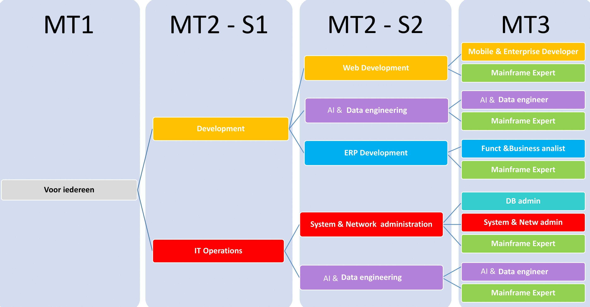

class: dark middle

# Enterprise Web Development C&#35;
> Course Overview

---
### Enterprise Web Development C&#35;
# Table of Contents

- [Situation](#situation)
- [Goals](#goals)
- [Technologies](#technologies)
- [Learning Materials](#learning-materials)
- [Classes](#classes)
- [Prerequisites](#prerequisites)
- [Examination](#examination)
- [What We're Building](#what-were-building)
- [Chapter Overview](#chapter-explanation)

---
name: situation
### Course Overview
# Situation
 
 

---
name: goals
### Course Overview
# Goals

At the end of this course, the student:
- Has a deep understanding of the **.NET framework**.
- Can create a client web application using **Blazor**.
- Can create a **REST|GRPC Web API** using **ASP.NET**.
- Can connect clients to server applications using **various protocols**.
- Can use different **(micro)-ORM Technologies** to persist data.
- Can integrate **authorization and authentication** in the application.
- Can test software using **unit and integration tests**.
- Can deploy production-ready applications on **Microsoft Azure**.
- Can use various **design patterns** and **best practices**.

---
name: technologies
### Course Overview
# Technologies

**Programming Languages**
- C&#35; 10
- HTML in combination with Razor
- CSS in combination with BULMA

**Frameworks** 
- Server: (ASP).NET 6
- Client: Blazor

**Packages**
- Entity Framework 6 | Dapper
- FluentValidation 
- A bunch of others to make our lives easier

---
### Course Overview
# Technologies

**Code Editors**
- Visual Studio Code
 - Mandatory
     - [C#](https://marketplace.visualstudio.com/items?itemName=ms-dotnettools.csharp)
     - [.NET Interactive Notebooks](https://marketplace.visualstudio.com/items?itemName=ms-dotnettools.dotnet-interactive-vscode)
 - Optional
     - [NuGet Gallery](https://marketplace.visualstudio.com/items?itemName=patcx.vscode-nuget-gallery) (optional)
     - [Azure Static Web Apps](https://marketplace.visualstudio.com/items?itemName=ms-azuretools.vscode-azurestaticwebapps) (optional)
     - [ASP.NET Core Switcher](https://marketplace.visualstudio.com/items?itemName=adrianwilczynski.asp-net-core-switcher) (optional)
- Visual Studio Community 2022

**Database Access**
- Azure Data Studio
- Microsoft SQL Server Management Studio 

---
name: learning-materials
### Course Overview
# Learning Materials

- Slides (EN)
 - **Bare minimum**, but linked to the [official documentation](https://docs.microsoft.com/)
- Exercises (EN)
 - Drill exercises using `.NET Interactive`
 - Real-life examples implementing a web store
- Demos
 - Each class, we'll use `.NET Interactive` or the web store example.
- Summary 
 - There is a [portal](../../../index.html) with links to all the learning materials.

> During this course, we try to mimic the life of a professional developer. Therefore, reading the official docs is mandatory.

---
name: classes
### Course Overview
# Classes
5 hours per week
 - 2 hours
 - 3 hours
> There is always a part theory and practicum.

**Practice-first approach**
 - Essential theory explained with slides and demos followed by exercises in each class.

Time investment in this course
- **60 hours** in class
- **150 hours** self-study 

---
name: prerequisites
### Course Overview
# Prerequisites
- HTML
- CSS
- JavaScript
- Design Patterns
- **T**est **D**riven **D**evelopment & Mocking
- Common sense

---
name: examination
### Course Overview
# Examination
- 100% Exam in the examination period
- **B**ring **Y**our **O**wn **D**evice
- Communication during the exam is strictly **forbidden**
- AI-based tools are strictly **forbidden**
- Implement parts of a larger solution

> If the code does not compile, a.k.a. `Build Errors`, **= 0/20.**

## Catch-up (inhaal examen)

- If you're sick or have another **valid** reason
- The catch-up exam is an **oral** exam via Teams.
- You can only take the catch-up exam if you have a **valid reason**.

---
name: what-were-building
### Course Overview
# What We're Building

A Web store that sells bogus products called BogusStore.

### Technologies
- Blazor WASM
- ASP.NET REST API
- Authentication and Authorization with Auth0
- Entity Framework and Microsoft SQL Server for persistence
- Deployed on Azure

### Use cases
- A user can browse the catalog using filtering
- An administrator can add products to the catalog
- A user can add products to the shopping cart
- ...

---
### What We're Building
# Bogus Store

<video controls width="100%" class="center" >
  <source src="../../08/slides/images/bogusstore-final-result.mp4" type="video/mp4">
Your browser does not support the video tag.
</video>

---
### What We're Building
# Shopping Cart

<video controls width="100%" class="center" >
  <source src="../../08/slides/images/shopping-cart.mp4" type="video/mp4">
Your browser does not support the video tag.
</video>

---
name: chapter-explanation
### Course Overview
# Chapters
- **Chapter 1** : Introduction to the .NET ecosystem
    - .NET Explained
    - Class Libraries
    - GIT Structure
- **Chapter 2** : See Sharp with C#
    - C# Basics
    - A lot of basic stuff you should already know in JAVA etc.
- **Chapter 3** : Model & Unit Testing
    - C# Advanced
    - Creating a Domain and best practices
    - Unit Testing
- **Chapter 4** : LINQ **Self Study**
    - Language Integrated Query
    - Like JAVA Streams, functional programming
- **Chapter 5** : David's & Goliath's Architecture
    - Modern Architecture
    - Learn how to set up a project
- **Chapter 6** : Suit up, wear a Blazor
    - Simple client-side C# with Blazor
    - Like React but with C#
    - No Server yet

> At this point, we're in week 4 of the semester.

---
### Course Overview
# Chapters
- **Chapter 7** : Ain't No REST for the wicked
    - Setting up a REST API.
    - Kinda like the Web Services course
- **Chapter 8** : Suit up, wear a fancy Blazor
    - Advanced client-side C# with Blazor
    - Connecting the Client and Server
    - Component Libraries
- **Chapter 9** : Data The New Raw Material
    - Connecting to a database
    - Using Object Relational Mappers
- **Chapter 10** : Try "Password123"
    - Authentication & Authorization
    - Using Auth0 to secure our application
- **Chapter 11** : Headless Testing
    - Testing our application
    - Integration testing
- **Chapter 12** : Example Exams
    - Prepare yourself for the examination
    
> At this point, it's Christmas.🌲🤶

---
### Course Overview
# Help
We don't provide help **after** class. Unless you created a [Stackoverflow](https://stackoverflow.com/) post to describe the issue and tried to copy-paste code like a real developer.

