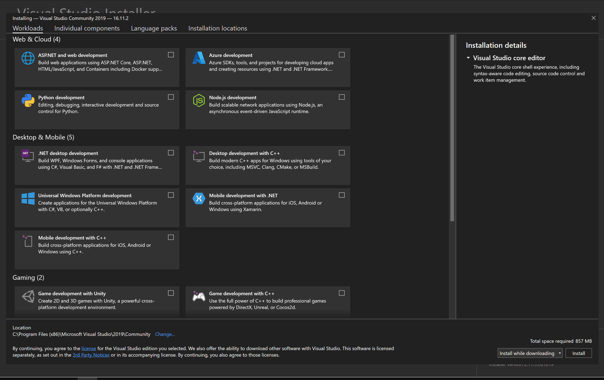
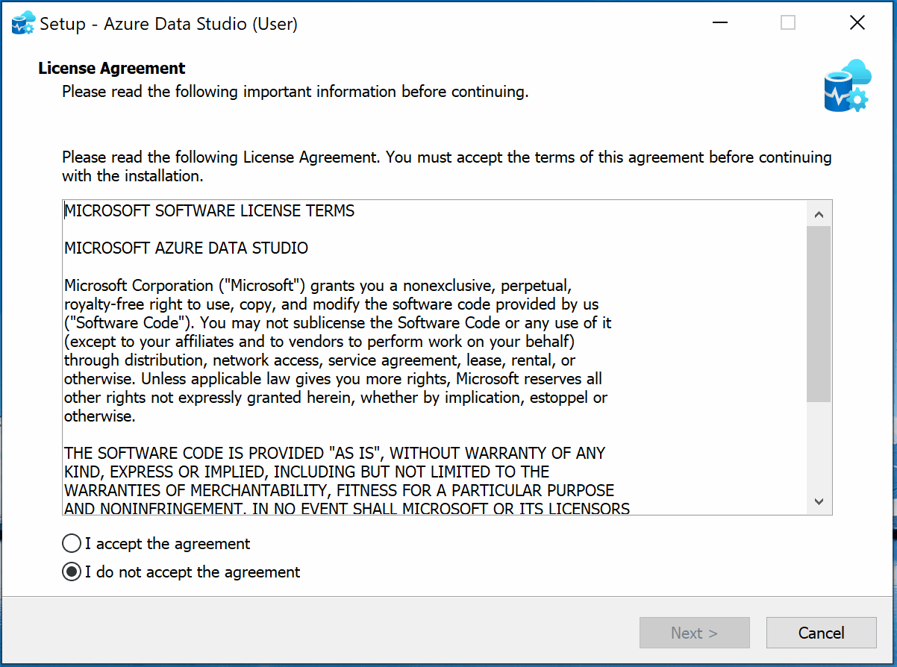

class: dark middle

# Enterprise Web Development C&#35;
> Installation Guide

---
### Installation Guide
# Table of contents

Code Editors (IDE)
- [Visual Studio Community 2019](#visual-studio) **Kinda Cross-platform**
- [Visual Studio Code](#visual-studio-code) **Cross-platform**
  - With various extensions

Data Management
- [Microsoft SQL Server Management Studio (SSMS)](#ssms)
- [Azure Data Studio](#azure-data-studio) **Cross-platform**

GIT
- [Gitkraken](#gitkraken) **Cross-platform**
---
class: dark middle

# Installation Guide
> Code Editors

---
name:visual-studio
### Installation Guide
# Visual Studio 2019 Community 
A fullblown source code editor to manipulate code **with a local database**

1. Download Visual Studio Community 2019
  - [Download for Windows](https://visualstudio.microsoft.com/thank-you-downloading-visual-studio/?sku=Community&rel=16)
  - [Download for Apple](https://visualstudio.microsoft.com/thank-you-downloading-visual-studio-mac/?sku=communitymac&rel=16)

2. Install* (for Windows)
  - Double click the installer
  - Select `.NET cross-platform development` workload
  - Select the tab `Individual components`
  - Search for `Class Designer`
  - Select `Class Designer`
  - Click `Install`

> *GIF provided in the next slide.

---
### Visual Studio 2019 Community - Installation workflow

> Your version could be a little bit different.

---
name:visual-studio-code
### Installation Guide
# Visual Studio Code
A lightweight source code editor to manipulate code.

1. Download Visual Studio Code
  - [Download for Windows](https://code.visualstudio.com/sha/download?build=stable&os=win32-x64-user)
  - [Download for Apple](https://code.visualstudio.com/sha/download?build=stable&os=darwin-universal)

2. Install* (for Windows)
  - Double click the installer
  - Install as you normally should **but**:
      - **Select Add Open with code action... file context menu**
      - **Select Add Open with code action... directory context menu**
      - **Select Register Code as an editor for supported file types**
  - Click `Install`

> *GIF provided in the next slide.

---
### Visual Studio Code - Installation workflow

> Your version could be a little bit different.

---
### Installation Guide
# Visual Studio Code Extensions
Some extra extensions to make our lives easier.

1. Click on the name of the extension.
2. Click `Install` on the page.

Mandatory
- [C#](https://marketplace.visualstudio.com/items?itemName=ms-dotnettools.csharp)
- [.NET Interactive Notebooks](https://marketplace.visualstudio.com/items?itemName=ms-dotnettools.dotnet-interactive-vscode)

Optional
- [NuGet Gallery](https://marketplace.visualstudio.com/items?itemName=patcx.vscode-nuget-gallery) (optional)
- [Azure Static Web Apps](https://marketplace.visualstudio.com/items?itemName=ms-azuretools.vscode-azurestaticwebapps) (optional)
- [ASP.NET Core Switcher](https://marketplace.visualstudio.com/items?itemName=adrianwilczynski.asp-net-core-switcher) (optional)

---
class: dark middle

# Installation Guide
> Data Management

---
name:ssms
### Installation Guide
# SQL Server Management Studio
A fullblown data editor.

1. Download SQL Server Management Studio (SSMS)
  - [Download for Windows](https://docs.microsoft.com/en-us/sql/ssms/download-sql-server-management-studio-ssms?view=sql-server-ver15)
  - Not supported for apple devices

2. Install*
  - Double click the installer
  - Click `Install`

> *GIF not provided in the next slide, since well yeah...

---
name:azure-data-studio
### Installation Guide
# Azure Data Studio
A lightweight data editor to manipulate the database.

1. Download Azure Data Studio
  - [Download for Windows](https://go.microsoft.com/fwlink/?linkid=2170400)
  - [Download for Apple](https://go.microsoft.com/fwlink/?linkid=2169955)

2. Install* (for Windows)
  - Double click the installer
  - Install as you normally should **but**:
      - **Select Register Studio as an editor for supported file types**
  - Click `Install`

> *GIF provided in the next slide.

---
### Azure Data Studio - Installation workflow

> Your version could be a little bit different.

---
class: dark middle

# Installation Guide
> GIT: *unpleasant person* in British English slang

---
name:gitkraken
### Installation Guide
# Gitkraken
A lightweight **G**raphical **U**ser **I**nterface for GIT

1. Download GitKraken
  - [Download for Windows](https://www.gitkraken.com/download/windows64)
  - [Download for Apple](https://www.gitkraken.com/download/mac)

2. Install* (for Windows)
  - Double click the installer
  - Sign-in with your GitHub account.

> *GIF not provided in the next slide, since well yeah...

---
### Installation Guide
# Success!
You're now ready to follow the classes in this course! #yay

