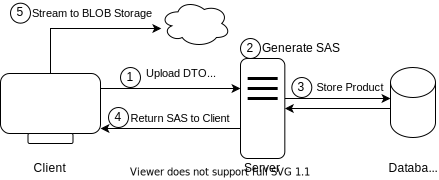
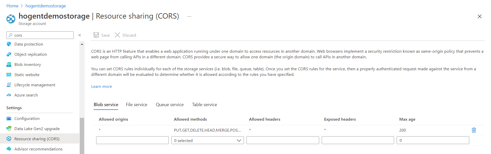

class: dark middle

# Enterprise Web Development C&#35;
> Optional: Storing images

---
### Storing images
# Table of contents
- [Best Practises](#best-practises)
- [BLOB Storage](#blob-storage)

---
name:best-practises
class: dark middle
# Storing images
> Best practises

---
### Image uploading
# Best practises
- **Don't store images in your database**, unless they're small
    - A browser cannot **cache** the images
    - Server takes a **big perf. hit** when requesting multiple files
    - Usually a reference(**URI**) to where the image is stored is kept
- Store your images somewhere they can be **backed-up**
    - Usually a wwwroot folder is not backed-up by default
- Binary Large Object(**BLOB**) storage is generally a good choice
- Who can upload/download the images?
    - Depending on the use-case
    - Most of the time **only certain users can upload**
    - Some images can be public and some should be private
    - Think about Facebook, who can see these images?
- Let your **client stream images** to a BLOB storage

---
### Image uploading
# **B**inary **L**arge **Ob**ject Storage
Blob storage is a feature in Microsoft Azure that lets developers store **unstructured data** in Microsoft's cloud platform. This data can be accessed from anywhere in the world and can include **audio, video and text**. Blobs are grouped into "**containers**" that are tied to user accounts. 

Blob storage is designed for:

- Serving images or documents directly to a browser.
- Storing files for distributed access.
- Streaming video and audio.
- Writing to log files.
- Storing data for backup and restore and archiving.

> There are other solutions as well, but we'll use Microsoft's BLOB storage, read more about it <a target="_blank" href="https://docs.microsoft.com/en-us/azure/storage/blobs/storage-blobs-introduction">here

---
name:blob-storage
class: dark middle
# Storing images
> Binary Large Object Storage (BLOB)

---
### BLOB Storage
# Resources
Blob storage offers three types of resources:

- The storage account
- A container in the storage account
- A blob in a container


---
### BLOB Storage
# Storage account
A storage account provides a unique namespace in Azure for your data. Every object that you store in Azure Storage has an address that includes your unique account name. The combination of the account name and the Azure Storage blob endpoint forms the base address for the objects in your storage account.

For example, if your storage account is named mystorageaccount, then the default endpoint for Blob storage is:

```
http://mystorageaccount.blob.core.windows.net
```

---
### BLOB Storage
# Containers
A container organizes a set of blobs, similar to a directory in a file system. A storage account can include an unlimited number of containers, and a container can store an unlimited number of blobs. A container can be public or private, most of the time you want private Create or Write and public Read access.

You can even have a hierarcical file structure in the container

```
- images
|-- user1
    |-- image1.jpg
    |-- image2.jpg
|-- user2
    |-- image1.jpg
```

> TIP: It's best to use simple file names and lowercase for the Container / BLOBS

---
### BLOB Storage
# Blobs

Azure Storage supports three types of blobs:

- **Block blobs** store text and binary data. Block blobs are made up of blocks of data that can be managed individually. Block blobs can store up to about 190.7 TiB. (we'll be using this)
- **Append blob**s are made up of blocks like block blobs, but are optimized for append operations. Append blobs are ideal for scenarios such as logging data. (not using this)
- **Page blobs** store random access files up to 8 TiB in size. Page blobs store virtual hard drive (VHD) files and serve as disks for Azure virtual machines. (not using this)

> More information about the different types can be found <a target="_blank" href="https://docs.microsoft.com/en-us/rest/api/storageservices/understanding-block-blobs--append-blobs--and-page-blobs">here</a>

---
### BLOB Storage
# Creating the account

Follow the steps in the recording, if you don't have a Free Azure Accounts yet, activate one first by going to <a target="_blank" href="https://azure.microsoft.com/nl-nl/free/">this link</a>.

<video controls width="95%" class="center" >
  <source src="images/blob-storage-account.mp4" type="video/mp4">
Your browser does not support the video tag.
</video>

---
### BLOB Storage
# Creating the container

<video controls width="95%" class="center" >
  <source src="images/blob-storage-container.mp4" type="video/mp4">
Your browser does not support the video tag.
</video>

---
### BLOB Storage
# Upload an image (portal)

<video controls width="95%" class="center" >
  <source src="images/blob-storage-image-upload.mp4" type="video/mp4">
Your browser does not support the video tag.
</video>

---
### BLOB Storage
# Uploading images
- All images are public (since the container is public read in this case) and can be viewed, creating or manipulating should be secured by a connectionstring.
- Do **NOT** share the connectionstring with anyone, only use it on the server, where it's safe.
- You can use Shared Access Signatures (SAS) to give someone a timeslot to upload or edit block blobs, without sharing your account information (it's a bit like a JWT)

---
### BLOB Storage
# Shared Access Signatures (SAS)
A shared access signature is a signed URI that points to one or more storage resources. The URI includes a token that contains a special set of query parameters. The token indicates how the resources may be accessed by the client. One of the query parameters, the signature, is constructed from the SAS parameters and signed with the key that was used to create the SAS. This signature is used by Azure Storage to authorize access to the storage resource.

Using a SAS we can give the client access for a few minutes (not too long) to upload an image directly without streaming the image to our server and then to the Azure Storage Container. Therefore the load is never on our server but on the client and Azure itself. 

---
### Image uploading
# Strategy


---
### Uploading via SAS and Postman
# Storage account Connectionstring
Grab the connectionstring of your storage account, don't share it!
<video controls width="95%" class="center" >
  <source src="images/blob-storage-connectionstring.mp4" type="video/mp4">
Your browser does not support the video tag.
</video>

---
### Uploading via SAS and Postman
# Console app for prototyping
Create a new console app
```
dotnet new console -o Hogent.Sas -f net6.0

cd .\Hogent.Sas
dotnet add package Azure.Storage.Blobs
```

On the next slide, copy-paste the code and replace YOUR_CONNECTION_STRING_HERE, with yours and run the console app.

---
### Uploading via SAS and Postman
# Console app for prototyping
```
using Azure.Storage.Blobs;
using Azure.Storage.Sas;
using System;

const string connectionString = "YOUR_CONNECTION_STRING_HERE";
const string containerName = "images";
const string filename = "filename.gif";

BlobServiceClient client = new BlobServiceClient(connectionString);
var containerClient = client.GetBlobContainerClient(containerName);
BlobClient blobClient = containerClient.GetBlobClient(filename);

var blobSasBuilder = new BlobSasBuilder
{
    ExpiresOn = DateTime.UtcNow.AddMinutes(5),
    BlobContainerName = containerName,
    BlobName = filename,
};
blobSasBuilder.SetPermissions(BlobSasPermissions.Write | BlobSasPermissions.Create);

var sas = blobClient.GenerateSasUri(blobSasBuilder);
Console.WriteLine(sas);
```
> Note that the extention (.gif) and filename are hard-coded.

---
### Uploading via SAS and Postman
# Console app for prototyping
1. Copy the generated URI from the console window and copy-paste it into Postman
2. Set the HTTP Method to `PUT`
3. Click on the Body tab and select a random image file.
4. Set a header named `x-ms-blob-type` to `BlockBlob`
5. Press Send
6. View the image in the Azure Storage Container

> Recording on next slide

---
### Uploading via SAS and Postman
# Postman call and upload
<video controls width="100%" class="center" >
  <source src="images/blob-storage-sas-token-upload-postman.mp4" type="video/mp4">
Your browser does not support the video tag.
</video>

---
name:upload-image
### Exercise
# Upload on Create
Implement the functionality to upload an image when creating a product. 

- When creating a product it should be possible to upload an image after the product is created on the server side.
- We'll use a `<InputFile/>` component and BULMA CSS' goodness to style it.

> Result on next slide

---
### Upload on Create
# Final Outcome
<video controls width="100%" class="center" >
  <source src="images/blob-storage-create-with-image.mp4" type="video/mp4">
Your browser does not support the video tag.
</video>

---
### Client
# StorageService
Using a normal HttpClient we can upload files to BLOB based on the SAS returned from the Server.

Client/Files/AzureBlobStorageService.cs
```
public class AzureBlobStorageService : IStorageService
{
    private readonly HttpClient httpClient;
    public static long MaxFileSize => 1024 * 1024 * 10; // 10MB

    public AzureBlobStorageService(HttpClient httpClient)
    {
        this.httpClient = httpClient;
    }

    public async Task UploadImageAsync(string sas, IBrowserFile file)
    {
        var content = new StreamContent(file.OpenReadStream(MaxFileSize));
        content.Headers.Add("x-ms-blob-type", "BlockBlob");
        content.Headers.Add("Content-Type", file.ContentType);
        var response = await httpClient.PutAsync(sas, content);
        response.EnsureSuccessStatusCode();
    }
}
```

---
### Client
# StorageService in DI

Client/Files/IStorageService.cs
```cs
public interface IStorageService
{
    Task UploadImageAsync(string sas, IBrowserFile file);
}
```

Add a Typed HttpClient in Dependency Injection

Client/Program.cs
```cs
// Other services
builder.Services.AddHttpClient<IStorageService,
                               AzureBlobStorageService>();
```

> Doing this will allow us to inject the HttpClient in the StorageService and mock it when testing.
---
### Client
# InputFile
Client/Products/Components/Create.razor
```
<div class="field">
    <div class="file has-name is-boxed is-fullwidth">
        <label class="file-label">
*           <InputFile class="file-input" OnChange="@LoadImage" accept="image/*" />
            <span class="file-cta">
                <span class="file-icon">
                    <i class="fas fa-upload"></i>
                </span>
                <span class="file-label has-text-centered">
                    <span>Selecteer een afbeelding</span>
                </span>
            </span>
            @if (image is not null)
            {
                <span class="file-name">
                    @image.Name
                </span>
            }
        </label>
    </div>
</div>
```

---
### Client
# InputFile
Client/Products/Components/Create.razor.cs
```
public partial class Create
{
    private ProductDto.Mutate product = new();
*   private IBrowserFile image;

    [Inject] public IProductService ProductService { get; set; }
    [Inject] public NavigationManager NavigationManager { get; set; }
*   [Inject] public IStorageService StorageService { get; set; }

    private async Task CreateProductAsync()
    {
        ProductResult.Create result = await ProductService.CreateAsync(product);
*       await StorageService.UploadImageAsync(result.UploadUri, image!);
        NavigationManager.NavigateTo($"product/{result.ProductId}");
    }

*   private void LoadImage(InputFileChangeEventArgs e)
*   {
*       image = e.File;
*       product.ImageContentType = image.ContentType;
*   }
}
```

---
### Shared
# ProductResult
Shared/Products/ProductResult.cs
Create a new class to return the result of creating a product.

Adding the UploadUri to the Create Response, so we can upload from the client.
```
public abstract class ProductResult
{
    public class Index
    {
        public IEnumerable<ProductDto.Index>? Products { get; set; }
        public int TotalAmount { get; set; }
    }

*   public class Create
*   {
*       public int ProductId { get; set; }
*       public string UploadUri { get; set; } = default!;
*   }
}
```

---
### Shared
# ProductDto
Shared/Products/ProductDto.cs

`ImageContentType` is the MIME type e.g. `image/jpeg`, `image/png`, `image/gif` etc. We need it to create a valid filename on the server.

```
```cs
public static class ProductDto
{
    // Other DTO's
    public class Mutate
    {
        public string Name { get; set; }
        // Other properties
*       public string? ImageContentType { get; set; }
    }
}
```

---
### Domain
# Add an Image class
Domain/Files/Image.cs

```cs
public class Image : ValueObject
{
    public Uri BasePath { get; }
    public Guid Identifier { get; }
    public string Extension { get; }

    public string Filename => $"{Identifier}.{Extension}";
    public Uri FileUri => new Uri($"{BasePath}/{Filename}");

    public Image(Uri basePath, string contentType)
    {
       Identifier = Guid.NewGuid();
*      Extension = MimeTypesMap.GetExtension(contentType).ToLower();
       BasePath = Guard.Against.Null(basePath,nameof(basePath));
    }

    protected override IEnumerable<object?> GetEqualityComponents()
    {
        yield return Extension.ToLower();
        yield return Identifier;
        yield return BasePath;
    }
}
```

---
### Services
# IStorageService
We'll use an interface here so we can easily switch from Azure BLOB to another storage provider.
Notice the abstract name, we're not referring to Azure at all, since it doesn't matter.

Services/Files/IStorageService.cs
```cs
public interface IStorageService
{
    Uri BasePath { get; }
    Uri GenerateImageUploadSas(Image image);
}
```

---
### Services
# Add Azure and Configuration 

Using the Azure SDK it makes our lives easier to use the built-in classes. However we'll still need the connectionString somewhere, it's best to use AppSettings.json for this.

Services/Services.csproj
```
dotnet add package Azure.Storage.Blobs
dotnet add package Microsoft.Extensions.Configuration.Abstractions
```

Server/AppSettings.json
```
  "ConnectionStrings": {
    "Storage": "YOUR_CONNECTION_STRING_HERE"
  },
```

> Adding ConnectionStrings to your repo is not the best practise in the world, make sure to take appropriate action, using environment secrets. Read more about <a target="_blank" href="https://docs.microsoft.com/en-us/aspnet/core/security/app-secrets?view=aspnetcore-5.0&tabs=windows">Storing Secrets</a>

---
### Domain
# Get the extension from the MIME

Domain/Domain.csproj
```
dotnet add package MimeTypesMap
```
Which is a NuGet package that maps MIME types to extensions.

```cs
using HeyRed.Mime;

MimeTypesMap.GetExtension("image/jpeg"); // => jpeg
MimeTypesMap.GetMimeType("filename.jpeg"); // => image/jpeg

MimeTypesMap.AddOrUpdate(string mime, string extension);
```

More information about the package can be found <a target="_blank" href="https://github.com/hey-red/MimeTypesMap">here</a>.
---
### BlobStorageService
Services/Files/BlobStorageService.cs

```cs
public class BlobStorageService : IStorageService
{
    private readonly string connectionString;
    public Uri BasePath => new Uri("https://`[your storage account]`.blob.core.windows.net/images");
    public BlobStorageService(IConfiguration configuration)
    {
        connectionString = configuration.GetConnectionString("Storage");
    }
    public Uri GenerateImageUploadSas(Image image)
    {
        string containerName = "images";
        var blobServiceClient = new BlobServiceClient(connectionString);
        var containerClient = blobServiceClient.GetBlobContainerClient(containerName);
        BlobClient blobClient = containerClient.GetBlobClient(image.Filename);
        var blobSasBuilder = new BlobSasBuilder
        {
            ExpiresOn = DateTime.UtcNow.AddMinutes(5),
            BlobContainerName = containerName,
            BlobName = image.Filename,
        };
        blobSasBuilder.SetPermissions(BlobSasPermissions.Create | BlobSasPermissions.Write);
        var sas = blobClient.GenerateSasUri(blobSasBuilder);
        return sas;
    }
}
```
---
### Services/Products/ProductService.cs
```
public class ProductService : IProductService {
*  private readonly IStorageService storageService;
   private readonly BogusDbContext dbContext;
   public ProductService(`IStorageService storageService`, BogusDbContext dbContext)
   {
        this.dbContext = dbContext;
*       this.storageService = storageService;
*  }
    public async Task<`ProductResult.Create`> CreateAsync(ProductDto.Mutate model)
    {
        // Check if the product already exists

*       Image image = new Image(storageService.BasePath, model.ImageContentType!);
        Money price = new(model.Price);
        Product product = new(model.Name!, model.Description!, price, `image.FileUri.ToString()`);

        dbContext.Products.Add(product);
        await dbContext.SaveChangesAsync();

*       Uri uploadSas = storageService.GenerateImageUploadSas(image);

        return new ProductResult.Create()
        {
            ProductId = product.Id,
            UploadUri = uploadSas.ToString()
        };
    }
```
---
### Services/ServiceCollectionExtensions.cs
# StorageService in DI

Services/ServiceCollectionExtensions.cs
```cs
services.AddScoped<IStorageService, BlobStorageService>();
```

---
### CORS
# Allow CORS
Since we're in a Browser, due to CORS we cannot upload the image. Let's allow all CORS for now, but in production you'll want to be more specific.



<a href="images/cors.png" target="_blank">Fullscreen</a>

---
### Upload on Create
# Done.
<video controls width="100%" class="center" >
  <source src="images/blob-storage-create-with-image.mp4" type="video/mp4">
Your browser does not support the video tag.
</video>

---
class: dark middle
# Suit up, wear a fancy Blazor
> 📝 Commit: Add Image Upload On Create
